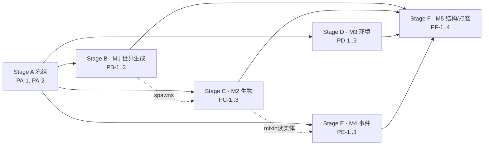

# 土卫六 (Titan Satellite) — 平行任务表 (Parallel Task Plan · multi-agent)

> 源 / Source: [设计案 titan_technical_design.md](titan_technical_design.md) + [总任务表 task-plan.md](task-plan.md)。
> **核心规则：同阶段任务【不共享文件】且【不互相依赖】（并行）；跨阶段【可依赖】（串行，每阶段有 Gate）。**
> 目标并行度：**3–4 个 agent 同时工作**。图例：☐ todo · ◐ 进行中 · ☑ 完成 · ⛔ 阻塞。

## 0. Agent 如何使用本表
1. **认领**一个「前置阶段全部 ☑」的任务：把状态 ☐→◐，在 `owner` 处签名。
2. 只改自己 **Owns** 的文件；**Reads** 一律只读；**绝不**碰别的任务的 Owns 文件或 §2 冻结项。
3. 完成后按 §1 协议把进度**行级精确**写回三处文档。
4. 一个阶段全部 ☑ → 跑该阶段 **Gate**（构建/冒烟）→ 解锁下一阶段。

## 1. 进度写回协议 (Progress-update Protocol)
1. **一文件一主人**（见 §6）。认领即 ☐→◐ 并签名。
2. 完成时用**行级精确替换**（先读后写；`oldString` 不匹配就重读重试，**绝不整段覆盖**）更新三处：
   - (a) **本表**：任务 ◐→☑ + 填 `output`；
   - (b) **总任务表**：勾选映射的 `T*`（见 §8）；
   - (c) **设计案**：仅当某 `to-verify` 被解决或设计变更时更新对应节。
3. **Gate**：阶段内任务全 ☑ → 跑 Gate 的集成检查 → 解锁下一阶段。
4. **变更请求 (CR)**：需要动 §2 冻结项或别人的 Owns 文件 → 先在 §7 加一行并暂停，协调后再动。

## 2. 冻结契约 (FROZEN — 无 CR 不得更改)

> 这是并行安全的地基。Stage A 一次性建立，之后 B–F 只读。

### 2.1 包结构 / 目录
```
com.tonywww.titan_satellite/
  TitanSatellite.java        # 主类：唯一 wiring 点（Stage A 冻结）
  registry/  TS*.java        # 全部 DeferredRegister（Stage A 冻结）
  block/     *Block.java      # 方块行为类（A 建桩 → E 填充）
  entity/    *.java           # 实体类（A 建桩 → C 填充）
  item/      *.java           # 特殊物品/装备（A 建桩 → C/D 填充）
  client/    *Renderer.java, TitanClientEvents.java, *Effects.java, *Overlay.java
  worldgen/  density/ feature/ structure/   # 自定义类型（A 建桩 → B/F 填充）
  env/       *Handler.java    # 环境系统（D）
  capability/*               # 环境 Capability（A 建接口 → D 填实现）
  event/     MethaneExtractionWaveEvent.java  # 自定义事件（A 冻结签名）
  mixin/     *.java + package-info            # Mixin（A 建配置 → E 填充）
data/titan_satellite/
  worldgen/{biome,noise_settings,density_function,configured_feature,placed_feature,structure,structure_set,template_pool}/
  forge/biome_modifier/      # 生成注入（每怪一文件，C）
  loot_table/  damage_type/  tags/  recipes/
assets/titan_satellite/  blockstates/ models/ textures/ lang/ sounds/
```

### 2.2 命名 / ID（全部 snake_case，命名空间 `titan_satellite`）
- **方块**（M0 已注册，行为类 A 建桩）：`titan_stone, titan_basalt, tholin_sand, crushed_ice, cryo_ice, packed_methane_ice, cryovolcanic_geyser, methane_pool_core, special_methane_pump, tholin_crystal, liquid_methane, liquid_ammonia`。
- **物品**：`aero_membrane`（有）、`cryo_carapace, toxic_gland, depleted_battery, precision_components`（M2 掉落）、`thermal_suit_helmet/chestplate/leggings/boots, oxygen_tank`（M3 装备）、`liquid_methane_bucket, liquid_ammonia_bucket`（有）、各生物 `*_spawn_egg`。
- **实体**：`aero_jelly`（有）、`cryo_scavenger, ammonia_stalker, corrupted_probe, probe_laser`（弹射物）。
- **流体**：`liquid_methane(+flowing_), liquid_ammonia(+flowing_)`（有）。
- **生物效果**：`oxygen_deprivation, frostbite, tholin_toxin`。
- **伤害类型**：`titan_cold, titan_suffocation`。
- **群系**：`methane_abyss, cratered_wastelands, tholin_dune_sea, polar_labyrinth, cryovolcanic_cliff`。
- **placed_feature**：`methane_lake, giant_crater, megayardang, ice_sinkhole, glowing_crystal_cluster, geyser_patch`。
- **结构**：`tholin_geode, pioneer_outpost`。
- **粒子**：`methane_bubble, geyser_spray, toxic_gas`。
- **方块实体**：`methane_pump, methane_pool_core, cryovolcanic_geyser`（如需 BE）。
- **群系标签**：`titan_satellite:is_titan`（列出 5 群系，供生成注入/特效判定）。
- **自定义 density function**：`titan_satellite:biome_height`（+ 组合用 `floor/ceiling/final` 视需要）。

### 2.3 冻结接口签名
- 实体：`public <E>(EntityType<? extends <Base>>, Level)` + `public static AttributeSupplier.Builder createAttributes()`（`TSEntities.onAttributeCreation` 逐怪调用之，A 冻结）。
- 行为方块：`public <X>Block(BlockBehaviour.Properties)`；带 BE 者 `extends BaseEntityBlock` 且 `newBlockEntity(...)`。
- Capability：`interface ITitanEnvironment { float getOxygen(); void setOxygen(float); float getBodyHeat(); void setBodyHeat(float); CompoundTag serializeNBT(); void deserializeNBT(CompoundTag); }`；`Capability<ITitanEnvironment> TITAN_ENV`。
- 事件：`class MethaneExtractionWaveEvent extends net.minecraftforge.eventbus.api.Event { ServerLevel getLevel(); BlockPos getPumpPos(); int getWaveIndex(); int getIntensity(); }`。
- density function：`class BiomeHeightDensityFunction implements DensityFunction.SimpleFunction { double compute(FunctionContext); double minValue(); double maxValue(); KeyDispatchDataCodec<? extends DensityFunction> codec(); }`（codec 具体类型以 R1 结论为准）。
- 客户端渲染器：`public <E>Renderer(EntityRendererProvider.Context)`（`TitanClientEvents` 注册之，A 冻结）。

### 2.4 协议 / lang / 特征槽位
- **lang**：`en_us.json`/`zh_cn.json` 的**全部键**由 PA-1 一次性冻结（含 M1–M5 所有方块/物品/实体/效果名）；**B–F 任何任务不得改 lang**。
- **biome `features` 数组**：11 段（对应 `GenerationStep.Decoration` 顺序）；冻结「哪个 placed_feature 放哪一段」的映射（见 PB-1/PB-3 约定），T1.1 与 T1.3 各自按此 ID 引用，不共享文件。
- **生成注入**：生物生成一律用 `data/.../forge/biome_modifier/<mob>_spawn.json`（每怪一文件），**不改 biome JSON 的 spawners**，避免 M2 与 M1 抢文件。

### 2.5 责任边界（防耦合）
- **注册 / wiring / lang / 渲染器注册 / 属性注册 / 创造标签**：只在 **Stage A** 改；B–F 只**读**并填充自己的桩类 / 加自己的数据文件。
- 跨并行单元的共享副作用（如刷怪、同步、持久化）上提到运行它们的 facade（如波次事件在 `event/` 集中 post，而非散落各处）。

---

## 3. 阶段与依赖总览 (Stages & Dependency)



| 阶段 | 并行任务 | 前置 | 里程碑 |
|---|---|---|---|
| A | PA-1, PA-2 | M0 ✅ | 契约冻结 |
| B | PB-1, PB-2, PB-3 | Gate A | M1 |
| C | PC-1, PC-2, PC-3 | Gate A（生成验证软需 Gate B） | M2 |
| D | PD-1, PD-2, PD-3 | Gate A | M3 |
| E | PE-1, PE-2, PE-3 | Gate A（PE-2 mixin 读 C 实体类型） | M4 |
| F | PF-1, PF-2, PF-3, PF-4 | Gate B/C/D/E | M5 |

> **并行窗口**：Gate A 后，B/C/D/E 四条支线同时开放（互相文件不重叠），3–4 个 agent 从就绪池各取一任务；世界生成（B）为关键路径优先。

---

## 4. 任务明细 (Task Details)

### Stage A · 契约冻结与脚手架（前置：M0 ✅）
> 两任务文件完全不相交；均建立 §2 冻结面，各自独立编译。

**PA-1 · 注册/装配/lang/渲染器 冻结**  ◐ owner:agent1 output:进行中
- Owns: `registry/TS*.java`（含新增 `TSMobEffects`、`TSParticles`、`TSBlockEntities`）、`TitanSatellite.java`、`block/*Block.java`（桩）、`entity/*.java`（桩，含 `probe_laser`）、`item/*.java`（桩）、`client/*Renderer.java`（桩）+`client/TitanClientEvents.java`、`lang/en_us.json`+`lang/zh_cn.json`。
- Reads: §2 全部 ID/签名。
- Deliverable/验收: `build` 通过；`runServer` Done（全注册项以桩存在）；`runClient` 到标题页；lang 完整。
- Maps to: **T0.1**。

**PA-2 · 系统与 worldgen 类型脚手架**  ☐ owner:___ output:___
- Owns: `worldgen/`（`TSWorldgenTypes` 注册 DensityFunction/Feature/Structure codec + `density/`,`feature/`,`structure/` 桩类）、`capability/*`（接口 + 附加 @EventBusSubscriber）、`event/MethaneExtractionWaveEvent.java`、`mixin/`（`titan_satellite.mixins.json` + Mixin 插件 + `package-info`）、`data/.../damage_type/{titan_cold,titan_suffocation}.json`、`data/.../tags/worldgen/biome/is_titan.json`。
- Reads: §2 ID/签名（不引用 PA-1 的桩，独立编译）。
- Deliverable/验收: 编译通过；capability/event/mixin 自订阅、不改主类；damage_type 与 is_titan 标签加载无误。
- Maps to: **T0.2**。

> **Gate A**：`:1.20.1-forge:build` + `runServer` Done + `runClient` 到标题页（渲染器桩不崩）。

### Stage B · M1 世界生成（前置：Gate A）
> 三任务：数据文件互不相交；跨引用只用 §2 冻结 ID。

**PB-1 · 五群系 biome + multi_noise 维度**  ☐ owner:___ output:___
- Owns: `data/.../worldgen/biome/{methane_abyss,cratered_wastelands,tholin_dune_sea,polar_labyrinth,cryovolcanic_cliff}.json`、`data/.../dimension/titan.json`、`data/.../dimension_type/titan.json`。
- Reads: 方块 ID、**placed_feature ID（PB-3，冻结）**、noise_settings ID。
- Deliverable/验收: 5 群系加载、`multi_noise` 分布、`features` 按 §2.4 槽位引用冻结特征 ID。
- Maps to: **T1.1**。

**PB-2 · 自定义 noise_settings + density（0–320 高差）+ 按群系 surface_rule**  ☐ owner:___ output:___
- Owns: `data/.../worldgen/noise_settings/titan.json`、`data/.../worldgen/density_function/*.json`、`worldgen/density/BiomeHeightDensityFunction.java`（填充 PA-2 桩 ※）。
- Reads: 方块 ID、群系 ID。
- Deliverable/验收: 峡谷/沙丘/断崖高差；各群系地表方块正确（`stone_depth` 深度受限）。
- Maps to: **T1.2**。

**PB-3 · 特征（甲烷湖/陨石坑/沙脊/天坑/晶簇/喷泉斑）**  ☐ owner:___ output:___
- Owns: `data/.../worldgen/configured_feature/*.json`、`placed_feature/*.json`、`worldgen/feature/*.java`（填充 PA-2 桩 ※）。
- Reads: 方块 ID。
- Deliverable/验收: 各特征生成，ID 与 PB-1 引用一致。
- Maps to: **T1.3**。

> **Gate B**：`runServer`→`execute in titan_satellite:titan` 探测：5 群系、高差地形、按群系地表、特征生成。

### Stage C · M2 生物（前置：Gate A；生成验证需 Gate B）
> 每怪一任务，独占各自实体/渲染/掉落/生成文件；属性经 `TSEntities.onAttributeCreation`（A 冻结）调用各怪 `createAttributes()`。

**PC-1 · 冰硅甲虫 Cryo-Scavenger（中立）**  ☐ owner:___ output:___
- Owns: `entity/CryoScavenger.java`（填充 ※）、`client/CryoScavengerRenderer.java`+model/texture、`data/.../loot_table/entities/cryo_scavenger.json`、`data/.../forge/biome_modifier/cryo_scavenger_spawn.json`、其 `SpawnPlacementRegisterEvent` 注册文件（`entity/CryoScavengerSpawn.java`）。
- Reads: `TSEntities`（冻结）、掉落物 ID、群系标签 `is_titan`。
- Deliverable/验收: summon 正常、受击反击/减伤、掉落、生成于 titan 群系。
- Maps to: **T2.1**。

**PC-2 · 氨泉掠食者 Ammonia-Stalker（敌对）**  ☐ owner:___ output:___
- Owns/Reads/Deliverable: 同构，独占 `entity/AmmoniaStalker.*`、渲染、`toxic_gland` 掉落、`ammonia_stalker_spawn.json`；攻击附毒。Maps to: **T2.2**。

**PC-3 · 失控探测器 Corrupted-Probe（敌对，激光）**  ☐ owner:___ output:___
- Owns/Reads/Deliverable: 同构，独占 `entity/CorruptedProbe.*` + `entity/ProbeLaser.*`（弹射物行为，类型 A 冻结）、渲染、`depleted_battery/precision_components` 掉落、生成于遗迹附近。Maps to: **T2.3**。

> **Gate C**：summon 三怪 AI/掉落正常；且在 M1 群系自然生成（需 Gate B）。

### Stage D · M3 环境系统（前置：Gate A）
> 环境系统各自独占文件；跨并行单元共享副作用（掉氧/扣温）集中在 tick facade。

**PD-1 · 低重力 + 缓降**  ☐ owner:___ output:___
- Owns: `env/GravityHandler.java`（@EventBusSubscriber；`ForgeMod.ENTITY_GRAVITY` + 缓降）。
- Reads: `TSDimensions.TITAN_LEVEL`（冻结）。
- Deliverable/验收: 维度内跳更高/降更慢，离开恢复。Maps to: **T3.1**。

**PD-2 · 缺氧+极寒 Capability + 伤害**  ☐ owner:___ output:___
- Owns: `capability/TitanEnvironment.java`（实现，填充 PA-2 接口 ※）、`env/EnvironmentTickHandler.java`（tick facade：掉氧/扣温/伤害）。
- Reads: `ITitanEnvironment`（冻结）、`damage_type` ID、装备物品 ID。
- Deliverable/验收: 无装备暴露持续掉氧/体温、归零周期受伤（`titan_cold/titan_suffocation`）。Maps to: **T3.2**。

**PD-3 · HUD + 保暖/供氧装备**  ☐ owner:___ output:___
- Owns: `client/EnvHudOverlay.java`（`RenderGuiOverlayEvent`）、`item/ThermalSuit*.java`+`item/OxygenTank.java`（填充 PA-1 桩 ※）+model/texture、`data/.../recipes/*`。
- Reads: capability 读值、装备 ID。
- Deliverable/验收: HUD 显示 O2/体温；穿装备缓解；可合成。Maps to: **T3.3**。

> **Gate D**：进维度 HUD 显示、装备减免、裸奔受伤。

### Stage E · M4 事件玩法（前置：Gate A；PE-2 读 C 实体类型）
**PE-1 · 冰火山喷泉击飞**  ☐ owner:___ output:___
- Owns: `block/CryovolcanicGeyserBlock.java`（填充 ※：randomTick/BE 蓄力-喷发、`entityInside` 击飞、粒子音效）。
- Reads: 喷泉方块/粒子（冻结）；自然生成由 PB-3 `geyser_patch` 特征放置。
- Deliverable/验收: 站上喷发被击飞。Maps to: **T4.1**。

**PE-2 · 甲烷开采塔防（含 Mixin 刷怪）**  ☐ owner:___ output:___
- Owns: `block/MethanePoolCoreBlock.java`、`block/SpecialMethanePumpBlock.java`+其 BlockEntity（填充 ※）、`event/WaveController.java`（状态机 + post `MethaneExtractionWaveEvent`）、`mixin/WaveSpawnMixin.java` + 向 `titan_satellite.mixins.json` 加条目（PA-2 建的空配置 ※，仅本任务动）。
- Reads: `MethaneExtractionWaveEvent`（冻结）、`TSEntities` 深渊怪（冻结）。
- Deliverable/验收: 泵放核心上激活→波次刷怪→保护→成功产出/失败重置。Maps to: **T4.2**。

**PE-3 · 晶洞惊扰**  ☐ owner:___ output:___
- Owns: `block/TholinCrystalBlock.java`（填充 ※：破坏概率放毒气 + 唤醒潜伏怪）。
- Reads: `tholin_crystal`、`tholin_toxin` 效果、实体（冻结）。
- Deliverable/验收: 破坏晶体→毒气云+惊醒附近敌对。Maps to: **T4.3**。

> **Gate E**：放泵→波次（Mixin 生效）；喷泉击飞；破坏晶体→毒气+惊怪。

### Stage F · M5 结构与打磨/整合（前置：Gate B/C/D/E）
**PF-1 · 结构（托林晶洞 / 先驱前哨站）**  ☐ owner:___ output:___
- Owns: `data/.../worldgen/structure/*`、`structure_set/*`、`template_pool/*`（或 NBT）、`tags/.../has_structure/*`、`worldgen/structure/*.java`（如需自定义 StructureType，填充 ※）。
- Reads: 方块、群系（B）。Deliverable: 结构在对应群系生成、内含战利品/探测器。Maps to: **T5.1**。

**PF-2 · 维度天空/雾特效**  ☐ owner:___ output:___
- Owns: `client/TitanDimensionEffects.java`（`DimensionSpecialEffects` + `RegisterDimensionSpecialEffectsEvent`）、`client/FogHandler.java`（`ViewportEvent`）。
- Reads: 维度 key。Deliverable: 橙黄浓雾、低能见度。Maps to: **T5.2**。

**PF-3 · 流体完善 + 音效**  ☐ owner:___ output:___
- Owns: `assets/.../sounds.json`+音效资源、流体交互补全文件（不含 lang）。
- Reads: 流体/方块。Deliverable: 流体交互合理、关键动作有音效。Maps to: **T5.3**。

**PF-4 · 平衡 + 验收矩阵 + DoD**  ☐ owner:___ output:___
- Owns: `docs/` 测试矩阵、config 文件。Reads: 全部。Deliverable: 全流程 `runClient` 通关、矩阵勾齐。Maps to: **T5.4**。

> **Gate F / DoD**：完整 `runClient` 通关；结构生成；天空雾；全系统联动。

---

## 5. 研究结论 (Research Findings，阻塞任务写回此处)
> R1–R5（见总任务表）由 Stage A 相关任务落地时在此写结论，供下游只读。
- R1 worldgen codec 类型：___（PA-2 落地后填）
- R2 Capability API：___（PA-2 落地后填）
- R3 Mixin 刷怪注入点：___（PE-2 落地后填）
- R4 multi_noise 气候参数：___（PB-1 落地后填）
- R5 Jigsaw 结构格式：___（PF-1 落地后填）

## 6. 文件归属矩阵 (File-ownership Matrix · 防冲突)
> ※ = 跨阶段接力文件（A 建桩 → 后续填充，串行安全，同阶段绝不并发共享）。

| 文件 / 目录 | 主人 | 阶段 |
|---|---|---|
| `registry/TS*.java`, `TitanSatellite.java`, `lang/*.json`, `client/TitanClientEvents.java` | PA-1 | A（此后只读） |
| `block/*Block.java`（桩） ※ | PA-1 建 → PE-1/2/3 填 | A→E |
| `entity/*.java`（桩） ※ | PA-1 建 → PC-1/2/3 填 | A→C |
| `item/*.java`（装备桩） ※ | PA-1 建 → PD-3 填 | A→D |
| `client/*Renderer.java`（桩） ※ | PA-1 建 → PC-* 填 | A→C |
| `worldgen/`（类型注册+桩） ※ | PA-2 建 → PB-2/3、PF-1 填 | A→B/F |
| `capability/*`（接口） ※ | PA-2 建 → PD-2 填实现 | A→D |
| `event/MethaneExtractionWaveEvent.java` | PA-2 | A（只读） |
| `mixin/*` 配置+插件 ※ | PA-2 建 → PE-2 加条目 | A→E |
| `data/.../damage_type/*`, `tags/.../is_titan.json` | PA-2 | A |
| `data/.../worldgen/biome/*`, `dimension/*`, `dimension_type/*` | PB-1 | B |
| `data/.../worldgen/noise_settings/*`, `density_function/*` | PB-2 | B |
| `data/.../worldgen/configured_feature/*`, `placed_feature/*` | PB-3 | B |
| `entity/CryoScavenger.*`, `.../cryo_scavenger*`, `biome_modifier/cryo_scavenger_spawn.json` | PC-1 | C |
| `entity/AmmoniaStalker.*`, `.../ammonia_stalker*` | PC-2 | C |
| `entity/CorruptedProbe.*`,`ProbeLaser.*`, `.../corrupted_probe*` | PC-3 | C |
| `env/GravityHandler.java` | PD-1 | D |
| `env/EnvironmentTickHandler.java`, `capability/TitanEnvironment.java` | PD-2 | D |
| `client/EnvHudOverlay.java`, `item/ThermalSuit*`,`OxygenTank`, `recipes/*` | PD-3 | D |
| `block/CryovolcanicGeyserBlock.java` | PE-1 | E |
| `block/MethanePoolCoreBlock.*`,`SpecialMethanePumpBlock.*`, `event/WaveController.java`, `mixin/WaveSpawnMixin.java` | PE-2 | E |
| `block/TholinCrystalBlock.java` | PE-3 | E |
| `data/.../worldgen/structure/*`,`structure_set/*`,`template_pool/*`, `worldgen/structure/*.java` | PF-1 | F |
| `client/TitanDimensionEffects.java`,`FogHandler.java` | PF-2 | F |
| `assets/.../sounds.json`+音效 | PF-3 | F |
| `docs/` 测试矩阵, config | PF-4 | F |

> **反冲突自证**：同一阶段列内无重复文件；共享文件（registry/lang/main/renderer-reg/mixins.json/worldgen 桩/capability 接口）均为 A 冻结或 ※ 跨阶段接力，绝不在同阶段被两个任务同时改。生物生成用每怪独立 `biome_modifier`，不碰 biome JSON。

## 7. 变更日志 (Change Requests)
| # | 日期 | 提出者 | 变更（冻结项 / 借用文件） | 处置 |
|---|---|---|---|---|
| — | — | — | — | — |

## 8. 平行任务 ↔ 里程碑 ↔ 总任务表
| 平行任务 | 总任务表 ID | 里程碑 |
|---|---|---|
| PA-1 | T0.1 | 冻结 |
| PA-2 | T0.2 | 冻结 |
| PB-1 / PB-2 / PB-3 | T1.1 / T1.2 / T1.3 | M1 |
| PC-1 / PC-2 / PC-3 | T2.1 / T2.2 / T2.3 | M2 |
| PD-1 / PD-2 / PD-3 | T3.1 / T3.2 / T3.3 | M3 |
| PE-1 / PE-2 / PE-3 | T4.1 / T4.2 / T4.3 | M4 |
| PF-1 / PF-2 / PF-3 / PF-4 | T5.1 / T5.2 / T5.3 / T5.4 | M5 |
