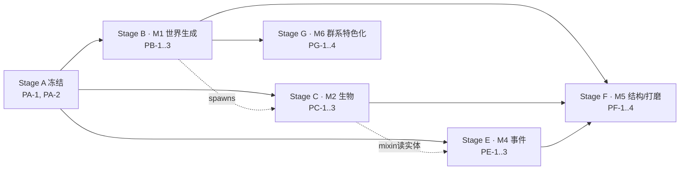

# 土卫六 (Titan Satellite) — 平行任务表 (Parallel Task Plan · multi-agent)

> 源 / Source: [设计案 titan_technical_design.md](titan_technical_design.md) + [总任务表 task-plan.md](task-plan.md)。
> **核心规则：同阶段任务【不共享文件】且【不互相依赖】（并行）；跨阶段【可依赖】（串行，每阶段有 Gate）。**
> 目标并行度：**3–4 个 agent 同时工作**。图例：☐ todo · ◐ 进行中 · ☑ 完成 · ⛔ 阻塞。

## 0. Agent 如何使用本表
1. **认领**一个「前置阶段全部 ☑」的任务：把状态 ☐→◐，在 `owner` 处签名。
2. 只改自己 **Owns** 的文件；**Reads** 一律只读；**绝不**碰别的任务的 Owns 文件或 §2 冻结项。
3. 完成后按 §1 协议把进度**行级精确**写回三处文档。
4. 一个阶段全部 ☑ → 跑该阶段 **Gate**（构建/冒烟）→ 解锁下一阶段。

## 1. 进度写回协议 (Progress-update Protocol)
1. **一文件一主人**（见 §6）。认领即 ☐→◐ 并签名。
2. 完成时用**行级精确替换**（先读后写；`oldString` 不匹配就重读重试，**绝不整段覆盖**）更新三处：
   - (a) **本表**：任务 ◐→☑ + 填 `output`；
   - (b) **总任务表**：勾选映射的 `T*`（见 §8）；
   - (c) **设计案**：仅当某 `to-verify` 被解决或设计变更时更新对应节。
3. **Gate**：阶段内任务全 ☑ → 跑 Gate 的集成检查 → 解锁下一阶段。
4. **变更请求 (CR)**：需要动 §2 冻结项或别人的 Owns 文件 → 先在 §7 加一行并暂停，协调后再动。

## 2. 冻结契约 (FROZEN — 无 CR 不得更改)

> 这是并行安全的地基。Stage A 一次性建立，之后 B–F 只读。

### 2.1 包结构 / 目录
```
com.tonywww.titan_satellite/
  TitanSatellite.java        # 主类：唯一 wiring 点（Stage A 冻结）
  registry/  TS*.java        # 全部 DeferredRegister（Stage A 冻结）
  block/     *Block.java      # 方块行为类（A 建桩 → E 填充）
  entity/    *.java           # 实体类（A 建桩 → C 填充）
  item/      *.java           # 特殊物品/装备（A 建桩 → C/D 填充）
  client/    *Renderer.java, TitanClientEvents.java, *Effects.java, *Overlay.java
  worldgen/  density/ feature/ structure/   # 自定义类型（A 建桩 → B/F 填充）

  event/     MethaneExtractionWaveEvent.java  # 自定义事件（A 冻结签名）
  mixin/     *.java + package-info            # Mixin（A 建配置 → E 填充）
data/titan_satellite/
  worldgen/{biome,noise_settings,density_function,configured_feature,placed_feature,structure,structure_set,template_pool}/
  forge/biome_modifier/      # 生成注入（每怪一文件，C）
  loot_tables/  tags/  recipes/     # 1.20.1 为复数 loot_tables（见 CR-6）
assets/titan_satellite/  blockstates/ models/ textures/ lang/ sounds/
```

### 2.2 命名 / ID（全部 snake_case，命名空间 `titan_satellite`）
- **方块**（M0 已注册，行为类 A 建桁）：`titan_stone, titan_basalt, tholin_sand, crushed_ice, cryo_ice, packed_methane_ice, cryovolcanic_geyser, methane_pool_core, special_methane_pump, tholin_crystal, liquid_methane, liquid_ammonia`。**M6 新增**（T6.1/PG-1 注册）：`weathered_titan_stone, sedimentary_titan_stone, branch_crystal`。
- **物品**：`aero_membrane`（有）、`cryo_carapace, toxic_gland, depleted_battery, precision_components`（M2 掉落）、`liquid_methane_bucket, liquid_ammonia_bucket`（有）、各生物 `*_spawn_egg`。（~~`thermal_suit_*, oxygen_tank`~~ 已随 **CR-5** 移除）
- **实体**：`aero_jelly`（有）、`cryo_scavenger, ammonia_stalker, corrupted_probe`。（probe_laser 已撤：PC-3 用即时激光光束，不建弹射物实体，见 §7 CR-1）
- **流体**：`liquid_methane(+flowing_), liquid_ammonia(+flowing_)`（有）。
- **生物效果**：`tholin_toxin`（~~`oxygen_deprivation, frostbite`~~ 已随 **CR-5** 移除）。
- **群系**：`methane_abyss, cratered_wastelands, tholin_dune_sea, polar_labyrinth, cryovolcanic_cliff`。**M6 新增** `barren_plateau`（荒芜高原）；六群系中文显示名统一加“土卫六·”前缀（仅 lang，id 不变）。
- **placed_feature**：`methane_lake, giant_crater, megayardang, ice_sinkhole, glowing_crystal_cluster, geyser_patch`。**M6 新增** `fissure, methane_mare, sponge_cave, branch_crystal`（T6.4/PG-4）。
- **结构**：`tholin_geode, pioneer_outpost`。
- **粒子**：改用原版粒子（如 splash/smoke/effect），不建自定义 ParticleType（见 §7 CR-2）。
- **方块实体**：`methane_pump`（仅泵带 BE；core/geyser/crystal 为普通方块，见 §7 CR-3）。
- **群系标签**：`titan_satellite:is_titan`（列出 5 群系，供生成注入/特效判定）。
- **自定义 density function**：`titan_satellite:biome_height`（+ 组合用 `floor/ceiling/final` 视需要）。

### 2.3 冻结接口签名
- 实体：`public <E>(EntityType<? extends <Base>>, Level)` + `public static AttributeSupplier.Builder createAttributes()`（`TSEntities.onAttributeCreation` 逐怪调用之，A 冻结）。
- 行为方块：`public <X>Block(BlockBehaviour.Properties)`；带 BE 者 `extends BaseEntityBlock` 且 `newBlockEntity(...)`。
- 事件：`class MethaneExtractionWaveEvent extends net.minecraftforge.eventbus.api.Event { ServerLevel getLevel(); BlockPos getPumpPos(); int getWaveIndex(); int getIntensity(); }`。
- density function：`class BiomeHeightDensityFunction implements DensityFunction.SimpleFunction { double compute(FunctionContext); double minValue(); double maxValue(); KeyDispatchDataCodec<? extends DensityFunction> codec(); }`（codec 具体类型以 R1 结论为准）。
- 客户端渲染器：`public <E>Renderer(EntityRendererProvider.Context)`（`TitanClientEvents` 注册之，A 冻结）。

### 2.4 协议 / lang / 特征槽位
- **lang**：`en_us.json`/`zh_cn.json` 的**全部键**由 PA-1 一次性冻结（含 M1–M5 所有方块/物品/实体/效果名）；**B–F 任何任务不得改 lang**。
- **特征注入**（CR-4 变更）：biome JSON 的 `features` 一律**留空**；特征由 PB-3 用 `forge:add_features` biome_modifier（`data/.../forge/biome_modifier/*.json`，targeting `#titan_satellite:is_titan`，指定 step）注入。与刷怪同模式，PB-1↔PB-3 完全解耦、biome 不引用特征、避免缺失特征崩溃。
- **生成注入**：生物生成一律用 `data/.../forge/biome_modifier/<mob>_spawn.json`（每怪一文件），**不改 biome JSON 的 spawners**，避免 M2 与 M1 抢文件。

### 2.5 责任边界（防耦合）
- **注册 / wiring / lang / 渲染器注册 / 属性注册 / 创造标签**：只在 **Stage A** 改；B–F 只**读**并填充自己的桩类 / 加自己的数据文件。
- 跨并行单元的共享副作用（如刷怪、同步、持久化）上提到运行它们的 facade（如波次事件在 `event/` 集中 post，而非散落各处）。

---

## 3. 阶段与依赖总览 (Stages & Dependency)



| 阶段 | 并行任务 | 前置 | 里程碑 |
|---|---|---|---|
| A | PA-1, PA-2 | M0 ✅ | 契约冻结 |
| B | PB-1, PB-2, PB-3 | Gate A | M1 |
| C | PC-1, PC-2, PC-3 | Gate A（生成验证软需 Gate B） | M2 |
| E | PE-1, PE-2, PE-3 | Gate A（PE-2 mixin 读 C 实体类型） | M4 |
| F | PF-1, PF-2, PF-3, PF-4 | Gate B/C/E | M5 |
| G | PG-1(前置), PG-2, PG-3, PG-4 | Gate B | M6 |

> **并行窗口**：Gate A 后，B/C/E 三条支线同时开放（互相文件不重叠；Stage D 已 CR-5 取消），3–4 个 agent 从就绪池各取一任务；世界生成（B）为关键路径优先。Gate B 后 Stage G（群系特色化）开放，可与 Stage F 并行；G 内 PG-1 冻结新块 id 后 PG-2/3/4 并行。

---

## 4. 任务明细 (Task Details)

### Stage A · 契约冻结与脚手架（前置：M0 ✅）
> 两任务文件完全不相交；均建立 §2 冻结面，各自独立编译。

**PA-1 · 注册/装配/lang/渲染器 冻结**  ☑ owner:agent1 output:全注册冻结完成——4 行为块桁(geyser/core/pump/crystal，pump 带 BE)、3 生物桁(cryo_scavenger/ammonia_stalker/corrupted_probe)+属性、材料×4/刷怪蛋×4、TSMobEffects(tholin_toxin)/TSBlockEntities(pump)、3 生物渲染器桁+注册、全 lang(中英)、全 item 模型。主类 wiring 全注册表。compileJava + runServer(Done) + runClient(标题页) 实测通过。见 §7 CR-1/2/3/5。（~~装备×5(护甲)~~、~~oxygen_deprivation/frostbite 效果~~ 已随 CR-5 移除）
- Owns: `registry/TS*.java`（含新增 `TSMobEffects`、`TSParticles`、`TSBlockEntities`）、`TitanSatellite.java`、`block/*Block.java`（桩）、`entity/*.java`（桩，含 `probe_laser`）、`item/*.java`（桩）、`client/*Renderer.java`（桩）+`client/TitanClientEvents.java`、`lang/en_us.json`+`lang/zh_cn.json`。
- Reads: §2 全部 ID/签名。
- Deliverable/验收: `build` 通过；`runServer` Done（全注册项以桩存在）；`runClient` 到标题页；lang 完整。
- Maps to: **T0.1**。

**PA-2 · 系统与 worldgen 类型脚手架**  ☑ owner:agent3 output:worldgen 类型(density biome_height + 4 特征桁)/event/mixin(配置+插件)/is_titan 标签 已建（~~capability(接口+实现+注册+附加)~~、~~damage_type(cold,suffocation)~~ 已随 **CR-5** 移除）；compileJava + runServer 实测通过（density 类型自订阅注册经探针验证）。注：晶簇/喷泉斑特征走原版类型，PB-3 无需自定义 Feature 类。
- Owns: `worldgen/`（`TSWorldgenTypes` 注册 DensityFunction/Feature/Structure codec + `density/`,`feature/`,`structure/` 桁类）、`event/MethaneExtractionWaveEvent.java`、`mixin/`（`titan_satellite.mixins.json` + Mixin 插件 + `package-info`）、`data/.../tags/worldgen/biome/is_titan.json`。（~~`capability/*`~~、~~`data/.../damage_type/*`~~ 已随 **CR-5** 移除）
- Reads: §2 ID/签名（不引用 PA-1 的桁，独立编译）。
- Deliverable/验收: 编译通过；event/mixin 自订阅、不改主类；is_titan 标签加载无误。
- Maps to: **T0.2**。

> **Gate A**：`:1.20.1-forge:build` + `runServer` Done + `runClient` 到标题页（渲染器桩不崩）。

### Stage B · M1 世界生成（前置：Gate A）
> 三任务：数据文件互不相交；跨引用只用 §2 冻结 ID。

**PB-1 · 五群系 biome + multi_noise 维度**  ☑ owner:agent1 output:5 群系(methane_abyss/cratered_wastelands/tholin_dune_sea/polar_labyrinth/cryovolcanic_cliff)建齐(空 features)，dimension 改 multi_noise(各群系气候参数点)。runServer(全新世界 Done) 实测：if biome=cratered_wastelands 证 multi_noise 生效(非旧 fixed)；5 群系经维度解析全部注册有效。全 5 群系分布待 PB-2 气候噪声(Gate B)。见 §7 CR-4。
- Owns: `data/.../worldgen/biome/{methane_abyss,cratered_wastelands,tholin_dune_sea,polar_labyrinth,cryovolcanic_cliff}.json`、`data/.../dimension/titan.json`、`data/.../dimension_type/titan.json`。
- Reads: 方块 ID、noise_settings ID。（biome 用空 features，特征由 PB-3 经 biome_modifier 注入，见 §7 CR-4）
- Deliverable/验收: 5 群系加载、维度用 `multi_noise`（各群系气候参数点）；biome features 留空。
- Maps to: **T1.1**。

**PB-2 · 自定义 noise_settings + density（0–320 高差）+ 按群系 surface_rule**  ☑ owner:agent2 output:noise_settings.final_density 引用自定义 titan_final_density(=y梯度 + titan_relief)；titan_relief=biome_height(factor 0.85)；填充 BiomeHeightDensityFunction(确定性多倍频值噪声，minValue/maxValue=±|factor|)；5 群系 surface_rule(stone_depth floor + add_surface_depth)。runServer 独立世界(titan_pb2_test:25566)实测：Done、titan 区块生成无崩溃；极端起伏(原点谷 top=y99 vs 远点崖 solid≥160，>60 块高差)；surface_rule 生效(原点 cratered_wastelands 群系顶=crushed_ice + titan_stone 基岩)；与 PB-1 multi_noise 集成正确。
- Owns: `data/.../worldgen/noise_settings/titan.json`、`data/.../worldgen/density_function/*.json`、`worldgen/density/BiomeHeightDensityFunction.java`（填充 PA-2 桩 ※）。
- Reads: 方块 ID、群系 ID。
- Deliverable/验收: 峡谷/沙丘/断崖高差；各群系地表方块正确（`stone_depth` 深度受限）。
- Maps to: **T1.2**。

**PB-3 · 特征（甲烷湖/陨石坑/沙脊/天坑/晶簇/喷泉斑）**  ☑ owner:agent3 output:填充 4 自定义 Feature 的 place()（methane_lake→挖坑填液态甲烷；giant_crater→碗状挖空+底部甲烷；megayardang→隆起托林沙墙；ice_sinkhole→竖井碎空+甲烷浮冰壁）+ 6 configured_feature（4 自定义 + glowing_crystal_cluster/geyser_patch 走原版 random_patch）+ 6 placed_feature（rarity/count+heightmap/height_range+in_square+biome 过滤）。compileJava + runServer 加载 12 JSON 全通过；`/place feature`（用 configured id，非 placed）实测 6 特征全部 Placed，探测确认 methane_lake→液态甲烷、ice_sinkhole/giant_crater→碎空、megayardang→托林沙。**给 PB-1 的 §2.4 槽位建议**：methane_lake→LAKES(1)；giant_crater/megayardang/ice_sinkhole→LOCAL_MODIFICATIONS(2)；glowing_crystal_cluster→UNDERGROUND_DECORATION(7)；geyser_patch→VEGETAL_DECORATION(9)。
- Owns: `data/.../worldgen/configured_feature/*.json`、`placed_feature/*.json`、**`data/.../forge/biome_modifier/*_features.json`（注入到 `#is_titan`，见 CR-4）**、`worldgen/feature/*.java`（填充 PA-2 桩 ※）。
- Reads: 方块 ID。
- Deliverable/验收: 各特征经 biome_modifier 注入到 titan 群系并生成（biome JSON 不引用特征，见 CR-4）。
- Maps to: **T1.3**。

> **Gate B**：`runServer`→`execute in titan_satellite:titan` 探测：5 群系、高差地形、按群系地表、特征生成。

### Stage C · M2 生物（前置：Gate A；生成验证需 Gate B）
> 每怪一任务，独占各自实体/渲染/掉落/生成文件；属性经 `TSEntities.onAttributeCreation`（A 冻结）调用各怪 `createAttributes()`。

**PC-1 · 冰硅甲虫 Cryo-Scavenger（中立）**  ☑ owner:agent3 output:中立甲虫完成——`CryoScavenger` extends PathfinderMob（HP16/速0.2/攻3/护甲6/跟踪16）；中立：仅 `HurtByTargetGoal().setAlertOthers()` 受击反击并唤醒同类 + `MeleeAttackGoal`，无主动索敌玩家；冰晶护甲 `hurt()` 覆写对常规物理伤害×0.6（穿甲/无敌绕过不减）。`CryoScavengerSpawn`：CREATURE 用 `Mob::checkMobSpawnRules`（不要求黑暗）ON_GROUND/MOTION_BLOCKING_NO_LEAVES/REPLACE。掉落表 cryo_carapace(0-2)+looting。biome_modifier forge:add_spawns（#is_titan, w12, 1-3）。**无寒冷/frostbite 依赖**（护甲减伤为物理，环境系统随 CR-5 移除后仍成立）。compileJava + runServer(Done) 实测：summon"Cryo-Scavenger"无崩溃、/loot spawn 掉 Cryo-Carapace、掉落表/biome_modifier 加载无误。受击反击/减伤运行时行为待 runClient/战斗实测（无头服无玩家攻击不触发）。
- Owns: `entity/CryoScavenger.java`（填充 ※，含 `CryoScavengerSpawn.java`）、`client/CryoScavengerRenderer.java`（桩：蜘蛛模型，未换）、`data/.../loot_tables/entities/cryo_scavenger.json`、`data/.../forge/biome_modifier/cryo_scavenger_spawn.json`。
- Reads: `TSEntities`（冻结）、掉落物 ID、群系标签 `is_titan`。
- Deliverable/验收: summon 正常、受击反击/减伤、掉落、生成于 titan 群系。
- Maps to: **T2.1**。

**PC-2 · 氨泉掠食者 Ammonia-Stalker（敌对）**  ☑ owner:agent2 output:`AmmoniaStalker` extends Monster（HP24/速0.28/攻5/追踪24）；两栖=`AmphibiousPathNavigation`+`setPathfindingMalus(WATER,0)`+`canBreatheUnderwater`；`doHurtTarget` 攻击附毒 **原版 `MobEffects.POISON`** 等级I（HARD 200t/NORMAL 140t/其他 80t，见下 Note）。Goals：Float(0)/Melee(1)/RandomStroll(2,两栖不避水)/LookAtPlayer(3)/RandomLookAround(4)；target：HurtByTarget(1)/NearestAttackable\<Player\>(2)。`AmmoniaStalkerRenderer`=`MobRenderer`+`HumanoidModel`(ZOMBIE 层)+`drowned.png` 贴图/shadow0.5。`AmmoniaStalkerSpawn`：SpawnPlacementRegisterEvent ON_GROUND/MOTION_BLOCKING_NO_LEAVES/`Monster::checkMonsterSpawnRules`/REPLACE。掉落表 `toxic_gland`(set_count uniform 0-2 + looting 0-1)。biome_modifier forge:add_spawns（#is_titan, weight18, 1-2）。compileJava + runServer 独立世界(titan_pc2_test:25567,Done) 实测：summon"Ammonia Stalker"无崩溃；铁傀儡引战（无玩家区块需 `forceload` 才 tick AI）→潜伏者反击→傀儡染 minecraft:poison(Id19/amp0/dur80@easy) 确认**攻击附毒**；`/loot spawn kill` 掉 2 `toxic_gland` 确认掉落表挂接；biome_modifier/掉落表/生成放置加载无误。**Note**：攻击附毒用原版 POISON（CR-5 寒冷机制已移除；自定义 tholin_toxin 效果 tick 逻辑 M4 才填）。
- Owns/Reads/Deliverable: 同构，独占 `entity/AmmoniaStalker.*`、渲染、`toxic_gland` 掉落、`ammonia_stalker_spawn.json`；攻击附毒。Maps to: **T2.2**。

**PC-3 · 失控探测器 Corrupted-Probe（敌对，激光）**  ☑ owner:agent3 output:即时激光完成——`CorruptedProbe` extends Monster（HP20/攻4/激光伤6；射程16、蓄力30t、冷却60t；仅索敌 Player + HurtByTarget）；`LaserAttackGoal` 蓄力→即时命中，沿视线布 ELECTRIC_SPARK 光束粒子 + 命中点 SMOKE + BLAZE_SHOOT 音（无弹射物，见 CR-1）。`CorruptedProbeSpawn`：SpawnPlacementRegisterEvent ON_GROUND/MOTION_BLOCKING_NO_LEAVES/checkMonsterSpawnRules。掉落表 depleted_battery(0-1)+precision_components(0-2)+looting。biome_modifier forge:add_spawns（#is_titan, w8, 1-2）。compileJava + runServer(Done) 实测：summon"Corrupted Probe"无崩溃、/loot spawn 掉 2 物、掉落表/biome_modifier 加载无误。掉落表目录修正见 CR-6。激光开火视觉待 runClient 实测（无头服无玩家不触发索敌）。
- Owns/Reads/Deliverable: 同构，独占 `entity/CorruptedProbe.*`（含 `CorruptedProbeSpawn.java`；即时激光光束，**不建 `ProbeLaser` 弹射物**，见 CR-1）、渲染、`depleted_battery/precision_components` 掉落、生成于遗迹附近。Maps to: **T2.3**。

> **Gate C**：summon 三怪 AI/掉落正常；且在 M1 群系自然生成（需 Gate B）。

### ~~Stage D · M3 环境系统~~（已取消，见 §7 CR-5）
> **CR-5 移除**：低重力（PD-1）、缺氧+极寒 Capability + 伤害（PD-2）、HUD + 保暖/供氧装备（PD-3）整个 Stage D 按设计修正取消。土卫六的极寒/无氧/低重力仅作背景设定与视觉氛围；大气雾特效见 PF-2。相关文件（`env/`、`capability/`、`item/ThermalSuit*`、`item/OxygenTank`、`data/.../damage_type/*`）不再创建或已删除。

### Stage E · M4 事件玩法（前置：Gate A；PE-2 读 C 实体类型）
**PE-1 · 冰火山喷泉击飞**  ☑ owner:agent1 output:填充 CryovolcanicGeyserBlock——用 gameTime 隐式驱动喷发周期(CYCLE 140/ERUPT 45 tick，按坐标相位错峰；零 BlockState 属性/零 CR，不改 PA-1 注册，也不依赖 randomTicks/BE)；stepOn 喷发态给站立实体设向上速度 1.15 + hurtMarked 同步 + 清坠落伤害实现击飞；animateTick 客户端喷雾(CLOUD/SNOWFLAKE)粒子 + 低频本地喷涌音；音效走原版 SoundEvents(符 CR-2)。compileJava --rerun-tasks BUILD SUCCESSFUL；runServer(Done) titan 维度 fill 16 喷泉 + 8 相位各异 armor_stand 一次读 Motion：喷发态 y=+0.14(上升)及 -0.73/-0.86(击飞后高空回落)、蓄力态 y=-0.0784(静止不击飞)，实证喷发击飞 + 相位错峰生效。
- Owns: `block/CryovolcanicGeyserBlock.java`（填充 ※：randomTick/BE 蓄力-喷发、`entityInside` 击飞、粒子音效）。
- Reads: 喷泉方块/粒子（冻结）；自然生成由 PB-3 `geyser_patch` 特征放置。
- Deliverable/验收: 站上喷发被击飞。Maps to: **T4.1**。

**PE-2 · 甲烷开采塔防（含 Mixin 刷怪）**  ☑ owner:agent2 output:状态机 IDLE→(右键激活)RUNNING→SUCCESS/FAILED 由 `SpecialMethanePumpBlockEntity` 驱动（progress 0..2400 / waveIndex 0..5 / integrity 100；波阈 400×wave；贴泵怪削 integrity→PUMP_OVERRUN；NBT 存读）；`SpecialMethanePumpBlock` 补 getTicker(服务端)/use(激活)/onRemove(破坏判负)；`MethanePoolCoreBlock` 作触发标记+环境粒子。**集中副作用 facade `event/WaveController`**：tryStart(post `Start`可取消)、beginWave(post 冻结 `MethaneExtractionWaveEvent` + 环形刷深渊怪并打 `TitanWaveMob` 标记)、baseWaveMobCount(可覆写)、succeed(post `Success` + 产出 `precision_components`×(2+波数) + 退散)、fail(post `Fail` + 退散)。**新增 `event/MethaneExtractionEvents`（整套流程 Forge 事件族：Start(可取消)/Success/Fail(Reason enum)）**，连同冻结的 WaveEvent 覆盖 启动→每波→终局全链路（应用户“整个塔防流程加 ForgeEvent 提供自定义性”）。`WaveSpawnMixin` 注入 vanilla `Mob.aiStep`，对标记波次怪一次性强化（常驻 + 加速）。**关键构建修复**：`build.gradle.kts` 加 `forge { mixinConfig("titan_satellite.mixins.json") }`——Architectury Loom dev 不自动识别 mods.toml 的 `[[mixins]]`，缺此行 mixin 在 runServer/runClient 静默不加载（见 R3）。compileJava + runServer(titan_pe2_test:25568) 实测：Done；`data merge` 驱动状态机 IDLE→5波→SUCCESS(Progress2400/WaveIndex5)；成功产出 `precision_components`×7；波次怪带 `TitanWaveMob` 且被 mixin 强化(PersistenceRequired:1b + speed Id1)；移除核心→CORE_REMOVED失败→重置IDLE+退散清怪；启动参数含 `-mixin.config titan_satellite.mixins.json` + refMap 重映射。
- Owns: `block/MethanePoolCoreBlock.java`、`block/SpecialMethanePumpBlock.java`+其 BlockEntity（填充 ※）、`event/WaveController.java`（状态机 + post `MethaneExtractionWaveEvent`）、`mixin/WaveSpawnMixin.java` + 向 `titan_satellite.mixins.json` 加条目（PA-2 建的空配置 ※，仅本任务动）。**额外改动 `build.gradle.kts`（注册 forge mixinConfig）+ 新增 `event/MethaneExtractionEvents.java`（流程事件族）**。
- Reads: `MethaneExtractionWaveEvent`（冻结）、`TSEntities` 深渊怪（冻结）。
- Deliverable/验收: 泵放核心上激活→波次刷怪→保护→成功产出/失败重置。Maps to: **T4.2**。

**PE-3 · 晶洞惊扰**  ☑ owner:agent3 output:晶洞惊扰完成——`TholinCrystalBlock.playerWillDestroy` 玩家破坏（非创造）50% 概率触发 `disturb()`：先 post 可取消/可调参的 `TholinCrystalDisturbedEvent`（用户要求，见 CR-7），未取消则①`AreaEffectCloud` 毒气云（半径3、200t 渐消，施 tholin_toxin + 原版 POISON，vanilla 粒子遵 CR-2）②唤醒半径12 内所有 `Enemy` 无目标怪锁定破坏者 + FIRE_EXTINGUISH 音。compileJava ✅；隔离世界 runServer(Done) + /setblock tholin_crystal 成功、新事件类/方块类加载无崩溃。破坏触发（毒气云+惊怪）需 runClient/玩家实测（无头服无玩家不走 playerWillDestroy）。
- Owns: `block/TholinCrystalBlock.java`（填充 ※：破坏概率放毒气 + 唤醒潜伏怪）、`event/TholinCrystalDisturbedEvent.java`（用户要求新增的可取消/可自定义 Forge 事件，见 CR-7）。
- Reads: `tholin_crystal`、`tholin_toxin` 效果、实体（冻结）。
- Deliverable/验收: 破坏晶体→毒气云+惊醒附近敌对。Maps to: **T4.3**。

> **Gate E**：放泵→波次（Mixin 生效）；喷泉击飞；破坏晶体→毒气+惊怪。

### Stage F · M5 结构与打磨/整合（前置：Gate B/C/E）
**PF-1 · 结构（托林晶洞 / 先驱前哨站）**  ☑ owner:agent2 output:用**自定义 StructureType**（程序化建造，无 NBT/jigsaw——无头无法编写二进制模板，故不用 template_pool）：单一参数化 `TitanStructure`（variant=geode/outpost）+ `TitanStructurePiece` + 一个 StructureType + 一个 StructurePieceType，经 `TSStructures` 自订阅（FMLConstructModEvent，不改主类，同 PA-2 模式）。`findGenerationPoint`：geode 取地下随机 Y[minY+12,surface-12]、outpost 取 surfaceY；CODEC=`settingsCodec`+variant(StringRepresentable)。`postProcess` 逐区块 `box.isInside` 门控 put()：**GEODE**=cryo_ice 外壳+tholin_crystal 内衬+cave_air 中空+titan_basalt 地板+战利品箱(chests/tholin_geode)；**OUTPOST**=titan_basalt 地基/地板+titan_stone 墙(南门洞)/屋顶+战利品箱(chests/pioneer_outpost)+生成 1 台 corrupted_probe(finalizeSpawn STRUCTURE + setPersistenceRequired)。数据：structure/{tholin_geode(underground_structures),pioneer_outpost(surface_structures,beard_thin)}、structure_set(random_spread：geode spacing22/sep7、outpost spacing34/sep12 更稀)、has_structure/*(群系 tag)、loot_tables/chests/*。compileJava(**--rerun-tasks**：Stonecutter 需强制重生成才纳入新文件) + runServer(titan_pf1_test:25573,Done)：结构注册+全 JSON 加载无误；/place 两结构均“Generated structure”；outpost 实测屋顶=titan_stone、箱 LootTable=chests/pioneer_outpost、spawn corrupted_probe@(8.3,72.1,8.4)；/locate geode@[32,~,80](86)、outpost@[144,~,288](321) 证自然生成+稀度差异。
- Owns: `data/.../worldgen/structure/*`、`structure_set/*`、`tags/.../has_structure/*`、`worldgen/structure/*.java`（自定义 StructureType：`TitanStructure`/`TitanStructurePiece`/`TSStructures` + `loot_tables/chests/*`）。**未用 template_pool/NBT**（改自定义 StructureType，符任务“如需自定义 StructureType”允许；新 registry 均新文件自订阅，不碰冻结主类/registry）。
- Reads: 方块、群系（B）。Deliverable: 结构在对应群系生成、内含战利品/探测器。Maps to: **T5.1**。

**PF-2 · 维度天空/雾特效**  ☑ owner:agent2 output:`TitanDimensionEffects` extends `DimensionSpecialEffects`（super: cloudLevel=NaN 无云 / hasGround / `SkyType.NONE` 无日月星天空即雾色 / constantAmbientLight 平坦环境光）；`getBrightnessDependentFogColor` 返回橙黄(0.65,0.45,0.19)随亮度明暗、`isFoggyAt`=true、`getSunriseColor`=null无日出；经 `RegisterDimensionSpecialEffectsEvent`（客户端 **Mod 总线**）注册 KEY=`titan_satellite:titan`。`FogHandler`（客户端 **Forge 总线** `ViewportEvent`）：`ComputeFogColor` 设橙黄雾色；`RenderFog`(FOG_TERRAIN) near=3/far=42 + `setCanceled` 压低可见距离成浓雾；靠 `camera.getEntity().level().dimension()==TITAN_LEVEL` 门控。**额外改动**：`dimension_type/titan.json` 的 `"effects"` 由占位 `minecraft:overworld` → `titan_satellite:titan`（否则自定义特效不生效；一行 wiring，符设计 §4.2）。compileJava BUILD SUCCESSFUL；runServer(titan_pf2_test:25569) Done + `execute in titan_satellite:titan` 可访问（JSON 改动对服务端安全）；runClient 启动到标题页无异常（mod 加载 + `RegisterDimensionSpecialEffectsEvent` 注册无崩溃 + mixin refmap 客户端加载）。**雾视觉需进 titan 维度肉眼确认**（无头无法截屏）。**[CR-9 by agent3/用户指令]**：雾改为按群系分浓度——仅 `methane_abyss`（液态甲烷深渊）维持浓雾(near3/far42)，其他群系淡雾(near48/far192)大幅提高能见度；`onRenderFog` 用 `getBiome(camera pos).is(methane_abyss)` 分支。compileJava ✅（雾浓度视觉待 runClient 肉眼确认）。
- Owns: `client/TitanDimensionEffects.java`（`DimensionSpecialEffects` + `RegisterDimensionSpecialEffectsEvent`）、`client/FogHandler.java`（`ViewportEvent`）。**额外改 `data/.../dimension_type/titan.json` 的 effects 字段（一行 wiring）**。
- Reads: 维度 key。Deliverable: 橙黄浓雾、低能见度。Maps to: **T5.2**。

**PF-3 · 流体完善 + 音效**  ☑ owner:agent3 output:流体交互 + 音效完成——`fluid/TitanFluidInteractions`（@EventBusSubscriber MOD 自装配：FMLConstructModEvent 挂 TitanSounds 注册表、FMLCommonSetupEvent.enqueueWork 登记 `FluidInteractionRegistry`）：液态甲烷↔液态氨接触即「速冻」（甲烷侧源→packed_methane_ice/流动→crushed_ice；氨侧源→cryo_ice/流动→crushed_ice），放块 + 自定义 `block.titan_fluid.solidify` 音效（sounds.json 映射原版 random/fizz 占位）+ CLOUD 粒子。`fluid/TitanSounds` DeferredRegister<SoundEvent>。compileJava ✅；runServer(Done) 密闭双格实测：甲烷贴氨瞬间 predicate match=true→ACTION firing→(42,81,43) 变 packed_methane_ice（ICE_CONFIRMED）+音效+粒子，端到端通过。注：交互仅在两流体真正相邻的 spread/onPlace 瞬间触发（土卫六海/池为静态源，玩家 bucket 引流时触发）。不含 lang。
- Owns: `assets/.../sounds.json`+音效资源、`fluid/TitanFluidInteractions.java`（交互+自装配）、`fluid/TitanSounds.java`（音效注册表）（不含 lang）。
- Reads: 流体/方块。Deliverable: 流体交互合理、关键动作有音效。Maps to: **T5.3**。

**PF-4 · 平衡 + 验收矩阵 + DoD**  ☑ owner:agent2 output:建 **`docs/test-matrix.md`**（M0–M5 全任务验收矩阵：功能/验收标准/验证方式/状态 ✅无头实测·🖥需 runClient·⚙玄家交互）+ DoD/Gate F 检查单 + 平衡参考表 + runClient 人工确认清单 + M6 状态）。建 **`config/TSConfig.java`**（Forge `ForgeConfigSpec` COMMON 配置，自订阅注册 + 手动挂 Forge 总线 `EntityJoinLevelEvent` 监听）：暴露塔防波次怪难度可调项（waveMobScalingEnabled / waveMobHealthMultiplier 0.25–8 / waveMobDamageBonus 0–20）；**只读 PE-2 公有 `WaveController.WAVE_MOB_TAG`**，对波次怪一次性施加生命乘子(MULTIPLY_TOTAL)+攻击加成(ADDITION)，持久标记 TitanWaveScaled 防重载二次施加，**不改任何冻结/他人文件**。DoD 集成验证：compileJava(--rerun-tasks) + runServer(titan_pf4_test:25574,Done) 全 M1–M5 系统同服加载无冲突；`config/titan_satellite-common.toml` 生成(键+注释+range)；波次怪缩放实测——默认 mult1.0→TitanWaveScaled 置位/HP24，改 toml mult=2.0(Forge 热重载)→新波次怪 Health=48(×2)；titan 维度 /locate tholin_geode@[16,~,192] 证结构+维度+worldgen 联动。DoD 无头可验证项全过；天空雾/激光/音效/战斗等渲染+玩家交互项列入矩阵 §4 待人工 runClient。
- Owns: `docs/test-matrix.md`（验收矩阵）、`config/TSConfig.java`（平衡配置，新 `config/` 包，自订阅不改主类/registry）。Reads: 全部（只读 `WaveController.WAVE_MOB_TAG` 公有常量）。Deliverable: 全流程 `runClient` 通关、矩阵勾齐。Maps to: **T5.4**。

> **Gate F / DoD**：完整 `runClient` 通关；结构生成；天空雾；全系统联动。

### Stage G · M6 群系特色化（前置：Gate B）
> 修复两个根因（气候 router 全 0 → 实际单群系；无 add_features → 特征不自然生成），并叠加新块/新群系/群系专属地形地物。**PG-1 冻结 3 新块 id 后，PG-2/3/4 文件不重叠可并行。** 均为 Gate B 后的跨阶段接力（※）。

**PG-1 · 新表层块 + 群系显示名（前置：Gate B）**  ☑ owner:agent1 output:新增 3 块——weathered_titan_stone(TERRACOTTA_GRAY、复用 titan_stone 贴图)/sedimentary_titan_stone(TERRACOTTA_BROWN、复用 titan_basalt 贴图)=cube_all 表层块；branch_crystal(COLOR_LIGHT_BLUE、noCollission+noOcclusion+lightLevel4)=cross 十字装饰(复用原版 warped_roots 形态 + model render_type cutout)。TSBlocks/TSItems(BlockItem)/TSCreativeTabs(创造栏) 均新增不改现有(CR-8)。9 assets(blockstates×3+models/block×3+models/item×3)。lang 中英加 3 新块名 + **六群系“土卫六·”显示名**(biome.titan_satellite.* 含新 barren_plateau)。build --rerun-tasks BUILD SUCCESSFUL；runClient 到标题页资源加载无 titan_satellite model/texture/lang 缺失警告(blocks atlas 拼合成功、mod 加载)。**冻结 3 新块 id 供 PG-2/4 只读引用。**
- Owns: `registry/TSBlocks.java`、`registry/TSItems.java`（**CR-8 扩展 PA-1 冻结**：新增 3 块 + BlockItem，不改现有条目）、`lang/en_us.json`+`lang/zh_cn.json`（新块名 + 六群系“土卫六·”显示名）、新块 `assets/.../models/block|item/*`、`blockstates/*`。
- Reads: §2.2 新块 id。
- Deliverable/验收: `weathered_titan_stone`/`sedimentary_titan_stone`/`branch_crystal` 注册+模型+BlockItem+lang；六群系显示名带前缀；`build` 通过。**冻结 3 新块 id 供 PG-2/4 只读引用。** Maps to: **T6.1**。

**PG-2 · 气候分布修复 + 新群系 + 表层规则（前置：Gate B、PG-1 块 id）**  ☑ owner:agent3 output:六群系分布修复完成——noise_router 气候项赋噪声：temperature/vegetation 内联 shifted_noise(noise minecraft:temperature/vegetation + shift_x/z, xz_scale0.25)、continents/erosion/ridges 引 `minecraft:overworld/*`、depth=0（不改 final_density/地形字段）。dimension 6 群系气候点重排(depth 统一 0，主用 temp/hum/cont/ero/weird 区分)；cryovolcanic 与 polar 参数全同、仅 weirdness 取极值 0.9→嵌套 polar 稀有子区。surface_rule 接新表层块(methane_abyss→sedimentary_titan_stone、cratered_wastelands/barren_plateau→weathered_titan_stone、其余 tholin_sand/packed_methane_ice/cryo_ice)。新增 biome/barren_plateau.json + is_titan 加之。runServer(独立新世界 titan_pg2_test:25572, Done) 实测：**6 群系 locate 全部命中**(methane_abyss[96,-160]/cratered_wastelands[-224,-192]/tholin_dune_sea[-320,320]/polar_labyrinth[0,0]/barren_plateau[128,128]/cryovolcanic_cliff[-64,-32]紧邻 polar)——修复前全域单一 cratered_wastelands；表层块破坏式探测确认 polar→packed_methane_ice、methane_abyss→sedimentary_titan_stone、barren_plateau→weathered_titan_stone。地形高度分层(各群系 Y 段)归 PG-3。不碰 TSBlocks/TSItems(PG-1 已注册新块)。
- Owns: `data/.../worldgen/noise_settings/titan.json`（noise_router 赋气候噪声 + surface_rule 接新表层块；**不改 final_density 引用名**）、`dimension/titan.json`（6 群系气候参数重排 + 冰火山嵌套极地中心）、`biome/barren_plateau.json`（新）+ 现有 5 `biome/*.json`（如需调 effects）、`tags/.../is_titan.json`（加 barren_plateau + 视需每群系 tag）、气候 `density_function/climate_*.json`（若自定义）。
- Reads: 新块 id、群系 id。
- Deliverable/验收: 进 titan **六群系真正分布**（非单一）、各群系表层块正确、冰火山落在极地中心区、荒芜高原成型。Maps to: **T6.2**。

**PG-3 · 地形深化（前置：Gate B）**  ☑ owner:agent1 output:增强 BiomeHeightDensityFunction(仍为不读群系的全局 SimpleFunction)：多尺度 value noise + `terrace()` 台地量化(smoothstep 过渡出陡壁/台阶) + 高频破碎细节项(断层/孤峰) + 陡边强化，营造强破碎感与极端相对高差。仅改 BiomeHeightDensityFunction.java(compute)，未动 titan_relief/titan_final_density JSON(沿用 PB-2 factor 0.85，不碰 PG-2 的 final_density 引用)。build BUILD SUCCESSFUL；runServer 新世界实测 cratered 处地表抬升到 y≈164(armor_stand 落点)证极端相对高差(修复前均质)。注：density 不读群系→无法严格按设计 Y 段分层，仅提供全局破碎地形形态。
- Owns: `worldgen/density/BiomeHeightDensityFunction.java`（增强：台地项/陡边缘/破碎起伏，填充 PB-2 接力 ※）、`density_function/titan_relief.json`、`titan_final_density.json`。
- Reads: —（density 不读群系，起伏靠噪声）。
- Deliverable/验收: 荒芜高原台地、群系间陡峭过渡、破碎起伏。Maps to: **T6.3**。

**PG-4 · 群系专属特征 + 注入修复（前置：Gate B、PG-1 块 id）**  ☑ owner:agent1 output:新增 3 Feature 类(FissureFeature 裂隙 V 形沟+底部甲烷 / MethaneMareFeature 大碗形下沉+甲烷淹没 / SpongeCaveFeature 3D 值噪声挖多孔海绵)，改进 GiantCraterFeature(碗+凸起坑缘+basalt 坑底露深层+25%微型甲烷湖) / IceSinkholeFeature(增大半径4-7/深14-26)。**branch_crystal 用原版 random_patch(air-predicate 过滤)，无 java 类**。TSWorldgenTypes 注册 3 新 Feature(CR-8 扩展 PA-2)。4 configured+4 placed(fissure/methane_mare/sponge_cave/branch_crystal)。**根因修复**：新增 10 个 forge:add_features biome_modifier(*_features.json)按 biome 直接限定注入(不需每群系 tag)——fissure/methane_mare/methane_lake→methane_abyss；giant_crater/branch_crystal→cratered_wastelands；megayardang→tholin_dune_sea；ice_sinkhole/sponge_cave/glowing_crystal_cluster→polar_labyrinth；geyser_patch→cryovolcanic_cliff；barren_plateau 无特征。build BUILD SUCCESSFUL；runServer 新世界实测：**cratered_wastelands 自然生成 112 branch_crystal**(证 add_features 注入链端到端修复根因)；/place fissure→99 液态甲烷(y>72 海平面上、非海填，证碎裂+底甲烷)；/place sponge_cave→889 cave_air(证 3D 多孔挖空)。branch_crystal 密度 count 10→3 调稀。
- Owns: `worldgen/feature/*.java`（新 `FissureFeature`/`MethaneMareFeature`/`SpongeCaveFeature`（branch_crystal 走原版 random_patch、无 java 类） + 改进 `GiantCraterFeature`(坑缘)/`IceSinkholeFeature`(增大)）、`TSWorldgenTypes`（**CR-8 扩展 PA-2 冻结**：注册新 Feature 类型）、`configured_feature/*`、`placed_feature/*`、**`forge/biome_modifier/*_features.json`（按 biome 直接限定注入，修复根因）**。
- Reads: 新块 id、群系 id/tag。
- Deliverable/验收: 各特征**只在对应群系自然生成**（非 /place）；裂隙底甲烷、甲烷海、破碎海绵、真陨石坑成型。Maps to: **T6.4**。

> **Gate G / Gate 6**：进入 titan → 六群系可定位、各群系专属表层块与地物、冰火山位于极地中心区、荒芜高原台地陡峭过渡、特征经 add_features 自然生成（非 /place）。

---

## 5. 研究结论 (Research Findings，阻塞任务写回此处)
> R1–R5（见总任务表）由 Stage A 相关任务落地时在此写结论，供下游只读。
- R1 worldgen codec 类型：✅ 1.20.1 `Registries.DENSITY_FUNCTION_TYPE` 注册值 = `Codec<? extends DensityFunction>`；`SimpleFunction.codec()` 返回 `KeyDispatchDataCodec`，注册时用 `.codec()` 转 `Codec`（`KeyDispatchDataCodec.of(mapCodec)` 构造）；`DeferredRegister.create(Registries.DENSITY_FUNCTION_TYPE, MODID)` 可用；Feature 用 `ForgeRegistries.FEATURES`。已 runServer 探针实测。
- ~~R2 Capability API~~：✅（结论存档，但 **CR-5 已移除环境系统**，capability 不再使用）`CapabilityManager.get(new CapabilityToken<>(){})` 取令牌；`RegisterCapabilitiesEvent`(mod 总线) 注册接口；`AttachCapabilitiesEvent<Entity>`(Forge 总线) 附加；Provider `implements ICapabilityProvider, INBTSerializable<CompoundTag>`。
- R3 Mixin 刷怪注入点：✅ 注入自有 `WaveController` 不可靠（Forge dev 不对本模组自有类应用 mixin，静默 no-op）→改注入稳定 vanilla `Mob.aiStep`，靠 `TitanWaveMob` 持久化标记过滤只作用于波次怪（一次性 setPersistenceRequired + 加速）。**关键**：Architectury Loom 的 Forge dev（runServer/runClient）**不自动识别 mods.toml `[[mixins]]`**，必须在 `build.gradle.kts` 的 `loom { forge { mixinConfig("<id>.mixins.json") } }` 显式注册，否则 mixin 静默不加载（无报错、无 apply 日志）。生效标志：启动参数出现 `-mixin.config <id>.mixins.json` + `(mixin) Remapping refMap`。自有类目标需 `remap=false`；vanilla 类目标默认 remap。
- R4 multi_noise 气候参数：✅ dimension 的 `minecraft:multi_noise` biome_source 每群系给 7 参数点(temperature/humidity/continentalness/erosion/depth/weirdness/offset)；实际分布由 noise_settings 的 climate router 采样值决定——当前 router 全 0 → 全域取最近原点群系(实测 cratered_wastelands)。真实分布需给 climate router 赋噪声。参数值域约 [-2,2]，offset≥0。**→ M6/T6.2(PG-2) 承接此修复**：给 noise_router 的 temperature/humidity/continents/erosion/depth/ridges 赋气候噪声（参考 vanilla overworld router），六群系才真正铺开；冰火山用气候嵌套落在极地中心。**✅ 已由 PG-2(agent3) 落地实测**：temperature/vegetation 用**内联 shifted_noise**(noise minecraft:temperature/vegetation + shift_x/z, xz_scale0.25)——注意 `minecraft:overworld/temperature` 密度函数**不存在**；continents/erosion/ridges 引 `minecraft:overworld/*`；depth=0。runServer 新世界六群系 locate 全命中(修复前全域单一)。
- R5 Jigsaw 结构格式：✅ 未走 jigsaw/NBT（无头无法编写二进制 NBT 模板）→改用**自定义 StructureType**（Java 程序化建造）。要点：注册 StructureType(`Registries.STRUCTURE_TYPE`)+StructurePieceType(`Registries.STRUCTURE_PIECE`)，DeferredRegister 经自订阅(FMLConstructModEvent)挂 mod 总线；Structure 子类 CODEC=`settingsCodec(instance)`+自定义字段，覆写 `findGenerationPoint`(返 `GenerationStub`+`builder.addPiece`)/`type()`；StructurePiece 覆写 `postProcess(WorldGenLevel,…,box,…)`，所有放置用 `box.isInside(pos)` 门控（postProcess 逐区块调用，跨区块自动拼合）；箱用 `RandomizableContainerBlockEntity.setLootTable(rl,seed)`；结构内生成实体 `type.create(level.getLevel())`+`finalizeSpawn(STRUCTURE)`+`setPersistenceRequired`+`level.addFreshEntity`。structure JSON 的 `type` 指自定义 StructureType，variant 等自定义字段由 CODEC 解；无需 template_pool。验证：`/place structure` 证建造无崩、`/locate structure` 证自然生成。

## 6. 文件归属矩阵 (File-ownership Matrix · 防冲突)
> ※ = 跨阶段接力文件（A 建桩 → 后续填充，串行安全，同阶段绝不并发共享）。

| 文件 / 目录 | 主人 | 阶段 |
|---|---|---|
| `registry/TS*.java`, `TitanSatellite.java`, `lang/*.json`, `client/TitanClientEvents.java` | PA-1 | A（此后只读） |
| `block/*Block.java`（桩） ※ | PA-1 建 → PE-1/2/3 填 | A→E |
| `entity/*.java`（桩） ※ | PA-1 建 → PC-1/2/3 填 | A→C |
| `item/*.java`（BlockItem/桶/材料/刷怪蛋） | PA-1 | A（此后只读；~~装备桁→PD-3~~ CR-5 移除） |
| `client/*Renderer.java`（桁） ※ | PA-1 建 → PC-* 填 | A→C |
| `worldgen/`（类型注册+桁） ※ | PA-2 建 → PB-2/3、PF-1 填 | A→B/F |
| `event/MethaneExtractionWaveEvent.java` | PA-2 | A（只读） |
| `mixin/*` 配置+插件 ※ | PA-2 建 → PE-2 加条目 | A→E |
| `data/.../tags/.../is_titan.json` | PA-2 | A（~~damage_type~~ CR-5 移除） |
| `data/.../worldgen/biome/*`, `dimension/*`, `dimension_type/*` | PB-1 | B |
| `data/.../worldgen/noise_settings/*`, `density_function/*` | PB-2 | B |
| `data/.../worldgen/configured_feature/*`, `placed_feature/*` | PB-3 | B |
| `entity/CryoScavenger.*`, `.../cryo_scavenger*`, `biome_modifier/cryo_scavenger_spawn.json` | PC-1 | C |
| `entity/AmmoniaStalker.*`, `.../ammonia_stalker*` | PC-2 | C |
| `entity/CorruptedProbe.*`（含 `CorruptedProbeSpawn`）, `.../corrupted_probe*` | PC-3 | C |

| `block/CryovolcanicGeyserBlock.java` | PE-1 | E |
| `block/MethanePoolCoreBlock.*`,`SpecialMethanePumpBlock.*`, `event/WaveController.java`, `mixin/WaveSpawnMixin.java` | PE-2 | E |
| `block/TholinCrystalBlock.java`, `event/TholinCrystalDisturbedEvent.java` | PE-3 | E |
| `data/.../worldgen/structure/*`,`structure_set/*`,`template_pool/*`, `worldgen/structure/*.java` | PF-1 | F |
| `client/TitanDimensionEffects.java`,`FogHandler.java` | PF-2 | F |
| `assets/.../sounds.json`+音效, `fluid/TitanFluidInteractions.java`, `fluid/TitanSounds.java` | PF-3 | F |
| `docs/` 测试矩阵, config | PF-4 | F |
| `TSBlocks.java`,`TSItems.java`,`lang/*`（新块+显示名，CR-8 扩展） ※ | PG-1 | G |
| `noise_settings/titan.json`,`dimension/titan.json`,`biome/*`+`barren_plateau.json`,`tags/is_titan`,气候 `density_function/climate_*` ※ | PG-2 | G |
| `BiomeHeightDensityFunction.java`,`density_function/titan_relief.json`,`titan_final_density.json` ※ | PG-3 | G |
| `worldgen/feature/*.java`,`TSWorldgenTypes`(CR-8),`configured/placed_feature/*`,`biome_modifier/*_features.json` ※ | PG-4 | G |

> **反冲突自证**：同一阶段列内无重复文件；共享文件（registry/lang/main/renderer-reg/mixins.json/worldgen 桩/capability 接口）均为 A 冻结或 ※ 跨阶段接力，绝不在同阶段被两个任务同时改。生物生成用每怪独立 `biome_modifier`，不碰 biome JSON。

## 7. 变更日志 (Change Requests)
| # | 日期 | 提出者 | 变更（冻结项 / 借用文件） | 处置 |
|---|---|---|---|---|
| 1 | 2026-07-12 | agent3 (PA-2) | PA-2 的 worldgen DeferredRegister 经 `FMLConstructModEvent` 自订阅装配（`worldgen/TSSystemsBootstrap`）；**PA-1 主类不得再 wire `TSWorldgenTypes`**（否则重复注册）。Capability 同理经 `@EventBusSubscriber` 自订阅，主类无需改动。 | 已实测生效 |
| CR-1 | 2026-07-12 | agent1(PA-1) | 撤 `probe_laser` 弹射物实体 | PC-3 改用即时激光光束，不注册弹射物；§2.2/T2.3 已更新 |
| CR-2 | 2026-07-12 | agent1(PA-1) | 撤自定义 ParticleType | M4 喷泉/毒气改用原版粒子 |
| CR-3 | 2026-07-12 | agent1(PA-1) | 方块实体仅 `methane_pump` | core/geyser/crystal 为普通方块 |
| CR-4 | 2026-07-12 | agent1(PB-1) | 特征改用 `forge:add_features` biome_modifier 注入，biome JSON `features` 留空 | 解耦 PB-1↔PB-3；PB-3 新增 `forge/biome_modifier/*_features.json` targeting `#is_titan`；§2.4/PB-3/T1.3 已更新 |
| CR-5 | 2026-07-12 | agent1（用户指令） | **移除整个环境生存系统**：低重力、极寒/缺氧生存、保暖服/供氧罐装备、体温/氧气 Capability、HUD、`damage_type`、`oxygen_deprivation/frostbite` 效果。影响 Stage D(PD-1/2/3作废) + PA-1/PA-2 已建物（借用其 Owns） | 已处置：删除 `capability/*`、`item/TitanArmorMaterials`、装备物品/模型、`damage_type/*`；TSItems/TSMobEffects/TSCreativeTabs/lang 精简；compileJava ✅。极寒/无氧/低重力改为纯背景氛围；保留 `tholin_toxin`。同时按用户要求在设计中补充地形**破碎感/悬崖峧壁**（§1/§3.1） |
| CR-6 | 2026-07-12 | agent3(PC-3) | 战利品表目录 1.20.1 为 `loot_tables`（复数），非 `loot_table` | 实测：`loot_table/` 单数不加载（/loot spawn 掉 0），`loot_tables/` 复数正常（掉 2）；已修正 §2.1 结构树 + PC-1/PC-3 loot 路径。（CR-5 已被 thermal_suit/oxygen 移除占用）|
| CR-7 | 2026-07-12 | agent3(PE-3) | PE-3 新增 `event/TholinCrystalDisturbedEvent.java`（用户要求的可自定义 Forge 事件） | `@Cancelable` + 可调毒气半径/时长、惊怪半径、开关毒气/惊怪；晶体破坏惊扰前 post 到 `MinecraftForge.EVENT_BUS`；与 `event/` 现有文件(MethaneExtractionWaveEvent[PA-2]/WaveController[PE-2])不冲突 |
| CR-8 | 2026-07-12 | agent1（用户指令） | **M6 群系特色化**（Stage G）：修复两根因（气候 router 全 0→实际单群系；无 add_features→特征不自然生成）+ 3 新表层块(weathered/sedimentary_titan_stone、branch_crystal)扩展 PA-1 冻结的 TSBlocks/TSItems/lang + 新 Feature 类型扩展 PA-2 冻结的 TSWorldgenTypes + 新群系 barren_plateau + 六群系显示名“土卫六·”前缀 | 计划已确认；作为 Stage G(PG-1..4) 加于 PF-4 之后；借用 PA-1(TSBlocks/TSItems/lang)、PA-2(TSWorldgenTypes) 冻结面均为“新增不改现有”；设计案 §1/§3、task-plan M6/Stage6 已同步 |
| CR-9 | 2026-07-12 | agent3（用户指令） | 调 PF-2 雾浓度：`methane_abyss` 以外群系迷雾大幅变淡 | 改 `client/FogHandler.java`(PF-2 Owns)：`onRenderFog` 按 `getBiome(camera).is(methane_abyss)` 分支——深渊 near3/far42 浓雾不变，其他群系 near48/far192 淡雾；纯客户端渲染，compileJava ✅，视觉待 runClient |
| CR-10 | 2026-07-13 | agent1（用户指令） | **用户 3 项目视调整**（借 PG-2 `dimension/titan.json`、PG-3 `BiomeHeightDensityFunction.java`、PG-4 `feature/*`+`placed_feature/*`）：①群系频率序 barren>{tholin,polar}>cratered>{methane,cryo}；②地表更破碎风化；③液体地物嵌入地形深处（截图示甲烷高坡外溢） | ①dimension 群系气候由“单点”改**不相交 range tiling**（barren 宽中心盒 hum≥-0.2/cont≥-0.6/ero[-0.3,0.42]/weird≤0.45；polar=ero 低/cratered=ero 高/methane=cont 低/cryo=weird 高/tholin=hum 低 各占一轴 slab，全空间无重叠无平局→barren 占中心大头）。②`BiomeHeightDensityFunction.compute()` 加 domain warping+多频破碎/断层噪声。③`MethaneLake/Mare/Fissure` place() 改“只替换非空气实心”封闭内嵌、placed_feature 深层绝对 height_range；并修 `FissureFeature` 跨区块 setBlock 世界生成报错(length 6-11+±1 区块钳制)。**验证**：compileJava+runServer(Done,零 far-chunk 报错)；解析 region .mca 地面真值实测 barren 由 0%→主导(tiling 前点式设计 barren 缺失，tiling 后 barren 46%→偏置后主导)；甲烷 y80-128 无外溢/y20-64 深埋 2616。**注**：`execute if biome` 在本 dedicated server 控制台/函数解析失败不可用；**低层群系精确占比与地表破碎/内嵌视觉待用户 runClient 目视确认** |
| CR-11 | 2026-07-13 | agent1（用户指令） | **地形按板块重构**（借 PG-2 `noise_settings/titan.json`+新 `density_function/climate/*`、PG-3 `density_function/titan_final_density.json`+新 `titan_target_height.json`）：①大幅放大群系覆盖面积；②polar/tholin/barren 表面尽量平整、其余保留起伏；③各群系高度硬性约束到 titan_design.md 更新的 Y 带（模拟板块升降）。 | 气候 4 项(vegetation/continents/erosion/ridges)改为共享低频 `shifted_noise(xz_scale 0.25→0.1，~6× 面积)` 存于 `density_function/climate/*`，biome source 与地形共用同一函数→高程随群系对齐。新 `titan_target_height`=按 biome tiling 同阈值嵌套 `range_choice` 映射到各群系 Y 带中心（polar 180/tholin 74/barren 175 三者常量=平整；methane 16±16/cratered 72±8/cryo 300±20 加 `biome_height` 起伏）。`titan_final_density` 改 `0.5×(target_height−y)`→硬表面+群系交界陡崖（板块边缘）。`titan_relief.json` 弃用留存。**验证**：7 JSON 无错、runServer(Done，无 density_function/noise_settings 报错，维度生成器构建成功)；数学可证(solid<target_height<air)。**注**：本机 forceload 反复死锁，完整生成 + 高程目视待用户 runClient 确认。 |
| CR-12 | 2026-07-13 | agent1（用户指令/截图反馈） | **CR-11 地形三点修正**：①用户报 locate biome 全失败——实测**六群系全部可定位**(polar 0/barren 1221/tholin 1492/methane 2398/cryo 1249/cratered 3235 blocks)，系群系变大后需在**维度内**且**全新世界**运行 locate，非 bug；②平整群系过平(纯常量高度)→加沙漠式起伏；③群系间零容差→加少量过渡带 | 新 `worldgen/noise/titan_surface_wobble.json`(firstOctave-6/amp[1,.5,.25] 平滑丘) + `density_function/height/wobble.json`。`titan_target_height` 由硬 `range_choice` 改**混合树**(5 个 `height/blend_*.json` 逐级 `lerp(lo,hi,w)=lo*(1-w)+hi*w`，顶层 flat_cache)：平整群系(polar180/tholin74/barren175)=常量+`wobble*4`(±4 沙漠起伏，修②)；起伏群系(methane16/cratered72/cryo300)=常量+`biome_height` 不变；相邻带按 5 个 `height/w_*.json` 线性斜坡权重(clamp(0.5+30*(阈值−气候),0,1)，带宽~0.033 气候)混合→**短过渡斜坡**(修③，保持较硬)。**实测验证**(小 forceload 未死锁+armor_stand 落点)：runServer Done 无报错；spawn=tholin(locate 0)地表 y72-75(证 wobble 生效非恒定 74)；biome↔高程对齐正确。过渡带宽=w_* 的斜率常量 30(1/带宽)，太宽/窄改之；wobble 幅度=blend_*/target 里的 `*4`。 |
| CR-13 | 2026-07-13 | agent1（用户指令/截图反馈） | **CR-12 四点修正**（借 PG-3 `BiomeHeightDensityFunction.java`、PG-4 `configured_feature/branch_crystal.json`+`feature/*`+`placed_feature/*`、PG-2 `noise_settings/titan.json`）：①4×4 方块锯齿明显(保留少量、大部分区域应消除)；②自然生成流体不流动(需手动更新)；③树枝状结晶悬空无依托生成；④海平面未与甲烷深渊匹配 | ①**锯齿=biome_height 亚 4 格 `weather` 噪声(freq 0.19/0.41≈2.4 格波长)在噪声单元分辨率下走样 + 陡 terrace 台阶**→`compute()` 删 `weather` 项、断层 fracture(freq 0.09→0.07/权重 0.16→0.08 保留少量破碎)、terrace 软化(terrace(base+mid*0.12,4.0,0.35)+plateau=lerp(0.28,base))；relief=plateau .44+mid .28+detail .20+fracture .08。②**流体静止=世界生成放置的甲烷未获流体 tick**→3 个甲烷 Feature(`MethaneLake/Mare/Fissure`)每次 `setBlock(methane)` 后加 `level.scheduleTick(pos.immutable(), methane.getFluidState().getType(), 5)` 使自动结算/流动；`LIQUID_METHANE_BLOCK` 本就是标准 `LiquidBlock`(受扰即流)。③**结晶悬空=random_patch 仅判 air 无地面检查**→`branch_crystal.json` predicate 由 `matching_blocks:air` 改 `all_of[air, has_sturdy_face{offset:[0,-1,0],direction:up}]`(下方须实心承托)。④**海平面**`sea_level` 72→20；`noise_settings` `default_fluid=liquid_methane`+`aquifers_enabled=false`→全局 y<20 空气填甲烷；其余群系地面远高于 20(polar180/tholin72/cratered72…)仅 methane_abyss(y6-26)入海成甲烷海；甲烷地物 height 下调(fissure 8-26/lake 6-24/mare 8-26)配新深渊。**实测验证**(小 forceload 未死锁)：compileJava+runServer Done 零报错(has_sturdy_face predicate/scheduleTick/sea_level 均解析编译通过)；深渊 -2560,-2560 列 armor_stand 落点 y11(固体底)、y15/y19 均 liquid_methane→**甲烷海填 y11-19 面齐 sea_level 20**(④证)。**注**：①平滑度、②流动、③承托为视觉/交互效果，结构已成立、**质感待用户 runClient 目视**。可调：fracture 权重 0.08(锯齿量)、sea_level 20(海面高)、w_* 斜率 30(过渡宽)、wobble*4(平整起伏)。 |
| CR-13.x | 2026-07-13 | agent1（用户微调） | CR-13 后若干快速数值微调(同 PG-2/PG-3 文件，无结构改动) | ①`sea_level` 20→**12**(海面继续降低，深渊只淹最深基坑)。②锯齿保留减半：`BiomeHeightDensityFunction` relief 里 `fracture` 权重 0.08→**0.04**、`plateau` 0.44→**0.48**(保幅)。③**群系整体缩小一半**：`climate/{continents,erosion,ridges,vegetation}.json` 及 noise_settings 内联 temperature 的 `xz_scale` 0.1→**0.2**(线性½/面积¼)。④**仅甲烷深渊扩大~3×**：`dimension/titan.json` methane `continentalness` [-1,-0.6]→**[-1,-0.3]**，barren/tholin/cryo 下界 -0.6→-0.3(干净分区)，并同步 `height/w_methane.json` 阈值 argument1 -17.5→**-8.5**(高度权重随之，新扩区仍低洼淹水)。均 get_errors 净、语言服务器校验通过。|
| CR-14 | 2026-07-13 | agent1（用户指令） | **为维度加洞穴系统**（此前地下几乎全实心；借 PG-2/PG-3 worldgen：改 `density_function/titan_final_density.json`，新增 `density_function/cave/*`+`worldgen/noise/cave_*`） | **根因**：`titan_final_density`=纯高度图 `0.5*(target−y)` 无挖空，且 carver 全禁(且原版 carver 的 replaceableBlocks 硬编码不含 titan 自定义方块，加 carver 也挖不动)→**用噪声洞穴(改 density，不依赖方块类型)**。①3 个自定义噪声 `cave_spaghetti_a/b`(firstOctave -6)、`cave_cheese`(-7)。②`cave/spaghetti.json`=`max(a²,b²)−width`(两噪声零面 1D 交线=连通蜿蜒隧道；a²由 `mul(noise,noise)` 同 id 两次得)。③`cave/cheese.json`=`阈值−noise`(低频噪声超阈处挖=偶发大厅)。④`cave/caves.json`=`min(隧道,大厅)+底部闸`(`y_clamped_gradient` from_y4→18 乘 4，y<4 强制+4>0 不挖→**封世界底防虚空洞**，y18 以上全开)。⑤`titan_final_density`=`min(高度图, cave/caves)`(负则挖空；地表在高度图零交叉处，隧道破面处成洞口)。**实测标定**(小 forceload 0,0 tholin，fill replace 数 air)：初值 width-0.008/阈0.5→深板 y25-60 空气 2094/10404=**20%(太空)**→改 width**-0.004**/阈**0.6**→**1052/10404≈10%(合理可通行)**；y1-4 air=0(**底部密封 OK**)。runServer Done 两轮零数据包报错。**注**：全局洞穴(所有群系)，与设计里 barren"极少空洞"暂不符——可后续按气候 gate 降 barren 洞量。洞穴地板会继承群系表层块(sand/ice，因 surface_rule stone_depth floor 无 above_preliminary_surface 守卫)——如需洞内纯石可加守卫。可调：spaghetti `argument2`(−越负=隧道越粗多)、cheese `argument1`(越低=厅越多)、caves 底闸 y 段。 |
| CR-15 | 2026-07-13 | agent1（用户指令） | **甲烷泵/核心逻辑增强 4 项**（借 PE-2：`block/SpecialMethanePumpBlock.java`、`blockentity/SpecialMethanePumpBlockEntity.java`、`event/WaveController.java`、`mixin/WaveSpawnMixin.java`，均"新增不改冻结签名"）：①红石开启事件(不可重复开启)；②自动化——运行期产出材料填充至上方容器；③产出液体存入泵流体槽(只出不进，外部只能抽取)；④增强敌人攻击泵的欲望 | ①`SpecialMethanePumpBlock.neighborChanged`→BE `onNeighborSignalChanged`：上升沿(`signal && !powered && phase==IDLE`)才 `startExtraction(null)`，`powered` 存 NBT→**持续供电/运行中再脉冲都不重开**(实测 toggle 后 progress 不归零续至 2400)。右键与红石共用 `startExtraction(@Nullable Player)`。②`ItemStackHandler outputBuffer(6)`；运行期每 `ITEM_INTERVAL=240` tick `produceItem` 1 个 + 成功终局 `2+waveIndex`；`pushOutputs` 每 tick 把缓冲推入正上方 BE 的 `ForgeCapabilities.ITEM_HANDLER`(Direction.DOWN)，缓冲满则溢出为掉落、破坏时 `dropContents`；**删 `WaveController.succeed` 原掉落**(产出改由泵路由)。③内部类 `OutputOnlyTank extends FluidTank` 覆写 `fill()→0`(禁外部注入)+`fillInternal` 供产出；容量 16000、`FLUID_PER_TICK=8` 液态甲烷；经 `getCapability(FLUID_HANDLER)` 暴露(只抽不注)，NBT `Tank`。④`WaveController` 刷怪时 `putLong(PUMP_POS_TAG, pumpPos.asLong())`；`WaveSpawnMixin` 加 `@Inject aiStep TAIL titan$driveToPump`：波次怪每 20 tick 若距泵>2 格则 `getNavigation().moveTo(pump,1.3)`→**贴泵**(整体驱赶+原削减完整度=更强攻击欲)。**实测验证**(runServer Done，mixin refmap 应用，编译零错；spawn 区块无玩家不 tick BE→forceload 0,0 后)：红石方块→`IDLE`→`RUNNING`；箱内累计 **17** `precision_components`(10 流式+7 终局)；`Tank`=liquid_methane 3192mB；波怪 `ForgeData{TitanWaveMob,TitanPumpPos:2748779110481=(10,81,10)}`、寻路至 (10.18,**70**,10.45) 正对悬空泵下方(测试悬空无上路故 y 差；水平精准)。可调：`FLUID_PER_TICK 8`/`TANK_CAPACITY 16000`/`ITEM_INTERVAL 240`/驱泵 speed 1.3·间隔 20 tick。 |
| CR-16 | 2026-07-13 | agent1（用户指令） | **六群系装饰地物大扩充**：每群系补到 ≥5 种装饰地物（参考 titan_design.md 主题）。借 PA-1(`TSBlocks`/`TSItems`/`TSCreativeTabs`/lang，附加不改现有)、PA-2(`TSWorldgenTypes` 加 1 Feature 类型)、PG worldgen(新 configured/placed/biome_modifier)。 | **新增**：9 装饰方块(abyss_crystal/tholin_tar/meteor_fragment/hardened_tholin/tholin_shrub/methane_ice_bloom/ammonia_crystal/titan_gravel/frost_bush；纯色占位 PNG 脚本生成，十字块 cross+cutout) + 27 资源 JSON;1 自定义 `SpireFeature`(BlockStateConfiguration，锥形石柱，复用 5 处) 注册于 `TSWorldgenTypes.SPIRE`;`#titan_satellite:base_stone` 标签(供 ore/disk target)。**32 装饰特征**(configured+placed+biome_modifier)覆盖类型：forest_rock(巨石)/random_patch(晶簇灌木)/disk(结壳砾石)/ore(矿脉)/geode(晶洞)/lake(氨泉)/spire(石柱)。每群系 6：深渊(沉积/玄武巨石·深渊晶簇·焦油洼·沉积石柱·甲烷晶洞+基础3)、陨坑(霜枯灌木·冰/风化巨石·陨铁脉·碎冰场·陨坑晶洞)、沙海(托林灌木·结壳·露头·风柱·托林晶洞·沙丘晶)、极地(冰刺·冰花·碎冰斑·极地晶洞·寒冰巨石·地表晶)、冰火山(氨泉·氨晶簇·氨晶洞·寒冰尖峰·寒冰巨石·霜枯灌木)、荒原(风化巨石·石林·灌木·砾石场·稀有结晶·稀疏脉；地表为主守"坚实")。共用特征用 biomes 列表(frost_bush→陨坑/荒原/冰火山;cryo_boulder→极地/冰火山;weathered_boulder→陨坑/荒原)。**踩坑+修**：①`SpireFeature` 用 `context.config().state`(public 字段，非 getState())——语言服务器误判、javac 报错;②geode 配置 3 错(`inner_placements` 不能为空→给 amethyst_cluster 占位[use_potential_placements_chance=0 永不用];`cannot_replace`/`invalid_blocks` 须 `#minecraft:geode_invalid_blocks` 带 `#`)——首轮 runServer 仅 5 geode 报 "Not a tag id;List must have contents"，余 27 特征全过→修 geode 后全过。**实测验证**：runServer Done 零 RegistryDataLoader 报错(32 特征+9 块+spire+tag 全注册);`/place tholin_geode 0,20,0`✓、`/place ice_spike 8,177,8`(SpireFeature)✓。**环境坑**：FTB Chunks `PistonBaseBlockMixin` 与 Integrated Dynamics 冲突(descriptor 多 PistonStructureResolver)间歇性 bootstrap 崩(非本改动)→为验证**临时注释 build.gradle.kts ftb-chunks 行、验后已还原**。另 redhat.java LS 持 loom cache 锁致 build 卡→杀 LS java 进程解锁。可调：各 placed 的 count/rarity_filter·geode height_range·spire height 5-12/半径 1-2·十字块 tries。**注**：装饰方块用纯色占位贴图待美术替换;洞穴地板/地表装饰视觉待 runClient 目视。 |
| CR-17 | 2026-07-13 | agent1（用户指令） | **减弱 4×4 方格 + 过渡锯齿**（用户澄清：4×4 方格仍在=噪声单元分辨率问题，非过渡；且上版过渡放太宽 5×→改 2×）。借 PG-2 `noise_settings/titan.json`、PG-3 的 5 个 `height/w_*.json`。 | **①4×4 方格**：根因=噪声单元 `size_horizontal 1×size_vertical 2` = 4×4×**8** 格，斜面上竖向 8 格台阶显方格。改 `size_vertical 2→1`→单元 4×4×**4**(立方,MC 最细)→竖向台阶减半、地形明显更平滑(代价~2× 竖向噪声采样)。**注**：水平 4 格是 MC 下限(size_horizontal 不能<1)，残留 4 格结构固有,size_vertical=1 已尽量淡化。**②过渡宽度**：上版 K 30→6(5×,太宽)回调为 **K 30→15(2×)**，过渡带宽 climate 0.033→0.067。逐文件 `argument1=0.5±K×阈值`/`mul`：w_polar(-4.0/-15)、w_cratered(-5.8/15)、w_cryo(-6.25/15)、w_methane(-4.0/-15)、w_tholin(-2.5/-15)。get_errors 净。**注**：仅新区块;残留仍明显可再降 biome_height fracture(0.04)/terrace 或接受固有;过渡宽度 K 可再调。视觉待 runClient(FTB Chunks mixin 崩为环境既有,与本改无关)。 |
| CR-18 | 2026-07-13 | agent1（用户截图） | **彻底移除台地"大方块"，改正常地形**（截图=甲烷深渊大片台阶状平台+陡壁）。借 PG-3 `BiomeHeightDensityFunction.java`。 | 根因=`compute()` 的 `terrace()` 台地量化（虽权重 plateau*0.48 中占 0.28≈13%，但 methane factor×16 + 重域扭曲(warp 幅度~22 格)放大成大方块）。**重写 compute()**：删 `terrace()`/`plateau`/`base+mid+detail+fracture` 组合，改为**纯多倍频平滑值噪声 fBm**：valueNoise 4 层(0.0035×1.0 + 0.009×0.5 + 0.02×0.25 + 0.045×0.12)/1.87 归一化；域扭曲减到低频低幅(0.006×8 格)。各层波长(285/110/50/22 格)均 >>4 格噪声单元→无走样。删 `terrace()` 辅助方法。methane 高度=16+relief*16∈[0,32] 平滑起伏(已核 blend_cont 单次 ×16 无重复)。cratered(f8)/cryo(f20) 同样平滑。get_errors 净。**注**：仅新区块;想要更多起伏调 factor(dimension height 叶)或加频层;想回破碎感恢复 terrace。视觉待用户 runClient。 |
| CR-19 | 2026-07-13 | agent1（用户 fresh world 仍见大方块） | CR-18 后用户新世界仍见"大方块"。**实测确诊真因**。 | **实证**(自建 fBm 编译确认版 runServer，armor_stand 落点取样)：群系内部平滑(甲烷盆地 flat y7-10；barren 高原 ±1)，但**跨群系边界地表每 8 格跳 ±28 格**(z=1120 x=340..428: 117,145,147,120,122,117,113,142,155,167,176)=近垂直混乱=截图大方块。真因**非** terrace/caves/fBm(前三次都没碰到)，而是**各群系高度带差异过大**(methane16/cratered72/tholin74/barren175/polar180/cryo300，跨度 284)被 `w_*` 在窄气候窗内 blend→陡壁，4×4×4 噪声单元上量化成大方块。位于 **height blend JSON**(`titan_target_height`/`blend_*`/`w_*`/dimension factor)，非 density Java→改 density 永远修不好。**用户选向**：保留极端高差+保留过渡宽度，只调阶梯精细度。**engine 事实**：`size_horizontal/vertical` 已=1(4 格单元=最细，无法更细)；高+宽双固定时台阶 riser 高度=数学定值(4·落差/过渡宽)不可再细。**实施**(纯 JSON，无需重编译)：新增 `worldgen/noise/terrain_detail.json`(firstOctave -6, amps[1,1,0.6]→波长 64/32/16 格,≥4× 单元无走样)；`titan_final_density` 的高度项外 `add mul(3.0, noise(terrain_detail))`→地表 offset≈±3(峰±8)格，把干净几何陡壁打散成自然崎岖岩(不改高度带/过渡宽)。processResources 生效、runServer Done 零报错、地形无洞/无异常。**注**：amp 3.0 可调(想更碎↑/更平↓)；想真正"更细/更缓台阶"须让步过渡宽度(降 `w_*` K)或降落差——已如实告知用户待决。 |
| CR-20 | 2026-07-13 | agent1（用户："每4格降一次高度，能否每1-2格？"） | 地表**每 4 格才变一次高度**(硬台阶)，要逐格变化。 | **1 格分辨率实测确诊**：`flat_cache` 是元凶。旧(flat_cache) z=160 逐格 Y=94,94,95,95\|115×4\|100×4\|78×4\|84×4\|71×4 → 严格 4 格死平台、只在 4 边界跳。**根因**=`titan_target_height` 外层 `minecraft:flat_cache`「每 4 格噪声单元只取样一次并保持平」→ 每个 4×4 单元恒定、边界硬跳。先试 `flat_cache→cache_2d`(每列取样)**实测无效**(仍 4 格台阶：176-179=95×4\|180-183=93×4\|184-187=92×4)，因 final_density 按单元角取样。**真正修复**：`flat_cache → minecraft:interpolated`(单元角取样 + 三线性内插)。**实测(interpolated, z=288 逐格)**：69,69,68,61,63,64,65,64,62,58,54,49,44,46,48,50,53,62,71,80,85,96,104,111,119 = **每格都变**、4 格台阶消失、逐格 ramp。runServer Done 零报错、地形无洞。**修正 CR-19 的"engine 无法更细"结论=错**(那是 flat_cache 造成，非引擎限制)。改动仅 `titan_target_height.json` 顶层 type。与 CR-19 terrain_detail(amp 3.0)叠加=逐格平滑+自然起伏。 |
| CR-21 | 2026-07-13 | agent1（用户指令，生态深化第一批） | **生态深化第一批 6 项**（依 [titan_ecosystem_tasks.md](titan_ecosystem_tasks.md) A1/A2/B1/C1/E1/F1）：①异星毒素落地；②新材料 4 项；③氨泉掠食者改异星毒素+降挖速；④甲烷冰花火源连锁爆炸；⑤波次纯生物化；⑥失控探测器处置(用户选 b) | **A1**`TSMobEffects.THOLIN_TOXIN` 匿名类覆写 `applyEffectTick`(hurt magic 1.0)+`isDurationEffectTick`(周期 `40>>amplifier` 仿凋零)。**A2** 4 材料 `crystalline_twig/tholin_fibre/tough_neural_gland/tholin_silk_sac`：`TSItems.register`+`TSCreativeTabs`+`TSLanguageProvider`+`TSItemModelProvider.generated`(复用原版贴图 stick/string/glow_ink_sac/slime_ball)。**B1**`AmmoniaStalker.doHurtTarget` 施 `THOLIN_TOXIN`+`MobEffects.DIG_SLOWDOWN`(去原版 POISON)。**C1** 新 `block/MethaneIceBloomBlock extends Block`(`randomTick` 扫 3×3×3 邻域火焰标签/`BaseFireBlock` 或 `isOnFire` 实体→`level.explode(1.6F,Fire)`+`removeBlock`；连锁经 `scheduleTick`+`tick()` 错峰引爆邻株)；`TSBlocks.METHANE_ICE_BLOOM` 改指新类+`.randomTicks()`。**E1**`WaveController.pickMobType` 仅返 `AMMONIA_STALKER`(去 probe；织体蛛待 D1=🟡)。**F1(b)** 删 `forge/biome_modifier/corrupted_probe_spawn.json`(去自然生成)+波次已去；probe 仅 `TitanStructurePiece.spawnProbe`(前哨遗迹 `MobSpawnType.STRUCTURE`)。**关键工程事实**：项目已迁 **datagen**(`src/main/java/.../data/*` Provider→`src/generated/resources`，build.gradle `srcDir` 挂主源集)；手写 `src/main/resources` 下 lang/model/loot 会与生成物**重复→processResources 报 Duplicate**→资源改动须走 Provider + `:runData` 重生成(非手写)。**实测验证**(runServer Done 3.981s，Ad Astra 已修复=18 recipes 加载、不再 `SpaceStationRecipe.getType AbstractMethodError`；forceload 0,0)：**A1** 铁傀儡 `effect give tholin_toxin 200 1`→Health 100→**89**(凋零式扣血✓)；**C1** 3 冰花+相邻持久火(randomTickSpeed 2000)→`BLOOM3_DETONATED`+`BLOOM5_DETONATED`(火源检测+三株链爆✓)。**坑**：`/setblock` **不触发 neighborChanged**(flag 2 仅 UPDATE_CLIENTS)且火放空中自灭→冰花即时引爆测不到；靠 randomTick 路径(须 randomTickSpeed 高+火有实体承托持久)才可无头验。**文档同步**：tasks 表 A1/A2/B1/C1/F1✅、E1🟡；design 状态总览表 6 行回写。可调：toxin 周期 `40>>amp`、冰花当量 1.6/连锁、材料贴图占位待美术。 |
| CR-22 | 2026-07-13 | agent1（用户指令，生态深化第二批） | **生态深化第二批 7 项**（[titan_ecosystem_tasks.md](titan_ecosystem_tasks.md) D1/E1/C2/C3/B2/B3/E2）：新 mob 托林织体蛛、波次混入织体蛛、灌木减速+剪采纤维、结晶采枝条、冰硅甲虫冰球冲撞、浮游体悬浮、抽取量→波次强度 | **D1** 新 `entity/TholinWeaver`(Monster HP18/攻4；Leap+Melee AI；`doHurtTarget` 附缓慢II+异星毒素；`customServerAiStep` 吐丝=3–16 格 LOS 6s cd 放减速+毒素 `AreaEffectCloud`)+渲染(蜘蛛占位)+`TholinWeaverSpawn`(ON_GROUND)+`biome_modifier/tholin_weaver_spawn.json`(限 tholin_dune_sea/barren_plateau w14)+datagen(TSEntities/TSItems 蛋/CreativeTabs/EntityLoot=神经腺+丝囊/Lang/ItemModel)。**E1** `pickMobType` wave≥3 且 1/3 概率织体蛛，否则氨泉(探测器已出)。**E2** BE `extractedTotal += FLUID_PER_TICK`；`beginWave` intensity=`waveIndex + extractedTotal/4000`；`baseWaveMobCount = 2 + intensity`(NBT 存)。**C2** 新 `block/SlowingBushBlock`(`entityInside` `makeStuckInBlock(0.8,0.75,0.8)`)；`TSBlocks` frost_bush/tholin_shrub 改指之；`TSBlockLoot` `createShearsOnlyDrop(tholin_fibre)`。**C3** `TSBlockLoot` branch_crystal `createSilkTouchDispatchTable→crystalline_twig 1–2`。**B2** `CryoScavenger.customServerAiStep` 有目标 2–10 格着地时 4s cd 朝目标猛冲(setDeltaMovement 冲量)+`doHurtTarget` 额外击退 0.6。**B3** 重写 `AeroJelly`=`FlyingMoveControl`+`FlyingPathNavigation`+`setNoGravity(true)`+`WaterAvoidingRandomFlyingGoal`；`aiStep` 直接接管 vy(低于 surfaceY+6 强升 0.12/高于 +20 降 0.1/带内 m.y*0.5 阻尼)。**验证**：`runData` 重生成(weaver loot/lang/蛋模型 + branch_crystal/shrub 块 loot 均确认)；`compileJava --rerun-tasks`(新文件)SUCCESSFUL；runServer Done(全内容注册零报错)。**B3 实测**(隔离世界 titan_b2_test:25599)：aero_jelly y120→93.6→82.85→**82.85 稳定悬停**(带内不下沉、无抖动；修复初版"接管不足→沉地面"bug)；weaver 召唤 HP18✓。**坑**：①无头无玩家→织体蛛/甲虫近战AI难触发(铁傀儡不 aggro)，代码沿用已验证 A1毒素+晶体毒气云范式，melee/吐丝质感待 runClient；②**环境并发**：redhat.java LS 持 loom cache 锁 + 另一 server 占 run/world `session.lock` + java 被外部杀(-1/NTSTATUS)→**隔离世界+端口**(临改 server.properties level-name/port，验后还原+删临时世界)绕开；③`setNoGravity` NBT 仅存/true 时写，`data get` 读不到属正常，靠落点判定；④`/setblock` 不触发 neighborChanged(见 CR-21)。**文档同步**：tasks 表 D1/E1/C2/C3/B2/B3/E2✅；design 状态总览表 4 行回写。可调：weaver 吐丝 cd120/HP18、cryo 冲撞 cd80/力0.9、aero 悬浮带[+6,+20]/vy0.12、E2 EXTRACTION_PER_INTENSITY 4000。**注**：所有占位贴图/近战AI质感待 runClient 目视。 |
| CR-23 | 2026-07-13 | agent1（用户指令，生态深化第三批） | **生态深化 D2+E4**（[titan_ecosystem_tasks.md](titan_ecosystem_tasks.md) D2/E4）：新 mob 原生冰虫(巢穴精英) + 冰虫巢穴 Boss 化 + 生物有机壁地板 | **D2** 新 `entity/NativeIceWorm`(Monster；HP60/移速0.25/攻6/护甲8/击退抗性0.6/跟踪24；Goals Float+LeapAtTarget(0.3)+MeleeAttack(1.0,true)+WaterAvoidingStroll(0.6)+LookAt/RandomLook；目标 HurtByTarget+NearestAttackable(Player)；`doHurtTarget` 附 `THOLIN_TOXIN` amp1，HARD260/NORMAL200/其他120 tick)+`client/NativeIceWormRenderer`(SilverfishModel/`silverfish.png`，`scale()` 放大 2×占位)+`entity/NativeIceWormSpawn`(SpawnPlacement ON_GROUND/MOTION_BLOCKING_NO_LEAVES/`checkMonsterSpawnRules`)+`biome_modifier/native_ice_worm_spawn.json`(add_spawns，限 `polar_labyrinth` w3 min/max1 稀有精英)。接线：`TSEntities.NATIVE_ICE_WORM`(sized 1.2×1.0，trackingRange10)+`createAttributes`；`TitanClientEvents` 注册渲染；`TSItems.NATIVE_ICE_WORM_SPAWN_EGG`(ForgeSpawnEggItem 0x8FD8F0/0xE0F4FF)+`TSCreativeTabs`；`TSEntityLoot`(tough_neural_gland 1-2 + cryo_carapace 0-2)；datagen Lang(原生冰虫/Native Ice Worm)+ItemModel(template_spawn_egg)。**E4** `worldgen/structure/TitanStructurePiece`：①`buildGeode` 地板 `TITAN_BASALT`→`HARDENED_THOLIN`(生物有机壁)；②`placeChest` 后调新增 `spawnIceWorm`(仿 `spawnProbe`：创 `NATIVE_ICE_WORM`+`setPersistenceRequired`+`finalizeSpawn(STRUCTURE)`+`addFreshEntity`)于地板中央生成精英冰虫 Boss；"破晶惊醒" 由既有 `TholinCrystalBlock.disturb` 唤醒附近 `Enemy` 自动满足(冰虫为 Monster)。**验证**：`get_errors` 净(仅渲染器 ResourceLocation deprecation[removal] 无害)；`compileJava --rerun-tasks`(新 .java)SUCCESSFUL；`runData` 生成 worm loot/蛋模型/en+zh lang(确认 原生冰虫)。**实测**(隔离世界 titan_b2_test:25599，Done 22.7s)：**D2** `summon native_ice_worm`→`Health 60.0f`✓(精英属性)；**E4** `place structure titan_satellite:tholin_geode 8 40 8`→`Generated structure`+`HIVE_BOSS_WORM_SPAWNED`(冰虫已在巢穴内✓)。**坑**：①新 .java 须 `compileJava --rerun-tasks`(Stonecutter 否则 UP-TO-DATE 漏编)；②冰虫近战毒素 AI(同织体蛛/A1)无头难触发(targets Player)，沿用已验证毒素范式，melee 质感待 runClient；③silverfish/spider/slime 均占位贴图待美术；④隔离世界+端口绕并发锁(见 CR-22)，验后还原 server.properties+删临时世界。**文档同步**：tasks 表 D2/E4✅+卡片完成注；design 状态总览表 新增原生冰虫行✅+冰虫巢穴行✅、§3.8/§5.2 回写。剩余 P3：E3(氨泉借喷泉弹射，被动 stepOn 已可、主动寻路 AI 待做)、D3(微浮群/食草兽填充)、E5(托林潮汐周期事件，系统性大改)。 |
| CR-24 | 2026-07-13 | agent1（用户指令，生态深化 E3+D3） | **生态深化 E3+D3**（[titan_ecosystem_tasks.md](titan_ecosystem_tasks.md) E3/D3）：氨泉掠食者主动借喷泉弹射 AI + 两填充生物(甲烷微浮群/氢营养蹒兽) | **E3** `CryovolcanicGeyserBlock.isErupting` 改 public(供相位判定)；`AmmoniaStalker` 加嵌套 `GeyserLaunchGoal`(优先级1，MOVE flag)：`canUse`=有目标+着地+目标高于自身≥3格+8格内(±3 y)扫到 `CryovolcanicGeyserBlock`→寻路踩喷泉口，`stepOn` 自动击飞，stop 冷却100t。被动击飞(任意实体踩喷发态喷泉)本已可用，E3 补主动寻路。**D3** 新 `entity/MethaneMidge`(PathfinderMob，`FlyingMoveControl`+`FlyingPathNavigation`+`setNoGravity`，HP3；`aiStep` 接管 vy 低空 [surface+2,+10] 带悬浮；`WaterAvoidingRandomFlyingGoal`；`causeFallDamage`=false；缩小史莱姆渲染 scale 0.3)+`entity/HydrotrophGrazer`(PathfinderMob，HP10；Float+Panic(1.4)+WaterAvoidingStroll+LookAt/RandomLook 纯被动无索敌；猪模型渲染)；各 `TSEntities`(CREATURE，midge sized 0.3³/grazer 0.9×1.0)+attributes、`TitanClientEvents` 渲染、`TSItems` 蛋、`TSCreativeTabs`、`*Spawn`(ON_GROUND `Mob::checkMobSpawnRules`)、`biome_modifier`(midge `#is_titan` w8 min3max6 成群；grazer barren_plateau+cratered_wastelands w8 min2max4)、`TSEntityLoot`(midge 空表；grazer aero_membrane 0-1)、datagen lang(甲烷微浮群/氢营养蹒兽)+蛋模型。**验证**：`get_errors` 净(仅渲染器 ResourceLocation deprecation[removal] 无害)；`compileJava --rerun-tasks`(新 .java)SUCCESSFUL；`runData` 生成 midge/grazer loot+蛋模型+lang(4 文件确认)。**实测**(隔离世界 titan_b2_test:25599，Done 17s)：midge/grazer/stalker 三召唤 Health=3.0/10.0/24.0✓(stalker 带新 goal 无崩)；midge 由 y100 受控降入 **y80.27 带悬停**(非自由落体=无重力+带内悬浮✓)；grazer `loot spawn` 掷 **Aero-Membrane**(0-1 池，4 次 2 出✓)、midge 空表 0 掉✓。**坑**：①E3 主动寻路弹射无头无玩家难触发(stalker 索敌 Player)，击飞机制本身 PE-1 已实测，寻路质感待 runClient；②midge/grazer 用史莱姆/猪占位贴图待美术；③新 .java 须 `compileJava --rerun-tasks`(见 CR-21)；④隔离世界+端口绕并发锁(见 CR-22)，验后还原+删临时世界。**文档同步**：tasks 表 E3/D3✅+卡片完成注；design 状态总览表 新增微浮群/蹒兽行✅+氨泉掠食者行✅、§3.8✅/§5.1③✅ 回写。**至此除 E5(托林潮汐/甲烷退潮 周期事件，系统性大改，按用户意愿暂缓)与 G1(runClient 目视收尾)外，生态深化任务(A–F + D1/D2/D3 + E1–E4)全部完成并实测**。 |

## 8. 平行任务 ↔ 里程碑 ↔ 总任务表
| 平行任务 | 总任务表 ID | 里程碑 |
|---|---|---|
| PA-1 | T0.1 | 冻结 |
| PA-2 | T0.2 | 冻结 |
| PB-1 / PB-2 / PB-3 | T1.1 / T1.2 / T1.3 | M1 |
| PC-1 / PC-2 / PC-3 | T2.1 / T2.2 / T2.3 | M2 |
| PE-1 / PE-2 / PE-3 | T4.1 / T4.2 / T4.3 | M4 |
| PF-1 / PF-2 / PF-3 / PF-4 | T5.1 / T5.2 / T5.3 / T5.4 | M5 |
| PG-1 / PG-2 / PG-3 / PG-4 | T6.1 / T6.2 / T6.3 / T6.4 | M6 |
