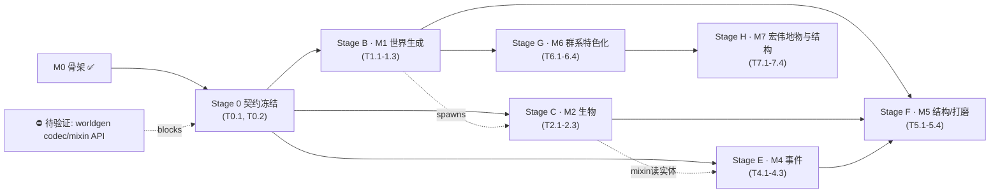

# 土卫六 (Titan Satellite) — 总任务表 (Master Task Plan)

> 源 / Source: [设计案 titan_technical_design.md](titan_technical_design.md)（Stage 1 设计）· 现状 [titan_project_structure.md](titan_project_structure.md)。
> 平行执行编排见 [平行任务表 parallel-tasks.md](parallel-tasks.md)。
> 范围: **M1–M5**（M0 骨架已完成并 `runServer` 实测）。
> 状态: ☐ todo · ◐ 进行中 · ☑ 完成 · ⛔ 阻塞。复杂度 **S / M / L**。**不给时间估算**（用复杂度 + 依赖表达工作量）。
> 世界生成路线（已定）：**数据驱动** = 继承 `NoiseBasedChunkGenerator` + 自定义 `noise_settings`/`density_function` + `multi_noise` 群系源；worldgen 差异集中在数据文件，天然可多 agent 并行。

---

## 里程碑 (Milestones)

| 里程碑 | 交付物（可验证状态） | 阶段 |
|---|---|---|
| M0 | 工程骨架：Stonecutter/Loom 构建通、主类加载、方块/物品/流体/示例实体注册、维度可进入且基础方块/液体可替换（**已完成，已实测**） | Stage 0 之前 |
| M1 | 世界生成：五大群系 `multi_noise` 分层 + 自定义 `noise_settings`（0–320 极端高差、**破碎感地形/悬崖峧壁**）+ 关键特征（甲烷湖/陨石坑/沙脊/天坑/晶簇） | Stage B |
| M2 | 生物：冰硜甲虫/氨泉掠食者/失控探测器 三种完整 AI、属性、渲染、生成规则与掉落（甲烷浮游体 M0 已有） | Stage C |
| ~~M3~~ | ~~环境系统~~ **（已取消，见 CR-5：低重力/缺氧/极寒生存、保暖/供氧装备、Capability、HUD、伤害类型全部移除）** | — |
| M4 | 事件玩法：喷泉击飞、甲烷开采塔防（自定义事件 + Mixin 刷怪）、晶洞惊扰 | Stage E |
| M5 | 结构与打磨：晶洞/前哨站结构、维度天空雾特效、流体完善、音效、平衡与验收 | Stage F |
| M6 | 群系特色化：修复气候 router（六群系真正分布）+ 3 新表层块（风化/沉积泰坦石、树枝结晶）+ 新群系荒芜高原 + 群系专属地形/地物（裂隙/甲烷海/真陨石坑/破碎海绵/嵌套冰火山）+ 特征注入（add_features） | Stage G |
| M7 | **宏伟地物与结构**：6 群系宏伟地物（乙炔大晶洞/液甲烷倾瀑/撞击盆地/镜湖群/托林巨拱/丝网谷/悬冰大殿/主冰火山/冻氨瀑/石林迷城）+ 4 宏伟结构（深钻者/坠毁残骸/大巢/深空信标阵）+ 2 新方块（乙炔冰笋/托林菌网） | Stage H |

> **契约冻结（Stage 0 / Stage A）** 是使 M1–M5 能并行的前置：所有跨任务注册项、命名、接口、lang、事件签名一次性冻结，之后各里程碑只读。

---

## Stage 0 · 契约冻结与脚手架 → 支撑 M1–M5

| ID | 任务 | Cx | Deps | 验收标准 | Files |
|---|---|---|---|---|---|
| ☑ T0.1 | 全注册与装配冻结：声明 M1–M5 全部方块/物品/实体/流体/生物效果/方块实体的 `RegistryObject`（指向桩类）；主类 wiring；全部 lang；客户端渲染器注册（指向桩） | L | agent1 | `build` 通过；`runServer` Done、所有注册项以桩存在；`runClient` 到标题页不崩 | `registry/TS*.java`, `TitanSatellite.java`, `block/*`, `entity/*`, `item/*`, `client/*Renderer.java`+`TitanClientEvents.java`, `lang/*.json` |
| ☑ T0.2 | 系统与 worldgen 类型脚手架：worldgen 自定义类型注册（DensityFunction/Feature/Structure codec）+ 桁类；`MethaneExtractionWaveEvent`；Mixin 配置 + 插件；`is_titan` 群系标签（~~环境 Capability 接口 + 附加~~、~~`damage_type` 数据~~ 已随 **CR-5** 移除） | M | — | 编译通过；event/mixin 骨架就位、自订阅不需改主类；`is_titan` 标签加载无误 | `worldgen/**`（类型注册+桁）, `event/*`, `mixin/*`, `data/.../tags/worldgen/biome/is_titan.json` |

**Gate 0**：`:1.20.1-forge:build` + `runServer` Done（全注册项以桩加载）+ `runClient` 到标题页。

## Stage 1 · M1 世界生成（数据驱动）

| ID | 任务 | Cx | Deps | 验收标准 | Files |
|---|---|---|---|---|---|
| ☑ T1.1 | 五群系 biome JSON + `multi_noise` 维度：`methane_abyss/cratered_wastelands/tholin_dune_sea/polar_labyrinth/cryovolcanic_cliff`，各含气候参数、效果色、生成特征引用（冻结 ID）；`dimension/titan.json` 改 `fixed→multi_noise`；`dimension_type` 调优 | M | T0.1,T0.2 | 5 群系加载；维度按 `multi_noise` 分布群系；进游戏能定位到各群系 | `data/.../worldgen/biome/*.json`, `data/.../dimension/titan.json`, `data/.../dimension_type/titan.json` |
| ☑ T1.2 | 自定义 `noise_settings` + density functions（极端高差 0–320、**破碎感/悬崖峧壁**）+ 按群系 `surface_rule`；填充 `BiomeHeightDensityFunction`（群系影响地形高度） | L | T0.1,T0.2 | 地形体现峡谷/沙丘/断崖高差、**明显悬崖峧壁破碎感**；各群系地表方块正确 | `data/.../worldgen/noise_settings/titan.json`, `data/.../worldgen/density_function/*.json`, `worldgen/density/BiomeHeightDensityFunction.java` |
| ☑ T1.3 | 特征：甲烷湖/陨石坑/巨型沙脊/冰层天坑/发光晶簇 → `configured_feature`+`placed_feature` + `forge:add_features` biome_modifier 注入 `#is_titan`（CR-4；biome JSON 不引用特征） | M | T0.1,T0.2 | 各特征经 biome_modifier 注入并生成 | `data/.../worldgen/configured_feature/*.json`, `placed_feature/*.json`, `data/.../forge/biome_modifier/*.json`, `worldgen/feature/*.java` |

**Gate 1**：`runServer` → `execute in titan_satellite:titan` 探测：5 群系存在、高差地形与悬崖峧壁破碎感、按群系地表、特征生成。

## Stage 2 · M2 生物

| ID | 任务 | Cx | Deps | 验收标准 | Files |
|---|---|---|---|---|---|
| ☑ T2.1 | 冰硅甲虫 Cryo-Scavenger（中立）：AI/属性/渲染/模型/贴图/掉落/生成（`biome_modifier`）/生成放置 | M | T0.1（生成验证软需 M1） | summon 正常、AI 正确、受击反击、掉落、生成于 titan 群系 | `entity/CryoScavenger.java`, `client/CryoScavengerRenderer.java`(+model/texture), `data/.../loot_tables/entities/cryo_scavenger.json`, `data/.../forge/biome_modifier/cryo_scavenger_spawn.json`, 生成放置注册文件 |
| ☑ T2.2 | 氨泉掠食者 Ammonia-Stalker（敌对，攻击附毒） | M | T0.1（同上） | 两栖、攻击中毒、掉落毒性腺体、生成于冰区 | 同构（各自独占文件） |
| ☑ T2.3 | 失控探测器 Corrupted-Probe（敌对，激光）：远程即时激光光束 | M | T0.1（同上） | 发射激光光束、掉落电池/元件、生成于遗迹附近 | 同构 + 即时光束攻击（不建弹射物实体，见 CR-1） |

**Gate 2**：summon 三种生物 AI/掉落正常；且在 M1 群系内自然生成（需 Gate 1）。

## ~~Stage 3 · M3 环境系统~~（已取消，见 CR-5）

> **CR-5 移除**：低重力/缺氧/极寒生存、保暖/供氧装备、体温/氧气 Capability、HUD、相关伤害类型全部按设计修正取消。原 T3.1（低重力）、T3.2（缺氧/极寒 Capability + 伤害）、T3.3（HUD + 装备）作废。土卫六的极寒/无氧/低重力仅作背景设定与视觉氛围（大气雾特效见 T5.2）。

## Stage 4 · M4 事件玩法

| ID | 任务 | Cx | Deps | 验收标准 | Files |
|---|---|---|---|---|---|
| ☑ T4.1 | 冰火山喷泉击飞：`CryovolcanicGeyserBlock` 周期喷发、踩上击飞 + 粒子音效 | M | T0.1 | 站上喷发被击飞、可垂直跨越高差 | `block/CryovolcanicGeyserBlock.java`（已填充）, 原版粒子（CR-2） |
| ☑ T4.2 | 甲烷开采塔防：core+pump 方块实体状态机 + 波次刷怪（post `MethaneExtractionWaveEvent`）+ Mixin 定制刷怪 | L | T0.1,T0.2（事件/mixin）, 软需 M2 生物 | 泵放于核心上激活→波次来袭→保护泵→成功产出/失败重置 | `block/MethanePoolCoreBlock.java`,`block/SpecialMethanePumpBlock.java`(+BE), `event/*`（波次逻辑）, `mixin/*WaveSpawnMixin.java` + `mixins.json`(加条目) |
| ☑ T4.3 | 晶洞惊扰：破坏 `TholinCrystalBlock` 概率放毒气 + 唤醒潜伏怪 | M | T0.1（晶体/效果） | 破坏晶体→毒气云+惊醒附近敌对 | `block/TholinCrystalBlock.java`（填充）, `event/TholinCrystalDisturbedEvent.java`（用户要求的可自定义 Forge 事件） |

**Gate 4**：放泵→波次刷怪（Mixin 生效）；喷泉击飞；破坏晶体→毒气+惊怪。

## Stage 5 · M5 结构与打磨（整合/收尾）

| ID | 任务 | Cx | Deps | 验收标准 | Files |
|---|---|---|---|---|---|
| ☑ T5.1 | 结构：托林晶洞、废弃先驱前哨站（低权重）→ `structure`+`structure_set`+模板池+`has_structure` 标签 | L | M1 | 结构在对应群系生成、内含战利品/探测器 | `data/.../worldgen/structure/*`, `structure_set/*`, `template_pool/*`, `tags/.../has_structure/*`, `worldgen/structure/*`（如需） |
| ☑ T5.2 | 维度天空/雾特效：`DimensionSpecialEffects`（浓橙雾）+ `ViewportEvent` 雾色 | M | T0.1 | 进维度呈橙黄浓雾、低能见度 | `client/TitanDimensionEffects.java`, `client/FogHandler.java` |
| ☑ T5.3 | 流体完善 + 音效 + 本地化打磨：甲烷/氨交互、`sounds.json` + 音效事件 | M | T0.1 | 流体交互合理、关键动作有音效 | `assets/.../sounds.json`, `fluid/TitanFluidInteractions.java`, `fluid/TitanSounds.java` |
| ☑ T5.4 | 平衡 + 验收测试矩阵 + DoD | M | M1–M4,T5.* | 全流程 `runClient` 通关、测试矩阵勾齐 | `docs/*`（测试矩阵）, config 文件 |

**Gate 5 / DoD**：完整 `runClient` 通关；结构生成；天空雾；全系统联动。

## Stage 6 · M6 群系特色化（前置：Gate B）

> 修复两个根因（气候 router 全 0 → 实际单群系；无 add_features → 特征不自然生成），并叠加新块/新群系/群系专属地形地物。T6.1 冻结新块 id 后 T6.2/6.3/6.4 可并行。

| ID | 任务 | Cx | Deps | 验收标准 | Files |
|---|---|---|---|---|---|
| ☑ T6.1 | 3 新表层块（`weathered_titan_stone`/`sedimentary_titan_stone`/`branch_crystal`）+ 六群系中文显示名 lang（土卫六·前缀） | M | Gate B | 3 块注册/模型/BlockItem/lang 就位；6 群系显示名带前缀；build 通过 | `registry/TSBlocks.java`,`TSItems.java`（CR 扩展 PA-1 冻结）, `lang/*.json`, 新块 `models/*`+`blockstates/*` |
| ☑ T6.2 | 修复气候 router（六群系分布）+ 气候参数重排 + 新群系 `barren_plateau` + 冰火山嵌套极地中心 + `surface_rule` 接新表层块 | L | Gate B, T6.1(块 id) | 进 titan 六群系真正分布、各群系表层块正确、冰火山落在极地中心区 | `noise_settings/titan.json`, `dimension/titan.json`, `biome/*.json`+`biome/barren_plateau.json`, `tags/.../is_titan.json`, 气候 `density_function/*.json` |
| ☑ T6.3 | 地形深化：增强 `BiomeHeightDensityFunction`（台地项/陡边缘/破碎起伏） | M | Gate B | 荒芜高原台地、群系间陡峭过渡、破碎起伏 | `worldgen/density/BiomeHeightDensityFunction.java`, `density_function/titan_relief.json`,`titan_final_density.json` |
| ☑ T6.4 | 群系专属特征 + 注入修复：新 `fissure`/`methane_mare`/`branch_crystal`/`sponge_cave` + 改进 `giant_crater`(坑缘)/`ice_sinkhole`(增大)；每群系 `forge:add_features` biome_modifier 限定注入 | L | Gate B, T6.1(块 id) | 各特征只在对应群系自然生成（非 /place）；裂隙底甲烷、甲烷海、破碎海绵、真陨石坑成型 | `worldgen/feature/*.java`, `TSWorldgenTypes`（CR 扩展 PA-2）, `configured_feature/*`,`placed_feature/*`, `forge/biome_modifier/*_features.json`, 每群系 `tags/.../*` |

**Gate 6**：进入 titan → 六群系可定位、各群系专属表层块与地物、冰火山位于极地中心区、荒芜高原台地与陡峭过渡、特征经 add_features 自然生成（非 /place）。

## Stage 7 · M7 宏伟地物与结构（前置：Gate 6）

> 在现有生态/地物/结构系统上叠加**复杂/大型/宏伟**地标。**地物** = 纯地形 Feature（无宝箱）；**结构** = `StructureType` + 宝箱。T7.1 冻结 2 新方块 id 后 T7.2–T7.4 可并行。参见 [titan_design.md](titan_design.md) §一「宏伟地物」/§6.2「宏伟结构」/§七 矩阵。

| ID | 任务 | Cx | Deps | 验收标准 | Files |
|---|---|---|---|---|---|
| ☑ T7.1 | 2 新方块冻结：**乙炔冰笋 `acetylene_spire`**（易爆高能晶柱，采「凝乙炔」）+ **托林菌网 `tholin_mycelium`**（分解者/巢壁）；注册 + 纯色占位贴图/模型 + BlockItem + lang（中英） | M | Gate 6 | 2 块注册/模型/BlockItem/lang 就位；build 通过；`runClient` 可见占位色 | `registry/TSBlocks.java`,`TSItems.java`, 生成 `blockstates/models/lang`, `textures/block/*` |
| ☑ T7.2 | 宏伟地物 · 深渊 + 陨坑：**乙炔大晶洞**（乙炔冰笋+深渊晶簇，近火爆）、**液甲烷倾瀑**、**陨星撞击盆地**（放大 `GiantCraterFeature` + 陨铁矿核 + 辐射脊线）、**陨坑镜湖群** → Feature + configured/placed + `add_features` biome_modifier | L | T7.1 | 各地物只在对应群系自然生成（非 /place）；矿核可挖、无悬浮 | `worldgen/feature/*.java`, `configured_feature/*`,`placed_feature/*`, `forge/biome_modifier/*_features.json` |
| ☑ T7.3 | 宏伟地物 · 沙海/极地/冰火山/荒原：**托林天生巨拱**、**丝网谷**（+织体蛛生成加权）、**悬冰大殿**（中空冰穹）、**主冰火山**（锥+口湖+喷泉 patch）、**冻氨巨瀑**、**石林迷城** → Feature + 配置 + 注入 | L | T7.1 | 各地物自然生成、依真实地表建造（无悬浮，遵 repo 地物防悬浮约定） | 同构（各自 Feature/配置/biome_modifier） |
| ☑ T7.4 | 宏伟结构：**深钻者**（深渊甲烷海据点+泵突袭）、**坠毁研究探测器残骸**（陨坑）、**大巢**（极地，扩展 `tholin_geode` 多腔 Boss 地牢）、**深空信标阵**（荒原）→ `StructureType`/`StructurePiece` + `structure_set`(低权重) + 宝箱 `loot_tables/chests` + 守卫/Boss 生成 | L | T7.1, 软需 现有结构/波次系统 | `/place structure` 无崩、`/locate structure` 命中；含宝箱战利品 + 守卫/Boss；深钻者可触发波次 | `worldgen/structure/*.java`, `data/.../structure/*`,`structure_set/*`, `tags/.../has_structure/*`, `loot_tables/chests/*` |

**Gate 7**：进入 titan → 各群系宏伟地物自然生成（非 /place、无悬浮）；4 宏伟结构 `/locate` 命中且内含战利品/守卫/Boss；乙炔冰笋近火连锁爆炸、大巢破晶惊巢。

---

## 依赖图 (Dependency Graph)

> 注：**Stage D · M3 环境系统已取消（CR-5）**，不再出现于依赖图。

**关键路径**：`M0 → Stage 0 → Stage B(M1) → Stage F(M5)`（世界生成→结构依赖它；生物/事件为并行支线）。

---

## 阻塞研究 / 待验证 (Blocking Research / To-Verify)

| ID | 项 | 阻塞 | 解决方式 |
|---|---|---|---|
| ⛔ R1 | 1.20.1 自定义 `DensityFunction`/`Feature`/`StructureType` 的 codec 返回类型（`Codec` vs `MapCodec` vs `KeyDispatchDataCodec`） | T0.2,T1.2,T1.3,T5.1 | 读 refs（Bumblezone 笔记 §2/§10）+ 反编译对照 `ChunkGenerator#codec()` 等签名 |
| ~~R2~~ | ~~1.20.1 Forge Capability API~~（CR-5 移除环境系统后不再需要） | — | 作废 |
| ⛔ R3 | Mixin 刷怪注入点（`NaturalSpawner`/自定义刷怪逻辑）在 1.20.1 稳定性 | T4.2 | refs Mixin 笔记；优先自订刷怪逻辑再决定是否 Mixin |
| ⛔ R4 | `multi_noise` 五群系气候参数覆盖（temperature/humidity/…/depth/weirdness）不重叠 | T1.1 | Bumblezone/vanilla 参数对照，进游戏逐群系定位验证 |
| ⛔ R5 | Jigsaw 结构模板池/NBT 在 1.20.1 数据格式 | T5.1 | refs Bumblezone §10.3；vanilla 结构对照 |

## 风险登记 (Risk Register，源自设计 §9 + refs)

| 风险 | 级别 | 缓解 | 相关任务 |
|---|---|---|---|
| worldgen codec 类型/版本不匹配导致注册失败 | H | R1 先行；类型注册集中 T0.2，签名冻结 | T0.2,T1.2 |
| `dimension_type` 与 `noise_settings` 的 min_y/height 不一致 | M | 已知（M0 已对齐 0/320）；T1.2 保持一致 | T1.2 |
| IntProvider/数据 JSON 严格格式（如需嵌套 `value`） | L | M0 已踩坑并记录；沿用基准对照法 | T1.* |
| ~~Capability 跨 reload/多世界一致性~~（CR-5 移除） | — | — | — |
| Mixin 刷怪注入点跨版本脆弱 | M | 优先 Forge 事件/自订逻辑，Mixin 仅兜底；集中一个 mixin | T4.2 |
| 结构 Jigsaw 复杂度高 | M | R5；先低权重简单结构跑通再迭代 | T5.1 |
| 客户端 `DimensionSpecialEffects` 注册总线放错 | M | refs Shader/Sky 笔记（mod 总线 vs Forge 总线） | T5.2 |
| 气候 router 赋噪声后六群系分布/过渡需反复进游戏调参 | M | 参考 vanilla overworld router；逐群系 locate 验证；迭代 | T6.2 |
| 冰火山“极地中心”为概率近似、非严格 | L | 气候嵌套；接受近似（用户已确认） | T6.2 |
| 同阶段任务改同一文件 → 冲突 | H | 见平行任务表 §2 冻结 + §6 文件归属矩阵 | 全部 |

## 完成定义 (Definition of Done)

- ☐ M1：进入 `titan_satellite:titan`，五大群系按 Y/坐标分层、极端高差地形、**悬崖峧壁破碎感**、关键特征生成。
- ☐ M2：三种生物完整 AI/属性/渲染/掉落，且在对应群系自然生成。
- ~~M3~~：环境系统已取消（CR-5），无对应验收项。
- ☐ M4：甲烷开采塔防波次可玩（含 Mixin 刷怪）；喷泉击飞；晶洞惊扰。
- ☐ M5：晶洞/前哨站结构生成；橙黄天空雾；流体/音效/本地化完善；平衡验收。
- ☐ M6：六群系真正分布（非单一群系）；各群系专属表层块与地物；冰火山在极地中心；荒芜高原台地陡峭过渡；特征经 add_features 自然生成。
- ☐ 质量：`:1.20.1-forge:build` 通过；`runClient`/`runServer` 无异常；docs（设计/结构/任务）互相一致且更新。

> 建议顺序：先交付 **Stage 0 冻结**，再并行推进 B/C/E（世界生成为关键路径优先；Stage D 已取消），随后 Stage G 群系特色化（Gate B 后即可，与 F 并行），最后 Stage F 整合打磨。
