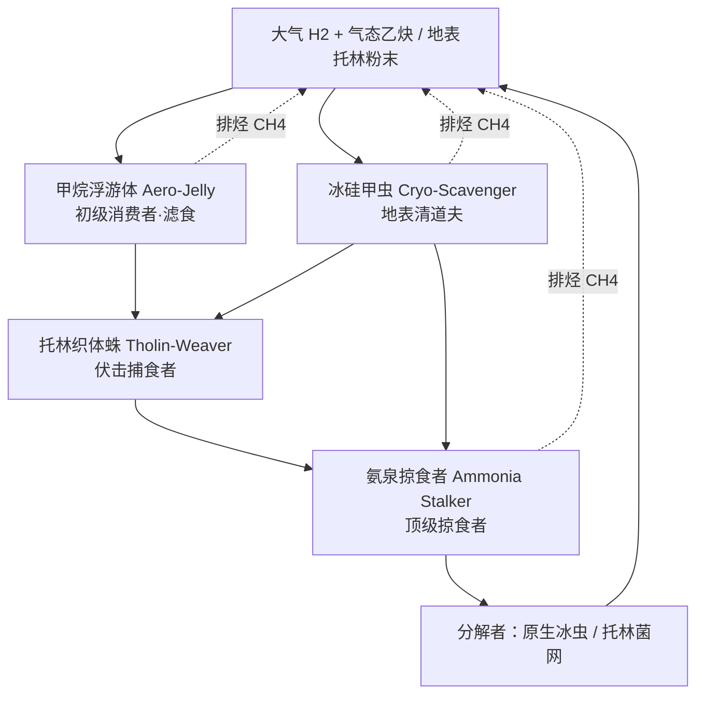
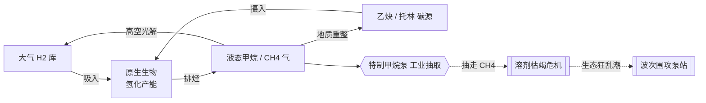

# 土卫六 (Titan) 维度最终设计方案
# Titan Dimension Final Design Document
*基于 Minecraft 1.20.1 整合包的维度设计*
*Dimension design for Minecraft 1.20.1 modpack*

本设计方案结合了现实中土卫六（Titan）的地质特征与 Minecraft 1.20.1 的维度定制特性，构建了一个具有极大高度差和深度冒险玩法的极端维度。
This design document combines Titan's real-world geological features with Minecraft 1.20.1 custom dimension capabilities to create an extreme dimension with massive elevation changes and deep adventure mechanics.

> 技术实现方案（注册项、数据驱动 worldgen、事件/Mixin 接入点、工程结构与里程碑）见配套文档：[titan_technical_design.md](titan_technical_design.md)。
> Technical implementation (registries, data-driven worldgen, event/Mixin hooks, project structure and milestones): see [titan_technical_design.md](titan_technical_design.md).

> 📌 **本文档已合并原「生态与代谢扩展设计」**（生物 / 植物 / 代谢链 Lore / 生态事件），现为该维度的**唯一综合设计文档**。工程任务见 [task-plan.md](task-plan.md)（总任务表，含 M7 宏伟地物与结构）与 [titan_ecosystem_tasks.md](titan_ecosystem_tasks.md)（生态深化）。
> This document now **absorbs the former ecosystem & metabolism design** (fauna / flora / metabolic-chain lore / ecological events) and is the single consolidated design doc. Tasks: [task-plan.md](task-plan.md) (incl. M7 grand landmarks) and [titan_ecosystem_tasks.md](titan_ecosystem_tasks.md).

---

## 〇、 维度基础参数 (Base Dimension Parameters)

*   **重力 (Gravity):** 采用普通重力（不改变玩家重力/跳跃/降落）。土卫六低重力仅作背景设定，不作玩法机制。 / Normal gravity (no player gravity/jump/fall changes). Titan's low gravity is background lore only, not a gameplay mechanic.
*   **温度与空气 (Temperature & Oxygen):** 极寒（-179°C）、无氧的橙黄大气仅作**环境氛围**（冷色群系、冰/甲烷地貌），**不再有需装备抵御的极寒/缺氧生存机制**。 / Extreme cold (-179°C) and the anoxic orange atmosphere are environmental ambiance only (cold biomes, ice/methane terrain); there is no cold/oxygen survival mechanic requiring gear.
*   **光照与天气 (Lighting & Weather):** 浓厚的橙黄色大气层，地表光照极低。普通降雨替换为“液态甲烷雨”。 / Dense orange haze, very low surface light. Normal rain is replaced with "Liquid Methane Rain."
*   **高度限制 (Build Limit):** Y = 0 至 Y = 320。
*   **溶剂与代谢 (Solvent & Metabolism) 〔Lore〕:** 液态甲烷 (CH₄) 取代水，成为原生生命的生化溶剂；生物吸入大气 H₂、氢化托林/乙炔取能、排出甲烷——**纯设定参考，不实装生化机制，详见 §四**。 / Liquid methane replaces water as the biochemical solvent; natives hydrogenate tholin/acetylene with atmospheric H₂ and exhale methane — lore only, no biochemistry simulated; see §四.

---

## 一、 地形与群系分布 (Terrain & Biomes)

> **地形基调 (Terrain tone):** 整体追求强烈的**破碎感**——悬崖峧壁、断层、陡坡与孤峰交错，避免平缓过渡；配合 0–320 的极大高差营造险峻、可垂直探索的地貌。 / Overall a strongly **fragmented** terrain — cliffs, precipices, fault scarps, steep slopes and isolated spires, avoiding smooth transitions; combined with the 0–320 elevation range for a rugged, vertically-explorable landscape.

> **群系分布机制 (Biome distribution):** 六大群系由 `multi_noise` 的气候噪声（temperature/humidity/continentalness/erosion/weirdness/depth）铺开；各群系专属表层方块由 `surface_rule` 决定，专属地物由按群系限定的 Feature 注入。**冰火山断崖为极地迷宫冰原内部中心的稀有子区域**。 / Six biomes spread by multi_noise climate fields; per-biome surface blocks via surface_rule, per-biome landmarks via biome-limited features. The Cryovolcanic Cliffs is a rare sub-region nested at the center of the Polar Labyrinths.

### 1. 土卫六·液态甲烷深渊 (Titan · Methane Abyss) [Y: 0 - 32]
由**沉积泰坦石 (sedimentary_titan_stone)** 构成的陡峭峡谷地带。地表遍布**大量碎裂的裂隙**（形似缩小的老版本峡谷），裂隙底部积存着液态甲烷。
Steep canyon terrain of sedimentary titan stone; the surface is riven with **numerous fractured fissures** (like smaller legacy ravines), with liquid methane pooling at their bottoms.
*   **特异地貌 (Special Feature):** **甲烷海 (Methane Mare)**。大面积地表整体坡陷至海平面以下、被液态甲烷彻底淹没，形成开阔的甲烷之海（类似巨型天坑式的地表移除）。 / Vast stretches of surface collapse below sea level and are completely flooded by liquid methane (large sinkhole-like surface removal).
*   **装饰地物 (Decorations):** 沉积巨石/玄武巨石、深渊晶簇 (abyss_crystal)、焦油洼 (tholin_tar)、沉积石柱、甲烷晶洞。 / Sediment & basalt boulders, abyss-crystal clusters, tholin-tar seeps, sediment columns, and methane geodes.
*   **宏伟地物 (Grand Features):** **乙炔大晶洞 (Great Acetylene Geode)**——岩壁上的巨型发光空洞，密布乙炔冰笋（新方块 ⬜）与深渊晶簇，近火源连锁爆炸；**液甲烷倾瀑 (Methane Cascade)**——从高处裂隙倾泻入甲烷海的液甲烷瀑布。 / Great Acetylene Geode — a huge glowing wall-cavern of acetylene ice spires + abyss crystals, chain-explosive near fire; Methane Cascade — liquid methane pouring from a high fissure into the mare.

### 2. 土卫六·撞击陨坑荒原 (Titan · Cratered Wastelands) [Y: 64 - 80]
由**风化泰坦石 (weathered_titan_stone)** 构成的冰冻荒原。地表零散分布着**树枝状结晶 (branch_crystal)** 丛，如冻结的枝杉。
Frozen wastelands of weathered titan stone, dotted with **branching crystal (branch_crystal)** growths like frozen twigs.
*   **特异地貌 (Special Feature):** **巨型陨石坑 (Giant Craters)**。带**凸起坑缘**的真实陨石坑轮廓（碗形凹陷 + 抬升的环形边缘）；坑底**小概率**露出微型甲烷湖。 / Realistic impact craters with **raised rims**; the crater floor **rarely** exposes a miniature methane lake.
*   **装饰地物 (Decorations):** 霜枯灌木 (frost_bush)、冰/风化巨石、陨铁矿脉 (meteor_fragment)、碎冰碎屑场、陨坑晶洞。 / Frost bushes, ice & weathered boulders, meteor-fragment veins, crushed-ice regolith patches, and crater geodes.
*   **宏伟地物 (Grand Features):** **陨星撞击盆地 (Great Impact Basin)**——远大于普通陨石坑的超级盆地，中央半埋可开采的陨铁矿核 + 向外数百格的辐射溅射脊线；**陨坑镜湖群 (Crater Mirror Lakes)**——相连的液甲烷坑湖链。 / Great Impact Basin — a mega-crater with a half-buried mineable meteorite core and radial ejecta ridges; Crater Mirror Lakes — a chain of linked methane crater-lakes.

### 3. 土卫六·托林沙海 (Titan · Tholin Dune Seas) [Y: 64 - 80]
广阔的橙色托林沙丘区，表面覆盖着托林有机化合物粉末（**tholin_sand**）。
Vast orange dune fields covered in powdery tholin organics.
*   **特异地貌 (Special Feature):** **巨型沙脊 (Megayardangs)**。高墙般狭长的风蚀山脊，配合连绵起伏的沙丘。 / Wall-like, long, narrow wind-eroded ridges amid rolling dunes.
*   **装饰地物 (Decorations):** 托林灌木 (tholin_shrub)、硬托林结壳 (hardened_tholin)、岩石露头、托林风柱、托林晶洞。 / Tholin shrubs, hardened-tholin crust patches, rock boulders, tholin wind-spires, and tholin geodes.
*   **宏伟地物 (Grand Features):** **托林天生巨拱 (Great Tholin Arch)**——横跨沙谷、可攀爬穿行的巨型风蚀天生桥（`hardened_tholin`）；**丝网谷 (Silk-Shroud Canyon)**——挂满托林丝网的峡谷，托林织体蛛群落聚居（靠生成加权，非结构/宝箱）。 / Great Tholin Arch — a colossal wind-carved natural land-bridge; Silk-Shroud Canyon — a web-draped canyon dense with tholin-weavers (spawn-weighted, not a structure).

### 4. 土卫六·极地迷宫冰原 (Titan · Polar Labyrinths) [Y: 160 - 200]
地势急剧抬升的甲烷浮冰（**packed_methane_ice**）迷宫。**地表向下数格后即化为巨型的破碎海绵**——密布空洞的多孔冰体。
Sharply rising labyrinths of packed methane ice. **A few blocks below the surface it turns into a giant shattered sponge** — porous ice riddled with cavities.
*   **特异地貌 (Special Feature):** **巨型冰层天坑 (Ice Sinkholes)**。巨大的冰窟竆直通下层地形。 / Massive ice sinkholes dropping straight to lower terrain.
*   **装饰地物 (Decorations):** 冰刺、甲烷冰花 (methane_ice_bloom)、碎冰斑块、极地晶洞、寒冰巨石、地表晶簇。 / Ice spikes, methane ice-blooms, crushed-ice patches, polar geodes, cryo boulders, and surface crystal clusters.
*   **宏伟地物 (Grand Features):** **悬冰大殿 / 冰晶穹顶 (Suspended Ice Cathedral)**——巨型中空冰穹，教堂式冰刺立柱 + 甲烷冰花（连锁爆炸）+ 殿底冰下甲烷湖。 / Suspended Ice Cathedral — a giant hollow ice dome with cathedral-like spike-columns, methane ice-blooms, and a subglacial methane lake.

### 5. 土卫六·冰火山断崖 (Titan · Cryovolcanic Cliffs) [Y: 280 - 320]
由寒冰（**cryo_ice**）构成的极度险峭的垂直断崖，**仅生成于极地迷宫冰原的中心区域**、被极地群系环绕。
Extremely steep vertical cliffs of cryo ice, generating **only at the center of the Polar Labyrinths**, encircled by the polar biome.
*   **特异地貌 (Special Feature):** **冰火山喷泉群 (Cryovolcanic Geysers)** 与山巅的**氨水火山口 (Ammonia Calderas)**。 / Clusters of cryovolcanic geysers and ammonia calderas at the peaks.
*   **装饰地物 (Decorations):** 氨泉 (liquid_ammonia)、氨晶簇 (ammonia_crystal)、氨晶洞、寒冰尖峰、寒冰巨石、稀疏霜枯灌木。 / Ammonia pools, ammonia-crystal clusters, ammonia geodes, cryo pinnacles, cryo boulders, and sparse frost bushes.
*   **宏伟地物 (Grand Features):** **主冰火山「白喉」(The Prime Cryovolcano)**——群系皇冠：中央巨型冰火山锥 + 山巅氨水火山口湖 + 满山喷泉，可借喷泉击飞垂直登顶、峰顶采氨晶/资源；**冻氨巨瀑 (Frozen Ammonia Falls)**——沿断崖倾泻的冻结氨瀑。 / The Prime Cryovolcano — a towering central cryovolcano with a summit ammonia caldera lake and geyser-lift ascent; Frozen Ammonia Falls.

### 6. 土卫六·荒芜高原 (Titan · Barren Plateau) [Y: 150 - 200]（新增 / New）
由**风化泰坦石 (weathered_titan_stone)** 构成的高耸台地。地质类似极地迷宫冰原，但**空洞区域极少出现**、地层坚实。与相邻群系之间以**极其陡峭的断崖**过渡。
Towering plateaus of weathered titan stone. Geologically similar to the Polar Labyrinths but with **very few cavities** and solid strata; transitions to neighboring biomes are **extremely steep escarpments**.
*   **装饰地物 (Decorations):** 风化巨石、风化石林、稀疏霜枯灌木、砾石场 (titan_gravel)、稀有结晶、稀疏矿脉。地表装饰为主、地下稀少，呼应“地层坚实”。 / Weathered boulders, weathered hoodoos, sparse frost bushes, titan-gravel pebble fields, rare crystals, and a sparse ore vein — surface-focused, keeping the solid strata.
*   **宏伟地物 (Grand Features):** **石林迷城 (The Hoodoo Labyrinth)**——巨型风化石林组成的天然迷宫（`weathered_titan_stone`）。 / The Hoodoo Labyrinth — a maze-forest of giant weathered hoodoos.

---

> 📌 **状态说明 (Status note):** 本文 §二–§八（生态 / 生物 / 代谢 / 事件）由原「生态与代谢扩展设计」合并而来；各分节内的 🟡/⬜/✅ 为**设计期标注**，**权威实现状态以 §八「实现状态总览」表为准**（多数生态项已 ✅ 落地）。图例：✅ 已实现 · 🟡 部分实现 · ⬜ 规划中 · 🚫 仅 Lore 不实装。

## 二、 群系植物相与初级生产者 (Flora & Primary Producers)

土卫六的「植物」由结晶体、有机高分子与化能菌群构成——**无叶绿素，靠化能/吸附**。

### 2.1 树枝状结晶 (Branch Crystals) 🟡
*   **群系:** 撞击陨坑荒原。**硅基植物**，根系吸收陨石带来的异星无机盐。
*   **已实现:** 方块 `branch_crystal`（十字发光装饰、无碰撞、承托检测 `has_sturdy_face` 防悬空）+ worldgen `branch_crystal.json`（陨坑群系注入）+ 镐采「晶化枝条 (Crystalline Twig)」（C3）。

### 2.2 霜枯灌木 & 托林灌木 (Frost Bushes & Tholin Shrubs) 🟡
*   **群系:** 陨坑荒原/荒芜高原（霜枯）；托林沙海（托林灌木）。**硅基**，节肢状固态多聚物触须；托林灌木长年吸附空气中的橙色托林粉末。
*   **已实现:** 方块 `frost_bush`、`tholin_shrub`（十字装饰）+ worldgen `frost_bush`、`tholin_shrub_patch` + 减速/剪采「托林纤维 (Tholin Fibre)」（C2）。

### 2.3 甲烷冰花 (Methane Ice Blooms) ✅
*   **群系:** 极地迷宫冰原。**碳基（类珊瑚）**，多孔冰体空洞表面的半透明花簇。
*   **已实现:** 方块 `methane_ice_bloom`（十字发光装饰）+ worldgen `ice_bloom_patch` + **火源检测连锁爆炸**（`randomTick` 扫邻域 → `level.explode` + 连锁引燃，C1 实测三株链爆）。

### 2.4 〔扩充〕新增初级生产者 (New Primary Producers) ✅
*   **乙烔冰笋 (Acetylene Ice Spires):** 深渊/裂隙壁生长的高能乙烔富集晶柱，采集得「凝乙烔」（燃料/合成）。与甲烷海相邻，靠近火源同样易爆。**（M7 深渊「乙烔大晶洞」宏伟地物的构成方块。）** **已实现:** `acetylene_spire`（发光方块）+ `AcetyleneSpireBlock` **近火剧烈连锁爆炸**（`randomTick`/`neighborChanged` 检测火源/着火实体 → `explode` 当量 2.4、高于甲烷冰花 + 沿晶脉 `scheduleTick` 链爆）。
*   **氢泡菌毯 (Hydrogen Bubble Mats):** 荒原低洼处的化能菌毯，随机刻缓释 H₂ 气泡（`#minecraft:fire` 邻接 → 轻微轰燃），为浮游体/蹒兽提供食源。**已实现:** `hydrogen_bubble_mat` 方块 + `HydrogenBubbleMatBlock`（`randomTick` 释放 H₂ 气泡粒子；近火**轻微轰燃**当量 1.0 + 链爆）+ worldgen（陨坑荒原 / 荒芜高原 `random_patch` 生成）+ 氢营养蹒兽啼食（§3.7）。
*   **托林菌网 (Tholin Mycelium):** 巢穴/洞穴内的分解者菌网，把生物残渣重整回托林——生态循环的「分解者」一环，也是冰虫巢穴/大巢的「生物有机壁」。**已实现:** `tholin_mycelium` 方块 + `TholinMyceliumBlock`（`randomTick` 散孢子 + 消解上方 1 格内本维度生物残渣掉落物，缓慢重整回托林）。

---

## 三、 特色生物群与食物网 (Fauna & Food Web)

> 各物种的**代谢特化** + 实装状态。食物网已由 **Lore + 分营养级刷怪** 深化为**运行时行为**：捕食者按 §3.1 能量流锁定下位物种（织体蜉猎浮游体 / 冰硅甲虫，氨泉掠食者猎织体蜉 / 冰硅甲虫），初级消费者主动摄食（浮游体滤食甲烷微浮群、蹒兽啼食氢泡菌毯），浮游体遇织体蜉逃逸，分解者（托林菌网）消解生物残渣。玩家仍是主要战斗交互对象。

### 3.1 营养级与能量流 (Trophic Flow)

### 3.2 甲烷浮游体 (Aero-Jelly) — 初级空域消费者 · Passive ✅
*   **代谢特化（低气压气囊积聚）：** 输入大气 H₂ + 气态乙炔；**过量甲烷储于浮游薄膜囊**维持浮力；输出极低流速的饱和甲烷气泡。
*   **已实现:** `entity/AeroJelly`（HP 8）+ **限高漂浮/升降浮力 AI**（低-中空 `[surfaceY+6, +24]` 带悬浮，`setDeltaMovement` 缓冲，兼容外部重力模组，B3 实测稳定悬停）+ 史莱姆模型占位 + `aero_jelly_spawn_egg` + 掉落 `aero_membrane`。

### 3.3 冰硅甲虫 (Cryo-Scavenger) — 地表清道夫 · Neutral ✅
*   **代谢特化（硅基外壳凝华）：** 输入地表固态托林粉末；代谢微量无机硅/氮**凝华于体表**成硬如钢铁的冰晶甲壳；输出固态高碳废渣。
*   **已实现:** `entity/CryoScavenger`（中立：受击才反击并唤醒同类）+ **冰晶甲壳 0.6× 物理减伤**（`hurt()` 覆写）+ **缩成冰球冲撞**（B2：有目标时周期冲撞 + 命中额外击退）+ 蜘蛛模型占位 + 掉落 `cryo_carapace`。

### 3.4 氨泉掠食者 (Ammonia Stalker) — 顶级两栖掠食者 · Hostile ✅
*   **代谢特化（热量内燃与氨泵）：** 分解猎物**多磷腈辅酶** + 液氨获爆发力，靠体内高浓度液氨循环做跨温标肌肉运动；输出高浓度**异星毒素** + 气态氮。
*   **已实现:** `entity/AmmoniaStalker`（`Monster`，HP 24/速 0.28/攻 5）+ 两栖导航 + `doHurtTarget` **附异星毒素 + 挖掘疲劳**（B1）+ **借冰火山喷泉弹射扑杀 AI**（E3，`GeyserLaunchGoal`）+ 人形模型占位 + 掉落 `toxic_gland`。是**生态狂乱潮主力波次怪**。

### 3.5 托林织体蛛 (Tholin-Weaver) — 伏击中级捕食者 · Hostile ✅
*   **代谢特化（高聚物毒素合成）：** 生物浓缩未完全氢化的氰基/多聚物，在丝囊中合成**黏性异星毒素 + 减速黏液**；输出异星毒素、托林丝线。
*   **分布:** 独居托林沙海，偶见荒芜高原；背部沙质伪装隆起，潜伏沙中突袭。
*   **已实现:** `entity/TholinWeaver`（D1：伏击扮击 + 近战附**缓慢 + 异星毒素** + 吐丝黑网云 `AreaEffectCloud`）+ 渲染 + 刷怪蛋 + 限沙海/荒原生成 + 掉落**强韧神经腺、托林丝囊**。**（M7「丝网谷」宏伟地物的聚居种。）**

### 3.6 原生冰虫 (Native Ice Worm) — 巢穴精英 · Hostile ✅
*   **代谢特化:** 分解者兼守卫，潜伏冰虫巢穴/大巢深处，钻地突袭、高血高抗。
*   **已实现:** `entity/NativeIceWorm`（D2：HP60/护甲8/击退抗性0.6，Leap+Melee，命中附 `THOLIN_TOXIN` II）+ 渲染 + 刷怪蛋 + 限 `polar_labyrinth` 稀有生成 + **作 `tholin_geode` 巢穴 Boss**（E4，破晶惊醒）+ 掉落强韧神经腺 + 冰晶甲壳。**（M7「大巢」结构的 Boss。）**

### 3.7 甲烷微浮群 / 氢营养蹒兽 (Methane Midge / Hydrotroph Grazer) — 底/中营养级 · Passive ✅
*   **甲烷微浮群 (Methane Midge, D3):** `entity/MethaneMidge`（HP3，无重力低空 `[+2,+10]` 带悬浮漂移），浮游体食源（营养级最底），全 titan 群系成群生成。
*   **氢营养蹒兽 (Hydrotroph Grazer, D3):** `entity/HydrotrophGrazer`（HP10，被动食草 + 受惊逃逸），啃食氢泡菌毯充实中层营养级，荒原/陨石荒野成群生成。

### 3.8 失控探测器 (Corrupted Probe) — 半生物遗留物 · Hostile ✅
*   **定位:** 机械体不属于纯生物食物网。**已去自然/波次生成，仅 `TitanStructurePiece` 遗迹出现**（F1）；`precision_components`/`depleted_battery` 保留为科技残骸/泵工业产物 Lore。**（M7「深钻者」「深空信标阵」结构的守卫。）**

### 3.9 异星毒素 (Alien Toxin) — 核心恶性效果 ✅
*   **设计:** 类**凋零伤害**的持续扣血 debuff。`TSMobEffects.THOLIN_TOXIN` 覆写 `applyEffectTick`（每 N tick `hurt`，周期按 amplifier `40>>amp`）+ `isInstantenous()=false`（A1 实测 Health 递减）；织体蛛/氨泉/晶洞毒气均改用之。

---

## 四、 核心生化：异星呼吸与代谢链 (Core Biochemistry — Alien Respiration)

> 🚫 **本章为纯设定参考，不实装任何生化机制**——不模拟氢化反应 / 酶 / 辅酶 / 呼吸产能。仅作世界观 Lore，供**命名、掉落物、剧情文本**取材；**任务清单不含本章实现项**。若某些「材料」被采纳，也只是普通掉落 / 合成物（见 §五）。

### 4.0 核心反应总式 (Core Equation)

土卫六生物的能量核心 = **乙炔（或高分子托林）的放热氢化**，即它们的「异星呼吸作用」：

$$\rm C_2H_2 + 3\,H_2 \xrightarrow{\;氮质体胞内酶\;} 2\,CH_4 + \Delta H \qquad (\Delta H \approx -375\ kJ/mol)$$

📌 **Lore 注：** 该反应在极寒 (-179 °C) 的液态甲烷中可**自发且高效**进行，是整个维度能量的**唯一源头**——没有光合，只有「氢化化能」。

### 4.1 代谢链三大阶段 (Three Stages of Metabolism)

| 阶段 | 中文机制 | 关键生化物 |
|---|---|---|
| **① 底物摄入与膜通透** | 细胞膜由**氮质体 (Azotosome)**（丙烯腈聚合的无水膜）构成，极寒下对液甲烷高通透。浮游生物经气孔吸入 H₂ 与气态乙炔；地表生物经外壳亲脂层吸附托林粉末。 | 氮质体膜、丙烯腈、乙炔、H₂、托林 |
| **② 胞内氢化与还原产能** | 液甲烷胞质中**不饱和键还原酶**催化 H₂ 逐步断裂乙炔/托林的 C≡C 三键释能。能量载体非 ATP，而是**多磷腈辅酶 (Polyphosphazene Coenzyme)**。 | 不饱和键还原酶、多磷腈辅酶 |
| **③ 排烃 (废气排泄)** | 终产物为饱和低碳烃（主 CH₄）。生物直接经表皮以气泡将甲烷「呼出」回环境。 | CH₄、C₂H₆ 气泡 |

### 4.2 生态碳-氢循环 (Carbon–Hydrogen Cycle)

整个维度是一个闭合碳氢循环，玩家的工业开采会**打破**它——这正是「生态狂乱潮」的生态学逻辑：

> 🎮 **游戏化钩子：** 泵每抽取一定量甲烷 → 提升该区「生态压力值」→ 决定生态狂乱潮波次强度/怪种（E2 已把抽取量并入 `WaveController` 强度）。

### 4.3 生化词条 → 潜在材料 (Biochem Glossary → Materials)

| 生化名词 | 设想游戏物 | 来源 | 用途设想 | 现状 |
|---|---|---|---|---|
| 氮质体膜 Azotosome | 「氮质体薄膜」item | 浮游体/织体蛛 | 耐寒容器/软管 | 🟡（`aero_membrane` ✅ 可复用） |
| 多磷腈辅酶 Polyphosphazene | 「多磷腈辅酶」item（高能） | 氨泉掠食者稀有掉落 | 生物电池 / 泵增效燃料 | ⬜ |
| 乙炔 Acetylene | 「凝乙炔」方块/物品 | 深渊乙炔冰笋 | 高能燃料 / 合成 | ⬜ |
| 托林 Tholin | 托林粉末/纤维 | 沙海、灌木 | 基础有机材料 | 🟡（`tholin_sand`/`hardened_tholin`/`tholin_fibre` ✅） |
| 不饱和键还原酶 | 「还原酶腺体」item | 织体蛛/冰虫 | 酿造异星毒素解毒剂 | ⬜ |

---

## 五、 材料与代谢产物链 (Materials & Metabolic Product Chain)

> 把「代谢链」落到可玩的物品链：**采集底物 → 生物加工产物 → 玩家合成**。

| 环节 | 物品 | 现状 | 说明 |
|---|---|---|---|
| 底物·碳源 | 托林砂/硬化托林 | ✅ `tholin_sand`/`hardened_tholin` | 基础有机 |
| 底物·碳源 | 凝乙炔 | ⬜ | 乙炔冰笋采集，高能燃料 |
| 底物·氢 | 氢气瓶（大气充装） | ⬜ | 可接工业模组气体系统 |
| 生物膜 | 氮质体薄膜 | 🟡 `aero_membrane`✅ | 可沿用/更名 |
| 高能辅酶 | 多磷腈辅酶 | ⬜ | 顶级掠食稀有掉落，泵增效/生物电池 |
| 甲壳 | 冰晶甲壳 | ✅ `cryo_carapace` | 硬化护甲升级材料 |
| 毒腺 | 毒性腺体 | ✅ `toxic_gland` | 抗性药剂/涂层 |
| 神经/丝 | 强韧神经腺、托林丝囊 | ✅ `tough_neural_gland`/`tholin_silk_sac` | 织体蛛/冰虫掉落 |
| 植物纤维 | 托林纤维、晶化枝条 | ✅ `tholin_fibre`/`crystalline_twig` | 灌木/结晶采集 |
| 工业产物 | 精密组件、废弃电池 | ✅ `precision_components`/`depleted_battery` | 泵产出（CR-15）/机械掉落 |

> 🎮 **产能载体思路:** 「多磷腈辅酶」作为跨系统硬通货——喂给特制甲烷泵作**增效燃料**（提高抽取速率/降低生态压力增幅），把生物流与工业开采闭环。

---

## 六、 冒险探索与结构 (Adventure, Exploration & Structures)

### 6.1 动态环境与特殊方块 (Dynamic Environments & Special Blocks) ✅
*   **冰火山喷泉方块 (Cryovolcanic Geyser Block):** 冰火山断崖自然生成，周期喷发高压液氨/冰晶，踩上实体获巨大垂直动能（击飞），玩家可配合滑翔跨越 Y 轴高差（PE-1 实测）；氨泉掠食者亦能主动借喷泉弹射扑杀（E3）。 / Naturally generated in the Cryovolcanic Cliffs; periodically erupts, launching standing entities upward for vertical traversal.

### 6.2 探索遗迹 / 地牢结构 (Exploration Structures)
> **地物 (Feature) vs 结构 (Structure) 界定：** 纯地形/方块生成、无宝箱 = **地物**（见 §一「宏伟地物」）；含程序化建筑 + 宝箱战利品 + Boss = **结构**（本节，走 `StructureType` + `structure_set` + `loot_tables/chests`）。

**已实现 (Implemented):**
*   **托林晶洞与地下冰虫巢穴 (Tholin Geodes & Underground Hives) ✅:** 迷宫冰原下方深层洞穴——`tholin_geode` 结构 + `sponge_cave` 多孔洞 + 墙面发光有机晶体（破坏 50% → 毒气云 + 惊醒潜伏怪，PE-3）；E4 地板改 `HARDENED_THOLIN` 有机壁 + 内生**精英原生冰虫 Boss**。
*   **废弃的先驱者前哨站 (Abandoned Pioneer Outposts) ✅ [低权重]:** 半掩埋荒原/沙丘的科幻废墟（`TitanStructurePiece`），含休眠探测器 + 上锁科技储藏箱。

**〔M7 新增〕宏伟结构 (Grand Structures) ⬜:**
*   **淹没的先驱者钻井平台「深钻者」(The Drowned Derrick)** — *液态甲烷深渊*。半沉甲烷海的多层工业遗迹 + 水下巨型甲烷池核心；上锁科技储藏箱、休眠 `corrupted_probe`；作**放大版泵站波次据点战**（终局甲烷开采「突袭版」）。
*   **坠毁研究探测器残骸 (Crashed Research Probe)** — *撞击陨坑荒原*。生成于「陨星撞击盆地」中心的小型残骸 + 宝箱 + 休眠探测器（陨石研究者 Lore）。
*   **冰虫巢母穴 / 大巢 (The Great Hive)** — *极地迷宫冰原*。现有 `tholin_geode` 巢的**多腔体地下 Boss 地牢放大版**：托林菌网隧道 + 育虫腔 + 晶体长廊 + `native_ice_worm` Boss + 材料库；破晶触发全巢警报。
*   **先驱者深空信标阵 (Deep-Space Beacon Array)** — *荒芜高原*。宏伟废弃射电天线阵 + 剧情终端 + `corrupted_probe` 守卫 + `precision_components`/`depleted_battery` 宝箱；串联开采终局的剧情锚点。

### 6.3 工业防卫战：甲烷开采事件 (Industrial Defense: Methane Extraction Event) ✅
该维度最核心的终局资源获取机制。 / The core endgame resource acquisition mechanic.
*   **机制核心 (Core Mechanics):** 深渊底部罕见生成 **甲烷池核心方块 (Methane Pool Core)**；玩家须合成放置 **特制甲烷泵 (Special Methane Pump)** 于其上方抽取（不可用桶直取）。泵含红石启动（不可重复）、自动化产物入上方容器、只出不进流体槽（CR-15）。
*   **事件触发 (Event Trigger):** 泵启动 → 后端抛 `MethaneExtractionWaveEvent` → 轰鸣吸引深渊怪物 → 塔防式波次围攻，须在开采完成前保护泵站。波次已**纯生物化**（氨泉掠食者 + 第 3 波起托林织体蛛，E1）；**抽取量 → 生态压力 → 波次强度**联动（E2，见 §4.2）；胜利产出可接代谢材料（多磷腈辅酶等）。

---

## 七、 生态 ↔ 群系分布矩阵 (Ecology × Biome Matrix)

| 群系 (Biome) | 生产者 | 消费者/掠食者 | 宏伟地物 (Features) | 结构 (Structures) |
|---|---|---|---|---|
| 液态甲烷深渊 Methane Abyss | 乙炔冰笋✅ | 氨泉掠食者✅ | 甲烷海✅、裂隙✅、乙炔大晶洞✅、液甲烷倾瀑✅ | 深钻者✅、甲烷池核心/泵✅ |
| 撞击陨坑荒原 Cratered | 树枝结晶🟡、霜枯灌木🟡、氢泡菌毯⬜ | 冰硅甲虫✅、氢营养蹒兽✅ | 巨型陨石坑✅、陨星撞击盆地✅、陨坑镜湖群✅ | 坠毁探测器残骸✅、前哨站✅ |
| 托林沙海 Tholin Dunes | 托林灌木🟡 | 托林织体蛛✅、冰硅甲虫✅ | 巨型沙脊✅、托林天生巨拱✅、丝网谷✅ | 前哨站✅ |
| 极地迷宫冰原 Polar | 甲烷冰花✅ | 原生冰虫✅ | 破碎海绵洞✅、冰层天坑✅、悬冰大殿✅ | 冰虫巢穴✅ → 大巢✅、托林晶洞✅ |
| 冰火山断崖 Cryovolcanic | 氨晶体✅ | 氨泉掠食者✅ | 冰火山喷泉✅、主冰火山✅、冻氨巨瀑✅ | — |
| 荒芜高原 Barren Plateau | 霜枯灌木🟡、泰坦砾石✅ | （稀疏） | 极陡断崖✅、石林迷城✅ | 深空信标阵✅、前哨站✅ |

---

## 八、 实现状态、路线与可调参数 (Status, Roadmap & Tunables)

### 8.1 实现状态总览 (Implementation Status Overview)

> 权威来源：`registry/TS*.java`、`entity/*.java`、`block/*.java`、`event/*.java`、`data/titan_moon/worldgen/**`。

| 设计元素 | 状态 | 代码/资源 id | 备注 |
|---|---|---|---|
| 群系 6 种 | ✅ | `dimension/titan.json` multi_noise | — |
| 甲烷浮游体 Aero-Jelly | ✅ | `entity/AeroJelly` | 无重力限高悬浮（B3） |
| 冰硅甲虫 Cryo-Scavenger | ✅ | `entity/CryoScavenger` | 中立 + 0.6× 减伤 + 冰球冲撞（B2） |
| 氨泉掠食者 Ammonia Stalker | ✅ | `entity/AmmoniaStalker` | 异星毒素 + 降挖速（B1）+ 借喷泉弹射（E3） |
| 托林织体蛛 Tholin-Weaver | ✅ | `entity/TholinWeaver` | 伏击 + 缓慢/毒素 + 吐丝黑网云（D1） |
| 原生冰虫 Native Ice Worm | ✅ | `entity/NativeIceWorm` | 巢穴精英 Boss（D2/E4） |
| 甲烷微浮群 Methane Midge | ✅ | `entity/MethaneMidge` | 被动飞行群集（D3） |
| 氢营养蹒兽 Hydrotroph Grazer | ✅ | `entity/HydrotrophGrazer` | 被动食草（D3） |
| 失控探测器 Corrupted Probe | ✅ | `entity/CorruptedProbe` | 仅前哨遗迹出现（F1） |
| 异星毒素 Alien Toxin | ✅ | `TSMobEffects.THOLIN_TOXIN` | 凋零式扣血（A1） |
| 树枝结晶/托林灌木/霜枯灌木 | 🟡 | `branch_crystal`/`tholin_shrub`/`frost_bush` | 采集物已补（C2/C3）；交互细节可深化 |
| 甲烷冰花 Methane Ice Bloom | ✅ | `MethaneIceBloomBlock` | 火源检测连锁爆炸（C1） |
| 冰火山喷泉 Cryovolcanic Geyser | ✅ | `CryovolcanicGeyserBlock` | 击飞 + 周期喷发 |
| 甲烷池核心 + 特制甲烷泵 | ✅ | `MethanePoolCoreBlock`/`SpecialMethanePumpBlock` | 红石/自动化/流体槽（CR-15） |
| 生态狂乱潮（波次防御） | ✅ | `WaveController` + `MethaneExtractionWaveEvent` + `WaveSpawnMixin` | 纯生物化 + 抽取量→强度（E1/E2） |
| 托林晶洞 / 冰虫巢穴 | ✅ | `tholin_geode` + `sponge_cave` + `TholinCrystalBlock` | 有机壁 + 精英 Boss（E4） |
| 掉落材料（膜/甲壳/毒腺/枝条/纤维/神经腺/丝囊/组件/电池） | ✅ | 见 §五 | 多磷腈辅酶（可选）未做 |
| 代谢链生化（呼吸/产能） | 🚫 Lore | — | 仅设定参考，不实装（§四）；命名/材料/剧情被 §五 取用 |
| **M7 宏伟地物** | ✅ | 乙炔大晶洞/撞击盆地/托林巨拱/悬冰大殿/主冰火山/石林迷城… | 10 地物，/place 实测生成（贴图/几何为占位）；见 §一 与 Stage 7 |
| **M7 宏伟结构** | ✅ | 深钻者/坠毁残骸/大巢/深空信标阵 | /place structure 实测生成，含宝箱/守卫/Boss；见 §6.2 |

### 8.2 剩余路线 (Remaining Roadmap)
> 生态深化主体已 ✅（见 §8.1 与 [titan_ecosystem_tasks.md](titan_ecosystem_tasks.md)）。剩余：
1.  **代谢材料链 + 辅酶增效泵** ⬜（高·深度）：多磷腈辅酶等新 item 链 + 泵燃料接口。
2.  **M7 宏伟地物与结构** ✅（10 地物 + 4 结构 + 2 新方块（乙炔冰笋/托林菌网），已实测；贴图/几何为占位，可后续精修）。
3.  **lang/创造栏/loot 全量补齐 + runClient 目视打磨** ⬜（G1）。

### 8.3 平衡与可调参数 (Tunables)

| 项 | 位置 | 现值 | 备注 |
|---|---|---|---|
| 冰花爆炸当量/半径 | `MethaneIceBloomBlock` | — | 1.0–2.0 当量、可燃连锁 |
| 异星毒素 DPS/周期 | `THOLIN_TOXIN` | `40>>amp` tick | 仿凋零：amplifier↑→周期↓ |
| 波次怪数 | `WaveController.baseWaveMobCount` | `2 + waveIndex + f(抽取量)` | E2 已联动 |
| 泵产液速率/容量 | `SpecialMethanePumpBlockEntity` | 8 mB/t / 16000 | CR-15 |
| 浮游体漂浮高度带 | 浮空 Goal | `[surfaceY+6, +24]` | B3 |
| 各生物生成权重 | `forge/biome_modifier/*_spawn.json` | 见文件 | 按营养级配比 |
| 地表托林晶体稀有度/簇 | `placed_feature/surface_crystal.json` | `rarity 12` / `tries 48` | 仅极地、小概率成簇 |

---

*（本设计为 Lore + 玩法蓝图；标 ⬜/🟡 项落地时请在 [parallel-tasks.md](parallel-tasks.md) §7 追加 CR 并回写状态。M7 宏伟地物与结构的可执行任务见 [task-plan.md](task-plan.md) Stage 7。）*