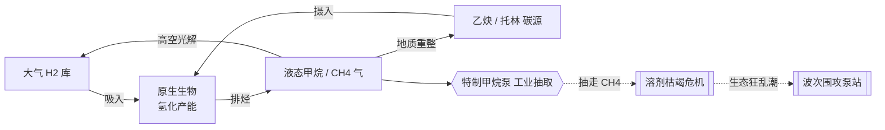
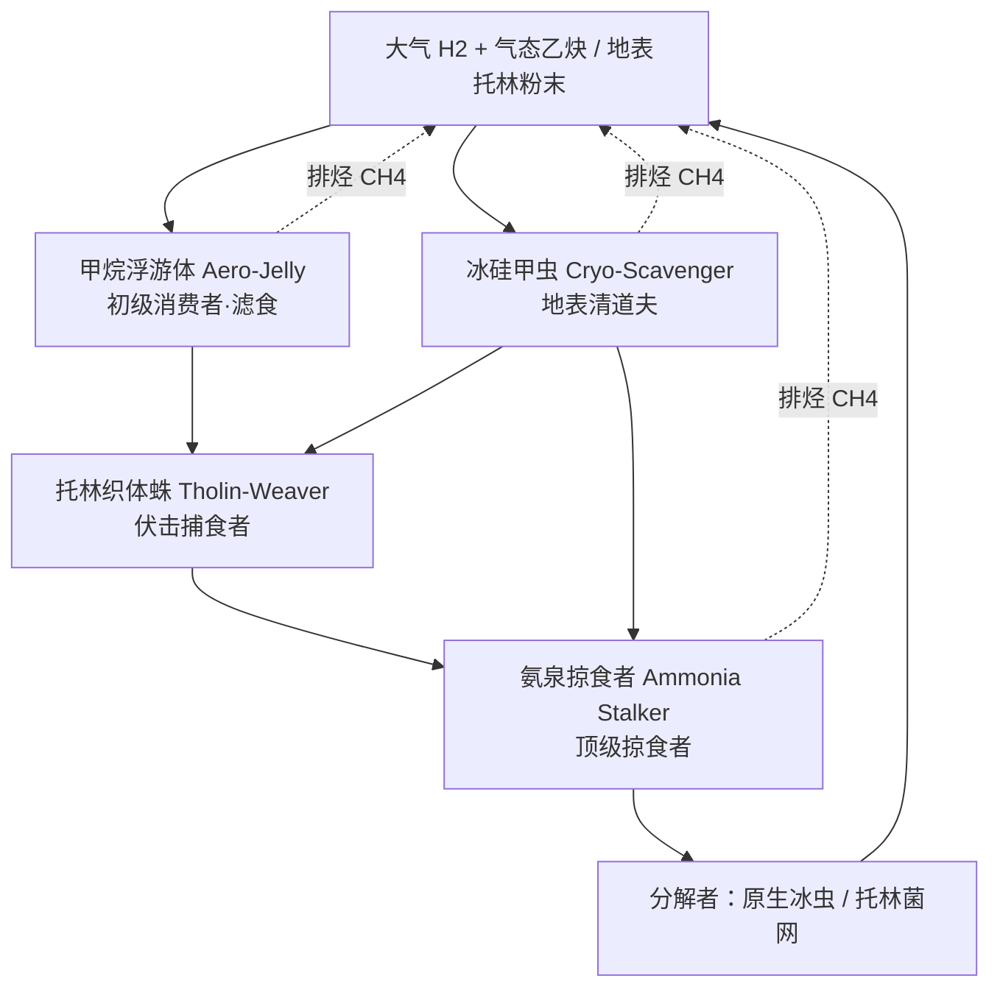

# 土卫六 (Titan) 维度 · 生态与代谢扩展设计
# Titan Dimension · Ecosystem & Metabolism Expanded Design
*基于 Minecraft 1.20.1 整合包的纯生物流生态、异星代谢链与冒险设计*
*Pure-biological ecosystem, alien metabolic chain and adventure design for a Minecraft 1.20.1 modpack*

> 本文在 `extended_design.md`（纯生物生态）与「代谢链补充资料」的基础上扩充细节，并**逐条标注已实现程度**。
> 配套：世界观/地形见 [titan_design.md](titan_design.md)；工程实现见 [titan_technical_design.md](titan_technical_design.md)；变更记录见 [parallel-tasks.md](parallel-tasks.md) §7。

---

## 图例 (Legend)

| 标记 | 含义 | Meaning |
|---|---|---|
| ✅ | **已实现**（注册 + 行为基本到位，代码 id 已注明） | Implemented |
| 🟡 | **部分实现**（方块/实体/物品已存在，但**核心行为或细节缺失**） | Partial — exists but behavior/detail missing |
| ⬜ | **规划中**（代码中尚无对应实体） | Planned — not in code yet |
| 🚫 | **仅设定参考，不实装**（纯 Lore，任务清单不含） | Lore-only, will not be implemented |

> 已实现内容的权威来源：`registry/TS*.java`、`entity/*.java`、`block/*.java`、`event/*.java`、`data/titan_satellite/worldgen/**`。

---

## 实现状态总览 (Implementation Status Overview)

| 设计元素 | 状态 | 代码/资源 id | 缺口摘要 |
|---|---|---|---|
| **群系 6 种** | ✅ | `dimension/titan.json` multi_noise | — |
| 甲烷浮游体 Aero-Jelly | ✅ | `entity/AeroJelly`（无重力飞行悬浮） | ✅ B3 实测：由 y120 降入 y≈83 区带稳定悬停（不下沉地面、无抖动） |
| 冰硅甲虫 Cryo-Scavenger | ✅ | `entity/CryoScavenger`（中立 + 0.6× 减伤 + 冰球冲撞） | ✅ B2：有目标时周期冲撞 + 命中额外击退 |
| 氨泉掠食者 Ammonia Stalker | 🟡 | `entity/AmmoniaStalker`（两栖 + 异星毒素 + 降挖速） | ✅ 攻击已改异星毒素+挖掘疲劳（B1）；仍缺喷泉弹射（E3） |
| 托林织体蛛 Tholin-Weaver | ✅ | `entity/TholinWeaver` + 渲染 + 刷怪蛋 + 生成 + 掉落 | ✅ D1：伏击(扮击)+近战附缓慢/异星毒素+吐丝黑网云；限沙海/荒原生成 |
| 失控探测器 Corrupted Probe | ✅ | `entity/CorruptedProbe`（仅前哨遗迹） | ✅ F1(b)：已去自然/波次生成，仅 `TitanStructurePiece` 遗迹出现 |
| 异星毒素 Alien Toxin | ✅ | `TSMobEffects.THOLIN_TOXIN`（凋零式扣血） | ✅ A1 实测：中毒实体 Health 递减（100→89） |
| 树枝状结晶 Branch Crystal | 🟡 | `block/BRANCH_CRYSTAL` + `branch_crystal`(worldgen) | 缺「晶化枝条」采集物 |
| 托林灌木 Tholin Shrub | 🟡 | `block/THOLIN_SHRUB` + `tholin_shrub_patch` | 缺减速/剪采「托林纤维」 |
| 霜枯灌木 Frost Bush | 🟡 | `block/FROST_BUSH` + `frost_bush` | 缺采集物/交互 |
| 甲烷冰花 Methane Ice Bloom | ✅ | `block/MethaneIceBloomBlock` + `ice_bloom_patch` | ✅ C1 实测：火源检测→连锁爆炸（三株链爆） |
| 冰火山喷泉 Cryovolcanic Geyser | ✅ | `block/CryovolcanicGeyserBlock` + `geyser_patch` | 击飞 + 周期喷发已实测 |
| 甲烷池核心 + 特制甲烷泵 | ✅ | `MethanePoolCoreBlock` / `SpecialMethanePumpBlock(+BE)` | 已含红石/自动化/流体槽/攻泵欲望（CR-15） |
| 生态狂乱潮（波次防御） | ✅ | `event/WaveController` + `MethaneExtractionWaveEvent` + `WaveSpawnMixin` | ✅ 纯生物化(氨泉+第3波起织体蛛) + E2 抽取量→波次强度 |
| 托林晶洞 / 冰虫巢穴 | 🟡 | `tholin_geode`(结构) + `sponge_cave` + `TholinCrystalBlock`(破坏放毒惊怪) | 缺「精英原生冰虫」专属 mob |
| 掉落材料 | 🟡 | `aero_membrane`/`cryo_carapace`/`toxic_gland` + 枝条/纤维/神经腺/丝囊 ✅ | ✅ A2 四材料已注册+模型；多磷腈辅酶（可选）未做 |
| 代谢链生化（呼吸/产能） | 🚫 Lore | — | **仅设定参考，不实装**（见 §1）；仅命名/材料/剧情可被 §4 取用 |

---

## 〇、维度基础生态参数 (Base Ecological Parameters)

> ⚠️ **本节为背景 Lore / 世界观，不做生存机制实装**（低重力、极寒、缺氧均只作氛围；见 [titan_design.md](titan_design.md) §0 与 CR-5）。

*   **大气与溶剂 (Atmosphere & Solvent):** 浓厚橙黄大气；普通降雨替换为「液态甲烷雨」。液态甲烷 (CH₄) 取代水，成为一切原生细胞的生化溶剂。✅ *维度雾/天空特效已实现（`TitanDimensionEffects`/`FogHandler`）；甲烷雨为氛围设定。*
*   **温度基调 (Temperature Tone):** 全域极寒 (-179 °C)。水冰在此硬如岩石，是构成地壳的主要无机矿物。✅ *冷色群系 + 冰/甲烷地貌已实现。*
*   **代谢通路 (Metabolic Pathway):** 生物吸入大气 H₂，与摄入的地表碳氢化合物（托林、乙炔）发生**放热氢化反应**取能，向环境排出甲烷气体。⬜ *纯 Lore，见 §1。*
*   **光照与建造 (Light & Build):** 地表光照极低；世界高度 Y = 0–320。✅

---

## 一、核心生化：异星呼吸与代谢链 (Core Biochemistry — Alien Respiration)

> 🚫 **本章为纯设定参考，不实装任何生化机制**——不模拟氢化反应 / 酶 / 辅酶 / 呼吸产能。以下仅作世界观 Lore，供**命名、掉落物、剧情文本**取材；**任务清单（[titan_ecosystem_tasks.md](titan_ecosystem_tasks.md)）不含本章任何实现项**。
> 若某些「材料」被采纳，也只是普通掉落 / 合成物（见 §4），与生化模拟无关。

### 1.0 核心反应总式 (Core Equation)

土卫六生物的能量核心 = **乙炔（或高分子托林）的放热氢化**，即它们的「异星呼吸作用」：

$$\rm C_2H_2 + 3\,H_2 \xrightarrow{\;氮质体胞内酶\;} 2\,CH_4 + \Delta H \qquad (\Delta H \approx -375\ kJ/mol)$$

📌 **Lore 注：** 该反应在极寒 (-179 °C) 的液态甲烷中可**自发且高效**进行，是整个维度能量的**唯一源头**——没有光合，只有「氢化化能」。

### 1.1 代谢链三大阶段 (Three Stages of Metabolism)

| 阶段 | 中文机制 | 关键生化物 | English |
|---|---|---|---|
| **① 底物摄入与膜通透** | 细胞膜由**氮质体 (Azotosome)**（丙烯腈单体聚合的无水膜）构成，极寒下对非极性溶剂（液甲烷）高通透。浮游生物经**气孔**吸入 H₂ 与气态乙炔；地表生物经外壳**亲脂层**吸附托林粉末。 | 氮质体膜、丙烯腈 (acrylonitrile)、乙炔、H₂、托林 | Substrate Intake & Membrane Permeation |
| **② 胞内氢化与还原产能** | 「糖酵解替代链」：在液甲烷胞质中，**不饱和键还原酶**催化 H₂ 逐步断裂乙炔/托林的 C≡C 三键，释放热能与自由能。能量载体**非 ATP**，而是**多磷腈辅酶 (Polyphosphazene Coenzyme)**，靠其键能断裂-重组驱动神经反射与肌肉运动。 | 不饱和键还原酶、多磷腈辅酶 | Intracellular Hydrogenation & Energy Generation |
| **③ 排烃 (废气排泄)** | 终产物为饱和低碳烃（主 CH₄、微量 C₂H₆）。因与体内溶剂同质，生物直接经表皮以**气泡/气体**将甲烷「呼出」或「排泄」回环境。 | CH₄、C₂H₆ 气泡 | Waste Elimination & Methane Exhalation |

### 1.2 生态碳-氢循环 (Carbon–Hydrogen Cycle)〔扩充〕

整个维度是一个闭合的碳氢循环，玩家的工业开采会**打破**它——这正是「生态狂乱潮」的生态学逻辑：

> 🎮 **游戏化钩子：** 泵每抽取一定量甲烷 → 提升该区「生态压力值」→ 决定生态狂乱潮波次强度/怪种（当前 `WaveController` 已有波次强度，可把「抽取量」并入强度公式）。

### 1.3 生化词条 → 潜在材料 (Biochem Glossary → Materials)〔扩充〕

| 生化名词 | 设想游戏物 | 来源 | 用途设想 | 现状 |
|---|---|---|---|---|
| 氮质体膜 Azotosome | 「氮质体薄膜」item | 浮游体/织体蛛 | 合成耐寒容器/软管 | ⬜（`aero_membrane` ✅ 可复用为其雏形） |
| 多磷腈辅酶 Polyphosphazene | 「多磷腈辅酶」item（高能） | 氨泉掠食者稀有掉落 | 生物电池 / 泵增效燃料 | ⬜ |
| 乙炔 Acetylene | 「凝乙炔」方块/物品 | 深渊乙炔冰笋 | 高能燃料 / 合成 | ⬜ |
| 托林 Tholin | 托林粉末/纤维 | 沙海、灌木 | 基础有机材料 | 🟡（`tholin_sand`✅、`hardened_tholin`✅、纤维⬜） |
| 不饱和键还原酶 | 「还原酶腺体」item | 织体蛛/冰虫 | 酿造异星毒素解毒剂 | ⬜ |

---

## 二、群系植物相与初级生产者 (Flora & Primary Producers)

土卫六的「植物」由结晶体、有机高分子与化能菌群构成——**无叶绿素，靠化能/吸附**。

### 2.1 树枝状结晶 (Branch Crystals) 🟡
*   **群系:** 撞击陨坑荒原。**硅基植物**，根系吸收陨石带来的异星无机盐。
*   **已实现:** 方块 `branch_crystal`（十字发光装饰、无碰撞、承托检测 `has_sturdy_face` 防悬空）+ worldgen `branch_crystal.json`（陨坑群系注入）。
*   **缺口:** 镐采产出「**晶化枝条 (Crystalline Twig)**」——耐低温工具柄基材（现在直接掉落方块本身）。🎮 加 `loot_table` + 新 item。

### 2.2 霜枯灌木 & 托林灌木 (Frost Bushes & Tholin Shrubs) 🟡
*   **群系:** 陨坑荒原/荒芜高原（霜枯）；托林沙海（托林灌木）。**硅基**，节肢状固态多聚物触须；托林灌木长年吸附空气中的橙色托林粉末。
*   **已实现:** 方块 `frost_bush`、`tholin_shrub`（均十字无碰撞装饰）+ worldgen `frost_bush`、`tholin_shrub_patch`。
*   **缺口:** ①踩上去**阻挡/减速**（改 `noCollission`→带碰撞或用 `MovementSpeed` slowdown 逻辑）；②剪刀采「**托林纤维 (Tholin Fibre)**」。

### 2.3 甲烷冰花 (Methane Ice Blooms) 🟡 → ⬜（核心特性）
*   **群系:** 极地迷宫冰原。**碳基（类珊瑚）**，多孔冰体空洞表面的半透明花簇。
*   **已实现:** 方块 `methane_ice_bloom`（十字发光装饰）+ worldgen `ice_bloom_patch`。
*   **缺口（关键）：火源检测连锁爆炸** ⬜——设计要求方块随机刻检测邻格：若存在**着火实体**或带 `#minecraft:fire` 等火焰标签的方块 → **瞬间引燃并连锁化学爆炸**。
    > 🎮 **实现建议:** `Block.randomTick()`（注册时 `.randomTicks()`）扫描 3×3×3 邻域 `state.is(BlockTags... )`/`getEntitiesOfClass(...isOnFire())` → `level.explode(...)` 小当量 + 把相邻冰花也标记引燃（连锁）。属**易实现且高表现力**，建议优先补。

### 2.4 〔扩充〕新增初级生产者 (New Primary Producers) ⬜
*   **乙炔冰笋 (Acetylene Ice Spires):** 深渊/裂隙壁生长的高能乙炔富集晶柱，采集得「凝乙炔」（燃料/合成）。与甲烷海相邻，靠近火源同样易爆。
*   **氢泡菌毯 (Hydrogen Bubble Mats):** 荒原低洼处的化能菌毯，随机刻缓释 H₂ 气泡（`#minecraft:fire` 邻接 → 轻微轰燃），为浮游体提供食源。
*   **托林菌网 (Tholin Mycelium):** 巢穴/洞穴内的分解者菌网，把生物残渣重整回托林——生态循环的「分解者」一环，也是冰虫巢穴的「生物有机壁」。

---

## 三、生物群与食物网 (Fauna & Food Web)

> 现状总述：四个实体已注册且有基础 AI，但**彼此之间无捕食 AI**（只对玩家/受击目标反应）——「食物网」目前是 Lore，机制上是各自独立的刷怪。下列为各物种的**代谢特化**（源自补充资料）＋ 实装缺口 ＋ 扩充。

### 3.1 营养级与能量流 (Trophic Flow)〔扩充〕

### 3.2 甲烷浮游体 (Aero-Jelly) — 初级空域消费者 · Passive 🟡
*   **代谢特化（低气压气囊积聚）：** 输入大气 H₂ + 气态乙炔；细胞产生的**过量甲烷不排出、而储于浮游薄膜囊**中维持浮力；输出极低流速的饱和甲烷气泡。
*   **已实现:** `entity/AeroJelly`（`PathfinderMob`，HP 8，速 0.15）+ `Float/WaterAvoidingRandomStroll/LookAtPlayer/RandomLookAround` 基础 AI + 史莱姆模型渲染占位 + 刷怪蛋 `aero_jelly_spawn_egg` + 掉落 `aero_membrane`。
*   **缺口:** ①**限高漂浮 + 升降浮力 AI**（限低-中空，储气↔排气调节 Y）；②**与低重力/引力模组（Ad Astra 等）兼容**，避免抖动/冲突（补充资料强调）。
    > 🎮 **实现建议:** 自定义 `FloatingWanderGoal`：读目标 Y 带 [surfaceY+6, surfaceY+24]，用 `setDeltaMovement` 缓冲趋近而非硬 setPos；每 tick 判 `getDeltaMovement().y` 与外部重力叠加取 `Mth.clamp`，避免与他模组 gravity 属性打架。

### 3.3 冰硅甲虫 (Cryo-Scavenger) — 地表清道夫 · Neutral 🟡
*   **代谢特化（硅基外壳凝华）：** 输入地表固态托林粉末；代谢其中微量无机硅/氮，**固化凝华于体表**成硬如钢铁的冰晶甲壳；输出固态高碳废渣。
*   **已实现:** `entity/CryoScavenger`（中立：`HurtByTargetGoal.setAlertOthers()` 受击才反击并唤醒同类）+ **冰晶甲壳 0.6× 物理减伤**（`hurt()` 覆写，穿甲/无敌绕过除外）+ 蜘蛛模型占位 + 掉落 `cryo_carapace`。
*   **缺口:** **缩成冰球冲撞**——受击/索敌时进入「冰球态」高速撞击并附击退。🎮 加 `state` 布尔 + 冲撞 Goal（`setDeltaMovement` 朝目标 + 命中 knockback），可复用玩家滚石表现。

### 3.4 氨泉掠食者 (Ammonia Stalker) — 顶级两栖掠食者 · Hostile 🟡
*   **代谢特化（热量内燃与氨泵）：** 输入其他生物的多磷腈辅酶 + 液氨；**强效分解猎物辅酶**获爆发力，靠体内高浓度液氨循环做**跨温标肌肉运动**；输出高浓度强效异星毒素 + 气态氮。
*   **已实现:** `entity/AmmoniaStalker`（`Monster`，HP 24/速 0.28/攻 5）+ 两栖导航（`canBreatheUnderwater`）+ `doHurtTarget` 攻击**附毒** + 主动索敌玩家 + 人形模型占位 + 掉落 `toxic_gland`。是**生态狂乱潮的主力波次怪**。
*   **缺口:** ①攻击用的是**原版 `MobEffects.POISON`**，应改为**异星毒素**（§3.7）；②**降低玩家挖掘速度**（附 `DIG_SLOWDOWN`/`MINING_FATIGUE`）；③**借冰火山喷泉弹射扑杀**的 AI。

### 3.5 托林织体蛛 (Tholin-Weaver) — 伏击中级捕食者 · Hostile ⬜〔全新〕
*   **代谢特化（高聚物毒素合成）：** 输入固态托林 + 冰体微量氨；**生物浓缩**未完全氢化的氰基/多聚物，在丝囊中合成**黏性异星毒素 + 减速黏液**；输出异星毒素（液）、托林丝线。
*   **分布:** 独居托林沙海，偶见荒芜高原；背部沙质伪装隆起，潜伏沙中突袭。
*   **效果:** 攻击/吐丝赋予**「缓慢」+「异星毒素」**。掉落**强韧神经腺、托林丝囊**。
*   **实现建议（全新 mob）:** 参照 `AmmoniaStalker` 骨架 + `entity/TholinWeaver` + 渲染器（蜘蛛模型占位）+ 属性/刷怪蛋/掉落表 + `forge/biome_modifier/tholin_weaver_spawn.json`(限 `tholin_dune_sea`)。伏击 = `sand-camouflage`（`RandomStroll` + 靠近玩家时 `pounce`）；吐丝 = 远程 `AreaEffectCloud`（减速 + 异星毒素，复用 `TholinCrystalBlock` 毒气云范式）。

### 3.6 失控探测器 (Corrupted Probe) — ⚠️ 与「纯生物」设定冲突
*   **现状:** `entity/CorruptedProbe` 已注册（机械体，发射激光）+ 掉落 `depleted_battery`/`precision_components`，且是波次怪之一。
*   **矛盾:** 本扩展为**纯原生生物**生态，机械体不属于食物网。
*   **建议二选一:** (a) **移除/雪藏** Corrupted Probe，波次怪改为 `ammonia_stalker` + `tholin_weaver`（纯生物围攻）；(b) **重新主题化**为「被托林菌网寄生的失控探测器」半生物遗留物，保留科技残骸 Lore（前哨站遗迹）。**推荐 (a)** 以贴合纯生物主线；`precision_components` 保留为「泵的工业产物」（已是 CR-15 泵产出）。

### 3.7 异星毒素 (Alien Toxin) — 核心恶性效果 🟡→⬜
*   **设计:** 类**凋零伤害**的持续扣血 debuff（整合包核心恶性药水），由织体蛛/氨泉掠食者施加。
*   **现状:** `TSMobEffects.THOLIN_TOXIN` **已注册但空实现**（无 `applyEffectTick`，仅图标/计时）；`AmmoniaStalker`/晶洞毒气目前施加的是**原版 POISON**。
*   **补齐建议:** 让 `THOLIN_TOXIN` 覆写 `applyEffectTick`（`living.hurt(伤害源, 1.0F)` 每 N tick，`isDurationEffectTick` 按 amplifier 调频，仿 `WITHER`）+ `isInstantenous()=false`；再把 `AmmoniaStalker.doHurtTarget`、`TholinWeaver`、`TholinCrystalBlock` 毒气云改用它。**即"异星毒素"名副其实。**

### 3.8 〔扩充〕新增生物 (New Fauna) ⬜
*   **原生冰虫 (Native Ice Worm) — 精英 · Hostile:** 潜伏冰虫巢穴深处；破坏发光晶体惊醒（设计已提及「精英级原生冰虫」）。分解者兼守卫，钻地突袭、高血高抗。掉落「还原酶腺体」。
*   **甲烷微浮群 (Methane Midge) — 群集 · Passive:** 极小浮游群，浮游体的食源（营养级最底），成群随风漂移，靠近火源轻微轰燃。
*   **氢营养蹒兽 (Hydrotroph Grazer) — 被动/中立:** 荒原上啃食氢泡菌毯的化能食草兽，冰硅甲虫/织体蛛的猎物，充实中层营养级。

---

## 四、材料与代谢产物链 (Materials & Metabolic Product Chain)

> 把「代谢链」落到可玩的物品链：**采集底物 → 生物加工产物 → 玩家合成**。标注现状。

| 环节 | 物品 | 现状 | 说明 |
|---|---|---|---|
| 底物·碳源 | 托林砂/硬化托林 | ✅ `tholin_sand`/`hardened_tholin` | 基础有机 |
| 底物·碳源 | 凝乙炔 | ⬜ | 乙炔冰笋采集，高能燃料 |
| 底物·氢 | 氢气瓶（大气充装） | ⬜ | 可接工业模组气体系统 |
| 生物膜 | 氮质体薄膜 | 🟡 `aero_membrane`✅ | 可直接沿用/更名 |
| 高能辅酶 | 多磷腈辅酶 | ⬜ | 顶级掠食稀有掉落，泵增效/生物电池 |
| 甲壳 | 冰晶甲壳 | ✅ `cryo_carapace` | 硬化护甲升级材料 |
| 毒腺 | 毒性腺体 | ✅ `toxic_gland` | 抗性药剂/涂层 |
| 神经/丝 | 强韧神经腺、托林丝囊 | ⬜ | 织体蛛掉落 |
| 植物纤维 | 托林纤维、晶化枝条 | ⬜ | 灌木/结晶采集 |
| 工业产物 | 精密组件、废弃电池 | ✅ `precision_components`/`depleted_battery` | **泵产出**（CR-15）/机械掉落 |

> 🎮 **产能载体思路:** 「多磷腈辅酶」作为跨系统硬通货——喂给特制甲烷泵作**增效燃料**（提高抽取速率/降低生态压力增幅），把生物流与工业开采闭环起来。

---

## 五、冒险玩法与生态事件 (Adventure & Ecological Events)

### 5.1 冰火山喷泉生态利用 (Geyser Exploitation) ✅
*   `CryovolcanicGeyserBlock`：冰火山断崖自然生成，周期喷发高压液氨/冰晶，踩上实体获巨大垂直动能（击飞）——已实测（PE-1）。
*   🎮 **扩充:** 让**氨泉掠食者**主动借喷泉弹射扑杀（§3.4 缺口③）；玩家可用击飞 + 滑翔跨越 Y 轴高差。

### 5.2 生态特殊地牢：地下冰虫巢穴 (Underground Hives) 🟡
*   **已实现:** `tholin_geode`（自定义结构）+ `sponge_cave`（多孔海绵洞特征）+ `TholinCrystalBlock`（玩家破坏 50% → 毒气云 + 惊醒附近敌对，PE-3）+ 全局噪声洞穴系统（CR-14）。
*   **缺口:** ①「生物有机壁」（高分子多糖硬壁）专用方块（可复用 `hardened_tholin`/新增）；②**精英原生冰虫** mob（§3.8）作为巢穴 Boss。

### 5.3 生态狂乱：甲烷开采防御战 (Ecosystem Frenzy Event) ✅🟡
*   **已实现:** 在**甲烷池核心**上放**特制甲烷泵**开采 → 后端抛 `MethaneExtractionWaveEvent`（冻结签名）→ `WaveController` 波次刷怪围攻泵站，`WaveSpawnMixin` 强化波次怪并驱其攻泵。**CR-15 刚增强：红石启动（不可重复）、自动化产物入上方容器、只出不进甲烷流体槽、增强攻泵欲望**——均已实测。
*   **缺口/扩充:**
    *   波次怪含**机械探测器** → 应改**纯生物**（氨泉掠食者 + 托林织体蛛，见 §3.6）。
    *   把 §1.2 的「**抽取量 → 生态压力值**」并入波次强度（`WaveController.baseWaveMobCount` 现为 `2+waveIndex`，可 `+ f(累计抽取)`）。
    *   胜利产出接入代谢材料（多磷腈辅酶等）。

### 5.4 〔扩充〕新增生态事件 (New Events) ⬜
*   **托林潮汐 (Tholin Bloom):** 周期性沙海托林粉末暴增 → 托林灌木/织体蛛短时繁盛，采集/危险双升。
*   **甲烷退潮 (Methane Ebb):** 若某区被过度抽取，甲烷海面下降、暴露乙炔冰笋与巢穴入口（把 `sea_level`/局部流体与开采量挂钩，进阶）。

---

## 六、生态 ↔ 群系分布矩阵 (Ecology × Biome Matrix)

| 群系 (Biome) | 生产者 | 消费者/掠食者 | 特色地物/事件 |
|---|---|---|---|
| 液态甲烷深渊 Methane Abyss | 乙炔冰笋⬜ | 氨泉掠食者🟡 | 甲烷海✅、裂隙✅、**开采防御战**✅、甲烷池核心✅ |
| 撞击陨坑荒原 Cratered | 树枝状结晶🟡、霜枯灌木🟡、氢泡菌毯⬜ | 冰硅甲虫🟡、氢营养蹒兽⬜ | 巨型陨石坑✅、陨铁碎块✅ |
| 托林沙海 Tholin Dunes | 托林灌木🟡 | **托林织体蛛**⬜、冰硅甲虫🟡 | 巨型沙脊✅、硬化托林✅、托林潮汐⬜ |
| 极地迷宫冰原 Polar | 甲烷冰花🟡 | 原生冰虫⬜ | 破碎海绵洞✅、冰层天坑✅、**冰虫巢穴**🟡、托林晶洞✅ |
| 冰火山断崖 Cryovolcanic | 氨晶体✅（矿） | 氨泉掠食者🟡 | 冰火山喷泉✅、氨水火山口🟡 |
| 荒芜高原 Barren Plateau | 霜枯灌木🟡、泰坦砾石✅ | （稀疏） | 极陡断崖✅、先驱者前哨遗迹🟡 |

---

## 七、实现差距与建议路线 (Gaps & Roadmap)

> 按「性价比（表现力 / 工作量）」排序，供后续里程碑取用。

1.  **甲烷冰花火源检测爆炸** 🟡→✅（易 · 高表现）：`randomTick` + `.randomTicks()` + `level.explode` + 连锁。
2.  **异星毒素落地** 🟡→✅（易 · 核心）：`THOLIN_TOXIN.applyEffectTick` 凋零式扣血；氨泉/晶洞改用之。
3.  **波次怪纯生物化** 🟡→✅（易）：`pickMobType` 去 `corrupted_probe`，加 `tholin_weaver`。
4.  **植物采集物** 🟡→✅（易）：晶化枝条/托林纤维 item + `loot_table`/剪采。
5.  **托林织体蛛新 mob** ⬜（中）：实体 + 渲染 + 伏击/吐丝 + 沙海 spawn。
6.  **冰硅甲虫冰球冲撞** 🟡→✅（中）：冲撞 Goal + 状态。
7.  **甲烷浮游体浮力/限高 + 重力模组兼容** 🟡（中）：自定义浮空 Goal，`clamp` 叠加外部重力。
8.  **原生冰虫（巢穴精英）** ⬜（中-高）：Boss 化 + 巢穴生成挂钩。
9.  **代谢材料链 + 辅酶增效泵** ⬜（高 · 深度）：新 item 链 + 泵燃料接口。
10. **抽取量→生态压力→波次强度** ⬜（中 · 系统联动）。

---

## 八、平衡与可调参数 (Tunables)

| 项 | 位置 | 现值 | 备注 |
|---|---|---|---|
| 冰花爆炸当量/半径 | （待建 `MethaneIceBloomBlock`） | — | 建议 1.0–2.0 当量、可燃连锁 |
| 异星毒素 DPS/周期 | （待建 `THOLIN_TOXIN`） | — | 仿凋零：amplifier↑→周期↓ |
| 波次怪数 | `WaveController.baseWaveMobCount` | `2 + waveIndex` | 可 `+ f(抽取量)` |
| 泵产液速率/容量 | `SpecialMethanePumpBlockEntity` | 8 mB/t / 16000 | CR-15 |
| 浮游体漂浮高度带 | （待建浮空 Goal） | — | `[surfaceY+6, +24]` 建议 |
| 各生物生成权重 | `forge/biome_modifier/*_spawn.json` | 见文件 | 按营养级配比 |

---

*（本设计为 Lore + 玩法蓝图；标 ⬜/🟡 项尚未落地，落地时请在 [parallel-tasks.md](parallel-tasks.md) §7 追加 CR 并回写状态。）*
