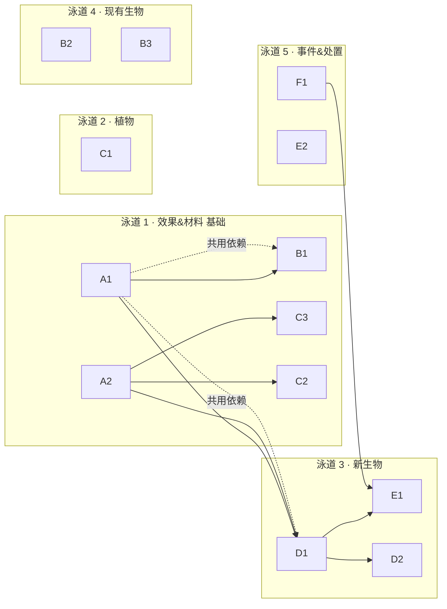

# 土卫六 (Titan) 维度 · 生态深化任务清单 (Ecosystem Deepening — Task List)
*配套设计：[titan_design.md](titan_design.md)（维度综合设计；§二–§八 为原「生态与代谢扩展设计」，已合并）*
*工程约定：[titan_technical_design.md](titan_technical_design.md)；变更记录：[parallel-tasks.md](parallel-tasks.md) §7*

> **范围声明 (Scope):** 本清单覆盖生态扩展设计中**标注为 🟡 部分实现 / ⬜ 规划中**的功能落地。
> **🚫 不包含代谢生化（设计 §1）的任何实现**——该章仅作设定参考，只在**命名 / 掉落物 / 剧情文本**上被取用，不模拟任何生化反应。

---

## 图例 (Legend)

**优先级 Priority:** `P0` 快赢·高表现（先做） · `P1` 核心 · `P2` 深化 · `P3` 可选/进阶
**体量 Size:**（复杂度，非工时）`S` 单文件/数值 · `M` 多文件/新逻辑 · `L` 新实体/系统
**状态 Status:** ⬜ 待办 · 🔧 进行中 · ✅ 完成

> **验收统一约定（无头可验，源自 repo 经验）：**
> - 编译：`compileJava`（新增 .java 需 `--rerun-tasks`）；加载：`runServer` 至 `Done` 零数据包报错。
> - 方块实体 / 生物 AI **需 `forceload add <x> <z>` 才 tick**（无玩家 dev 服连 spawn 区块也不 tick）。
> - 读状态：`/data get block <x y z> <path>`、`/data get entity @e[..] ActiveEffects|ForgeData`；
>   掉落：`/loot spawn ~ ~ ~ loot <ns>:...` 或挖掘观察；生成分布：`/locate biome`、`fill air replace X` 计数。
> - 视觉/交互（爆炸、粒子、玩家破坏）→ `runClient` 目视。

---

## 任务总表 (Master Table)

| ID | 分组 | 任务 | P | Size | 依赖 | 状态 |
|---|---|---|---|---|---|---|
| **A1** | 基础 | 异星毒素 `tholin_toxin` 效果实装（凋零式扣血） | P0 | S | — | ✅ |
| **A2** | 基础 | 新掉落/材料 item 注册（枝条/纤维/神经腺/丝囊） | P1 | S | — | ✅ |
| **C1** | 植物 | 甲烷冰花 火源检测 → 连锁爆炸 | P0 | M | — | ✅ |
| **B1** | 生物 | 氨泉掠食者：改用异星毒素 + 降低挖掘速度 | P1 | S | A1 | ✅ |
| **E1** | 事件 | 波次怪纯生物化（去机械探测器，加织体蛛） | P1 | S | D1,F1 | ✅ |
| **F1** | 处置 | 失控探测器处置（移除 / 改造）决策与执行 | P1 | S–M | — | ✅ |
| **D1** | 新生物 | 托林织体蛛 Tholin-Weaver（新 mob 全套） | P1 | L | A1,A2 | ✅ |
| **C2** | 植物 | 灌木减速/阻挡 + 剪采「托林纤维」 | P2 | M | A2 | ✅ |
| **C3** | 植物 | 树枝结晶采集「晶化枝条」（loot 改造） | P2 | S | A2 | ✅ |
| **B2** | 生物 | 冰硅甲虫「缩成冰球冲撞」 | P2 | M | — | ✅ |
| **B3** | 生物 | 甲烷浮游体 浮力/限高 AI + 重力模组兼容 | P2 | M | — | ✅ |
| **E2** | 事件 | 抽取量 → 生态压力 → 波次强度联动 | P2 | M | — | ✅ |
| **D2** | 新生物 | 原生冰虫 Native Ice Worm（巢穴精英） | P2 | L | A1,A2 | ✅ |
| **E3** | 事件 | 氨泉掠食者借冰火山喷泉弹射 AI | P3 | M | — | ✅ |
| **E4** | 事件 | 冰虫巢穴 Boss 化 + 生物有机壁方块 | P3 | L | D2 | ✅ |
| **D3** | 新生物 | 微浮群 / 化能食草兽（充实营养级） | P3 | M | — | ✅ |
| **H1** | 生产者 | 生产者方块行为（氢泡菌毯 / 乙烔冰笋 / 托林菌网） | P2 | M | — | ✅ |
| **H2** | 捕食 | 捕食者锁定下位物种 AI（食物网） | P2 | M | D1,D3 | ✅ |
| **H3** | 摄食 | 初级消费者摄食 / 逃逸 AI（浮游体 / 蹒兽） | P2 | M | D3,H1 | ✅ |
| **G1** | 收尾 | lang/创造栏/loot 全量补齐 + runClient 目视 + CR 回写 | P1 | S | 各项 | ✅ |

---

## 详细任务卡 (Task Cards)

### A · 基础与共用件 (Foundations)

#### A1 — 异星毒素 `tholin_toxin` 效果实装 〔P0 · S〕 ✅
- **目标：** 让已注册但空实现的 `THOLIN_TOXIN` 成为「凋零式」持续扣血 debuff（设计 §3.7）。
- **建立于：** `registry/TSMobEffects.java`（`THOLIN_TOXIN` 已注册，匿名 `MobEffect` 空体）。
- **步骤：**
  1. 匿名类内覆写 `applyEffectTick(LivingEntity, amplifier)`：`entity.hurt(damageSources().magic()/自定义, 1.0F)`。
  2. 覆写 `isDurationEffectTick(duration, amplifier)`：仿凋零，周期 `40 >> amplifier`（等级越高越快），`isInstantenous()=false`。
  3. （可选）自定义 `DamageType` `titan_moon:alien_toxin`（数据 JSON，scaling `never`）作伤害源，便于 tooltip/免疫。
- **验收（无头）：** `effect give @e[..] titan_moon:tholin_toxin 30 0` → 目标 `data get entity @s Health` 随时间递减；效果计时正常；不误伤免疫源。
- **注意：** 这是 B1/D1/D2 及晶洞毒气的**共同依赖**，先做。

#### A2 — 新掉落/材料 item 注册 〔P1 · S〕 ✅
- **目标：** 注册生态掉落物（设计 §4）。**只做普通 item（掉落/合成用），不涉及生化。**
- **建立于：** `registry/TSItems.java`（`register(...)` 范式已有）、`TSCreativeTabs.java`、`lang`、`models/item/*`。
- **新增 item：** `crystalline_twig`（晶化枝条）、`tholin_fibre`（托林纤维）、`tough_neural_gland`（强韧神经腺）、`tholin_silk_sac`（托林丝囊）。〔`polyphosphazene_coenzyme` 多磷腈辅酶列为**可选** P2 风味掉落，不做机制。〕
- **步骤：** `register` 4 项 → 创造栏 `output.accept` → `item/generated` 模型（复用近似原版贴图占位）→ 中英 lang。
- **验收：** `/give @p titan_moon:crystalline_twig` 成功；创造栏可见；无 model/lang 缺失警告（runClient）。

---

### B · 现有生物行为补全 (Existing Mob Behaviors)

#### B1 — 氨泉掠食者：异星毒素 + 降挖速 〔P1 · S〕 ✅ （依赖 A1）
- **目标：** 把攻击附毒从**原版 POISON** 换成**异星毒素**，并附加**挖掘疲劳**（设计 §3.4 缺口①②）。
- **建立于：** `entity/AmmoniaStalker.java`（`doHurtTarget` 现施 `MobEffects.POISON`）。
- **步骤：** `doHurtTarget` 中 `living.addEffect(new MobEffectInstance(TSMobEffects.THOLIN_TOXIN.get(), dur, 0))` + `MobEffects.DIG_SLOWDOWN`（挖掘疲劳，短时）。
- **验收（无头）：** `forceload` 平台，铁傀儡诱敌被咬后 `data get entity @e[type=iron_golem] ActiveEffects` 含 `titan_moon:tholin_toxin` 与 `dig_slowdown`。

#### B2 — 冰硅甲虫「冰球冲撞」〔P2 · M〕 ✅
- **目标：** 中立受击/索敌时进入「冰球态」高速撞击 + 击退（设计 §3.3 缺口）。
- **建立于：** `entity/CryoScavenger.java`（已有 `HurtByTargetGoal` + 0.6× 减伤）。
- **步骤：** 加 `boolean rolling`（`SynchedEntityData` 供渲染）+ 自定义 `RollChargeGoal`（有目标时朝其 `setDeltaMovement`，接触 `doHurtTarget`+额外 `knockback`）；`rolling` 态提高护甲/速度。
- **验收（无头）：** `forceload` + 傀儡诱敌 → `data get entity @e[type=..cryo_scavenger] Motion` 出现朝目标高速位移；接触附击退。渲染滚动 runClient 目视。

#### B3 — 甲烷浮游体 浮力/限高 + 重力模组兼容 〔P2 · M〕 ✅
- **目标：** 限低-中空漂浮、平滑升降，**与低重力/引力模组（Ad Astra 等）兼容不抖动**（设计 §3.2 缺口）。
- **建立于：** `entity/AeroJelly.java`（现仅 `Float/Stroll/LookAt`）。
- **步骤：** 自定义 `FloatingWanderGoal`：目标 Y 带 `[surfaceY+6, +24]`，用 `setDeltaMovement` 缓冲趋近（非 setPos）；`getDeltaMovement().y` 与外部重力叠加后 `Mth.clamp`；`setNoGravity` 谨慎（优先弱化而非关闭，兼容他模组重力属性）。
- **验收（无头）：** `forceload` + 连续 `data get entity @e[..aero_jelly] Pos[1]` 稳定在 Y 带内、无剧烈跳变。与重力模组共存的抖动 runClient 目视确认。

---

### C · 植物交互与采集 (Flora Behaviors & Harvest)

#### C1 — 甲烷冰花 火源检测 → 连锁爆炸 〔P0 · M〕 ✅ ★核心特性
- **目标：** 补齐设计 §2.3 的**核心机制**：随机刻检测邻近**着火实体**或**火焰标签方块** → 瞬间引爆 + 连锁。
- **建立于：** `block/`（新建 `MethaneIceBloomBlock`）、`TSBlocks.METHANE_ICE_BLOOM`（现为普通 `Block`，改指新类 + `.randomTicks()`）。
- **步骤：**
  1. 新 `MethaneIceBloomBlock extends Block`，注册属性加 `.randomTicks()`。
  2. `randomTick(state, level, pos, rand)`：扫 3×3×3 邻域——`level.getBlockState(p).is(BlockTags.FIRE)`/是 `BaseFireBlock`，或 `getEntitiesOfClass(Entity, box, Entity::isOnFire)` 非空 → `level.explode(null, x,y,z, power≈1.5, Fire)` + `removeBlock`。
  3. 连锁：爆炸/引燃时对邻近 `METHANE_ICE_BLOOM` 触发同样处理（或依赖爆炸波及邻块的 randomTick）。
- **验收（无头）：** `forceload` → `setblock` 冰花 + 相邻 `setblock fire` → 数刻后冰花消失/爆炸坑（`execute if block <pos> air`）；相邻多株连锁。爆炸表现 runClient 目视。
- **可调：** 当量 `1.0–2.0`、是否留火、连锁半径。

#### C2 — 灌木减速/阻挡 + 剪采纤维 〔P2 · M〕 ✅ （依赖 A2）
- **目标：** `frost_bush`/`tholin_shrub` 踩踏减速；剪刀采「托林纤维」（设计 §2.2）。
- **建立于：** `TSBlocks.FROST_BUSH`/`THOLIN_SHRUB`（现 `noCollission` 装饰）。
- **步骤：** ①`entityInside` 施短时 `MOVEMENT_SLOWDOWN` 或降 `setDeltaMovement`（保持可穿过，不用实心碰撞）；②`loot_table`：默认无掉落，`shears` 掉 `tholin_fibre`（`minecraft:match_tool` 条件）。
- **验收：** 挖/剪掉落符合表；`runClient` 穿行减速目视。

#### C3 — 树枝结晶采「晶化枝条」〔P2 · S〕 ✅ （依赖 A2）
- **目标：** `branch_crystal` 镐采产「晶化枝条」而非方块本身（设计 §2.1）。
- **步骤：** `data/titan_moon/loot_tables/blocks/branch_crystal.json`（`minecraft:block` 类型，掉 `crystalline_twig` 1–2，可加 `silk_touch` 例外掉方块）。
- **验收：** `/loot spawn ~ ~ ~ mine <pos> <手持镐>` 或挖掘掉 `crystalline_twig`。

---

### D · 新生物 (New Fauna)

#### D1 — 托林织体蛛 Tholin-Weaver 〔P1 · L〕 ✅ （依赖 A1,A2）
- **目标：** 新增伏击型中级捕食者（设计 §3.5）：潜伏沙海、突袭、吐丝（减速 + 异星毒素）。
- **建立于：** 参照 `entity/AmmoniaStalker`（`Monster` 骨架）与 `block/TholinCrystalBlock`（`AreaEffectCloud` 毒气云范式）。
- **交付物（全套）：**
  1. `entity/TholinWeaver.java`（`Monster`；属性 HP≈18；伏击 = 慢速游荡 + 靠近 `pounce`；`doHurtTarget` 附 `MOVEMENT_SLOWDOWN`+`THOLIN_TOXIN`）。
  2. `client/TholinWeaverRenderer.java`（蜘蛛模型占位）+ `TitanClientEvents` 注册。
  3. `TSEntities` 注册 + 属性 + `TSItems` 刷怪蛋 + `TSCreativeTabs`。
  4. `forge/biome_modifier/tholin_weaver_spawn.json`（限 `tholin_dune_sea`，偶 `barren_plateau`）+ `SpawnPlacementRegisterEvent`（`Monster::checkMonsterSpawnRules`）。
  5. `loot_tables/entities/tholin_weaver.json`（`tough_neural_gland`、`tholin_silk_sac`）。
  6. 中英 lang（含 `entity.` 名 + 刷怪蛋）。
- **验收（无头）：** `runServer` Done；`/summon` + `forceload` 观察伏击/吐丝（毒气云 `data get` 中毒）；`/locate biome tholin_dune_sea` 附近自然生成；掉落表 `loot spawn` 命中。
- **拆分建议：** D1a 实体+渲染+注册（骨架）→ D1b AI（伏击/吐丝）→ D1c 生成+掉落+lang。

#### D2 — 原生冰虫 Native Ice Worm（巢穴精英）〔P2 · L〕 ✅ （依赖 A1,A2）
- **目标：** 冰虫巢穴深处的精英守卫/分解者（设计 §3.8、§5.2 缺口②）。
- **交付物：** `entity/NativeIceWorm.java`（高 HP/抗性，钻地突袭，攻击附异星毒素）+ 渲染 + 注册 + 生成（`polar_labyrinth` 深处 / 巢穴结构挂钩）+ loot（`tough_neural_gland`）+ lang。
- **验收：** 同 D1 模式；作为巢穴 Boss 的高血/高抗可 `data get ... Health` 核对。
- **✅ 完成（CR-23）：** `NativeIceWorm`（HP60 / 护甲8 / 击退抗性0.6 / 移速0.25 / 攻击6 + `THOLIN_TOXIN` II，Leap+Melee AI，目标 HurtBy/Player）+ `NativeIceWormRenderer`（放大 2× 银鱼占位）+ `TSEntities`/生成蛋/创造栏/`TSEntityLoot`（`tough_neural_gland` 1-2 + `cryo_carapace` 0-2）+ `NativeIceWormSpawn`（ON_GROUND）+ `biome_modifier/native_ice_worm_spawn.json`（`polar_labyrinth` w3）+ 数据生成 lang（原生冰虫）/生成蛋模型。无头验证：`summon`→`Health 60.0f` ✓。

#### D3 — 微浮群 / 化能食草兽（可选）〔P3 · M〕 ✅
- **目标：** 充实营养级底层（设计 §3.8）：`methane_midge`（群集被动，浮游体食源）、`hydrotroph_grazer`（化能食草）。
- **状态：** 纯体验增强，低优先；结构同 D1 精简版。
- **✅ 完成（CR-24）：** `MethaneMidge`（被动飞行群集，HP3，无重力 + 低空 [+2,+10] 带悬浮漂移，缩小史莱姆占位）+ `HydrotrophGrazer`（被动食草，HP10，Float+Panic+游荡，猪模型占位）；各含 渲染/`TSEntities`/生成蛋/创造栏/`SpawnPlacement`(CREATURE `Mob::checkMobSpawnRules`)/biome_modifier(midge `#is_titan` w8 成群；grazer 荒原+陨石荒野 w8)/loot(midge 空表；grazer `aero_membrane` 0-1)/数据生成 lang+蛋模型。无头验证：midge Health 3.0 + 由 y100 受控降入 y≈80 带悬停（不自由落体）；grazer Health 10.0 + loot 掉 Aero-Membrane✓。

---

### E · 生态事件深化 (Ecosystem Events)

#### E1 — 波次怪纯生物化 〔P1 · S〕 ✅ （去探测器 + 第3波起混入织体蛛）
- **目标：** 生态狂乱潮改为**纯原生生物**围攻（设计 §5.3、§3.6）。
- **建立于：** `event/WaveController.pickMobType`（现 `ammonia_stalker` + `corrupted_probe`）。
- **步骤：** 去 `corrupted_probe`，前期 `ammonia_stalker`，第 3 波起混入 `tholin_weaver`（D1）。
- **验收（无头）：** 触发开采（见 CR-15 测法）→ 波次怪 `data get entity @e[..] ForgeData{TitanWaveMob:1b}` 仅生物种类。

#### E2 — 抽取量 → 生态压力 → 波次强度 〔P2 · M〕 ✅
- **目标：** 把设计 §1.2 的生态逻辑落到数值：抽越多，围攻越猛。
- **建立于：** `SpecialMethanePumpBlockEntity`（有 `progress`/`Tank`）+ `WaveController.baseWaveMobCount`（现 `2+waveIndex`）。
- **步骤：** BE 累计 `extractedTotal` → `beginWave` intensity 传入 `baseWaveMobCount(waveIndex, intensity + f(extracted))`。
- **验收（无头）：** 不同抽取量下 `data get` 每波怪数差异可复现。

#### E3 — 氨泉掠食者借喷泉弹射 〔P3 · M〕 ✅
- **目标：** 设计 §3.4 缺口③、§5.1 扩充：踩喷泉被击飞扑杀。
- **步骤：** 复用 `CryovolcanicGeyserBlock` 的击飞（`stepOn`）——波次/野生 stalker 靠近喷泉时寻路踩上；或在其 AI 中检测喷泉喷发相位。
- **验收：** `runClient`/`forceload` 目视被弹射。
- **✅ 完成（CR-24）：** 被动击飞（`stepOn` 对任意踩上喷发态喷泉的实体）本已可用；新增主动 `GeyserLaunchGoal`（`AmmoniaStalker` 优先级1，仅当目标高于自身≥3格且 8 格内有喷泉时寻路踩上喷泉口，击飞由 `stepOn` 自动完成） + `isErupting` 改 public 供相位判定。无头验证：stalker 加载+召唤 HP24 无崩；主动寻路弹射需 runClient 目视（无头无玩家难触发寻路，击飞机制本身已于 PE-1 实测）。

#### E4 — 冰虫巢穴 Boss 化 + 生物有机壁 〔P3 · L〕 ✅ （依赖 D2）
- **目标：** 设计 §5.2 缺口①②：`tholin_geode`/`sponge_cave` 内加「生物有机壁」方块（可复用/新增 `hardened_tholin` 变体）+ 精英冰虫作 Boss + 破坏晶体惊醒之。
- **验收：** `/place` 结构含有机壁 + 惊扰生成冰虫。
- **✅ 完成（CR-23）：** `TitanStructurePiece.buildGeode` 地板改 `HARDENED_THOLIN`（生物有机壁）+ 新增 `spawnIceWorm` 在 `tholin_geode` 内生成精英冰虫 Boss；破坏托林晶体经既有 `TholinCrystalBlock.disturb` 惊醒附近 `Enemy`（冰虫为 Monster 自动满足）。无头验证：`/place structure titan_moon:tholin_geode`→ 结构生成 + 冰虫已在巢穴内 ✓。

---

### F · 失控探测器处置 (Corrupted Probe Disposition)

#### F1 — 决策并执行 〔P1 · S–M〕 ✅（已选 b：遗迹限定 / 脱离食物网）
- **目标：** 消解机械体与「纯生物」设定的冲突（设计 §3.6）。
- **二选一（需用户拍板）：**
  - **(a) 移除/雪藏（推荐）：** 从 `WaveController.pickMobType` 去除；保留 `entity/CorruptedProbe` 与 `depleted_battery` 但不再自然/波次生成（或从生成表移除）；`precision_components` 保留为**泵工业产物**（已是 CR-15）。
  - **(b) 改造：** 重主题化为「被托林菌网寄生的失控探测器」半生物残骸，仅出现在**先驱者前哨遗迹**，脱离生态食物网。
- **验收：** 按所选项，波次/自然生成不再含机械体（或仅遗迹出现）；无残留注册报错。
- **✅ 已选 (b) 并落地：** `WaveController.pickMobType` 仅 `ammonia_stalker`（去 probe）；删 `forge/biome_modifier/corrupted_probe_spawn.json`（去自然生成）；probe 仅由 `TitanStructurePiece.spawnProbe`（先驱者前哨遗迹，`MobSpawnType.STRUCTURE`）生成。实测 runServer Done、波次纯生物。

---

### G · 收尾与校验 (Finalize)

#### G1 — 全量补齐 + 目视 + 回写 〔P1 · S〕 ✅
- lang（中英）、创造栏、loot、models 对**所有新增**方块/物品/实体补齐，无缺失警告。
- `runClient` 目视：冰花爆炸、织体蜉吐丝、甲虫滚球、浮游体漂浮。〔headless 无法目视，留用户在 `runClient` 复核视觉表现。〕
- 每落地一组，在 [parallel-tasks.md](parallel-tasks.md) §7 追加 CR 并回写本表与设计总览表状态（⬜→✅）。
- **✅ 完成：** 新增方块/物品经 `runData` 全量生成 lang/创造栏/loot/models（`hydrogen_bubble_mat` 等）；修 `ammonia_stalker` 中文名 `氨泉掠食者`；`compileJava --rerun-tasks` + `runData` 均 BUILD SUCCESSFUL。

---

### H · 生态闭环补完 (Predation / Feeding / Producers) ✅

> 依用户指令，移除 E5（托林潮汐 / 甲烷退潮）后，把设计 §3.1 食物网从「Lore + 刷怪」深化为运行时行为，并补齐 §2.4 生产者方块行为。

#### H1 — 生产者方块行为 〔P2 · M〕 ✅（设计 §2.4）
- `HydrogenBubbleMatBlock`：`randomTick` 释 H₂ 气泡粒子；近火（火焰标签方块/着火实体）**轻微轰燃**当量 1.0 + `scheduleTick` 链爆；陨坑荒原 / 荒芜高原 `random_patch` 自然生成。
- `AcetyleneSpireBlock`：近火**剧烈连锁爆炸**当量 2.4（高于甲烷冰花）。
- `TholinMyceliumBlock`：`randomTick` 散孢子 + 消解上方 1 格内本维度生物残渣掉落物（重整回托林，不吞玩家工具/战利品）。

#### H2 — 捕食 AI 〔P2 · M〕 ✅（设计 §3.1）
- `TholinWeaver` targetSelector += `NearestAttackableTargetGoal<AeroJelly>` + `<CryoScavenger>`（伏击捕食下位）。
- `AmmoniaStalker` targetSelector += `NearestAttackableTargetGoal<TholinWeaver>` + `<CryoScavenger>`（顶级捕食）。

#### H3 — 摄食 / 逃逸 AI 〔P2 · M〕 ✅（设计 §3.2/§3.7）
- `AeroJelly` `FilterFeedGoal`（游向并吸收甲烷微浮群 → `heal` + 粒子）+ `AvoidEntityGoal<TholinWeaver>` 逃逸捕食者。
- `HydrotrophGrazer` `GrazeMatGoal`（`MoveToBlockGoal` 走向氢泡菌毯 → 周期进食：`heal` + 孢子粒子，30% 概率消耗一格）。

- **验证：** `compileJava --rerun-tasks` + `runData` 均 BUILD SUCCESSFUL；mat worldgen 4 JSON 结构对照已知可用的 `frost_bush` 链校验通过。运行时 AI / 摄食表现待 `runClient` 目视。

---

## 建议排期与并行 (Sequencing & Parallelization)

> 本项目为多 agent 协作；下列泳道内串行、跨泳道可并行（注意文件所有权，避免冲突）。

- **第一批（快赢，先做）：** `A1 异星毒素`、`C1 冰花爆炸`、`A2 材料`、`F1 探测器决策`。
- **第二批（核心）：** `B1`、`D1 织体蛛`、`E1 波次纯生物化`、`C2/C3 采集`。
- **第三批（深化）：** `B2`、`B3`、`E2`、`D2`。
- **第四批（可选）：** `E3`、`E4`、`D3`。

## 文件所有权提示 (Ownership — 避免冲突)
| 文件/域 | 相关任务 |
|---|---|
| `registry/TSMobEffects.java` | A1 |
| `registry/TSItems.java`,`TSCreativeTabs.java`,`lang` | A2,D1,D2,G1（**高频共享**，改动集中一处提交） |
| `entity/AmmoniaStalker.java` | B1,E3 |
| `entity/CryoScavenger.java` | B2 |
| `entity/AeroJelly.java` | B3 |
| `block/MethaneIceBloomBlock.java`(新)+`TSBlocks` | C1 |
| `entity/TholinWeaver.java`(新)+渲染+spawn+loot | D1 |
| `entity/NativeIceWorm.java`(新)+… | D2 |
| `event/WaveController.java` | E1,E2,F1(a) |
| `data/.../loot_tables/**` | A2,C2,C3,D1,D2 |

---

*本清单随落地推进更新状态列；🚫 代谢生化（设计 §1）不列入任何任务。*
